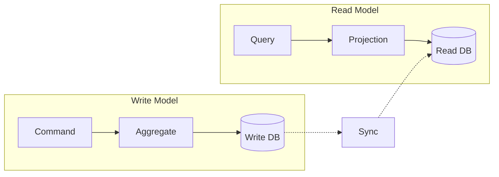

# CQRS — Command Query Responsibility Segregation

CQRS — паттерн, разделяющий операции чтения (Query) и записи (Command). В традиционной архитектуре одна модель данных и для чтения, и для записи. CQRS предлагает разные модели.

## Зачем разделять

В сложных системах требования к чтению и записи отличаются:

**Запись (Command):** валидация, бизнес-правила, транзакции, consistency.

**Чтение (Query):** агрегация, проекции, денормализация, производительность.

Когда у вас одна модель, она пытается быть и эффективной для чтения, и корректной для записи. Обычно не получается ни то, ни другое.

## Как работает

**Command Side:** принимает команды, проверяет бизнес-правила, сохраняет события.

**Query Side:** принимает запросы, читает из оптимизированной для чтения БД.

**Sync:** синхронизация между write и read моделями (обычно через события).

## CQRS + Event Sourcing

CQRS часто комбинируют с Event Sourcing:

1. Command side сохраняет не текущее состояние, а последовательность событий.
2. Query side строит проекции из этих событий.
3. Можно иметь несколько query моделей для разных сценариев.

## Когда использовать

**Нужно:** система с разными нагрузками на чтение и запись, сложные бизнес-правила, несколько read-моделей (отчёты, дашборды, API).

**Не нужно:** простой CRUD, одна read-модель.

## Проблемы

**Сложность.** В два раза больше кода, моделей, БД.

**Eventual consistency.** Данные в read-модели всегда немного позади write-модели.

**Синхронизация.** Механизм синхронизации нужно проектировать, мониторить и чинить.

## Что дальше

- **Event-Driven Architecture** — инфраструктура для синхронизации CQRS
- **Микросервисы — паттерны** — как CQRS вписывается в микросервисы

## Проверь себя

1. Какие проблемы решает разделение Command и Query?
2. Почему CQRS сложнее, чем кажется?
3. Как Event Sourcing связан с CQRS?
