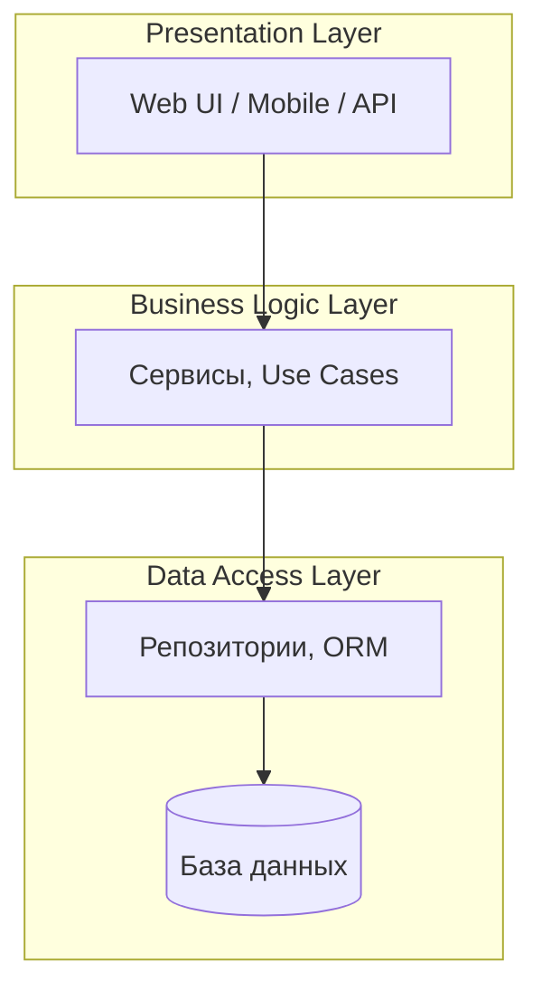

# Слоистая архитектура (layered)

Слоистая архитектура — самый распространённый способ организации кода. Идея проста: система делится на горизонтальные уровни, каждый отвечает за свою зону ответственности. Верхний слой может обращаться только к соседнему нижнему — это правило называется **строгой иерархией**.

## Традиционные три слоя

**Presentation Layer** — пользовательский интерфейс или точка входа API. Отвечает за взаимодействие с внешним миром, но не содержит бизнес-логики.

**Business Logic Layer** — ядро системы. Содержит правила, расчёты, проверки и сценарии. Работает с бизнес-сущностями, не зная, где и как хранятся данные.

**Data Access Layer** — доступ к данным. Реализует CRUD-операции, скрывая детали работы с конкретной базой.

## Зачем нужны слои

**Изоляция изменений.** Если вы меняете базу данных с PostgreSQL на MongoDB — меняется только Data Layer. Бизнес-логика и интерфейс не затрагиваются.

**Тестируемость.** Каждый слой можно тестировать независимо. Бизнес-логику — без базы и UI.

**Понимание.** Разработчик знает, где искать код для конкретной задачи. Аналитик знает, в каком слое какое решение принимается.

## Проблемы слоистой архитектуры

**«Боже, какой огромный слой».** Со временем Business Layer разрастается до нечитаемого состояния. Нет правил, как делить его внутри.

**Жёсткая связанность.** Нижние слои часто несут данные, специфичные для верхних. Например, DAL знает про формат ответа API.

**Ложное чувство порядка.** Проект выглядит структурированным, но изменения всё равно требуют правок во всех слоях — просто потому, что новая фича затрагивает каждый уровень.

## Layered vs Clean Architecture

Слоистая архитектура — база. Clean Architecture и Hexagonal Architecture — её эволюция.

| Архитектура | Правило зависимостей | Сложность |
|-------------|---------------------|-----------|
| Layered | Только сверху вниз | Низкая |
| Clean | Внутрь (core не зависит от внешнего) | Средняя |
| Hexagonal | Через порты и адаптеры | Высокая |

Для большинства корпоративных приложений слоистой архитектуры достаточно. Clean Architecture стоит вводить, когда:

- Система живёт больше 3 лет
- Часто меняются внешние интеграции
- Много бизнес-правил с высокой сложностью

## Как аналитик работает со слоями

Аналитик не проектирует слои — это задача архитектора. Но аналитик должен:

- Понимать, в каком слое возникает то или иное требование
- Описывать требования так, чтобы было ясно, какой слой они затрагивают
- Фиксировать в ADR решения, которые ломают слоистую архитектуру (например, «по соображениям производительности UI читает данные напрямую из БД»)

**Пример.** Требование «отображать на дашборде количество заказов в реальном времени» — это Presentation Layer. Решение «считать количество заказов через отдельный агрегат в БД» — это Data Layer. Решение «при каждом заказе отправлять событие в WebSocket» — ломает слои и требует ADR.

## Ключевые термины

- **Слой (Layer)** — горизонтальный уровень с единой ответственностью
- **Строгая иерархия** — правило: слой обращается только к соседнему нижнему
- **Cross-cutting concern** — сквозная функциональность (логирование, безопасность), затрагивающая все слои

## Что дальше

- **Монолит vs Микросервисы** — когда слои перестают работать
- **C4 — Container diagram** — как контейнеры соотносятся со слоями

## Проверь себя

1. Почему Presentation Layer не должен содержать бизнес-логику?
2. Какая проблема возникает, когда слоистая архитектура «стареет»?
3. В каком случае стоит переходить от Layered к Clean Architecture?
