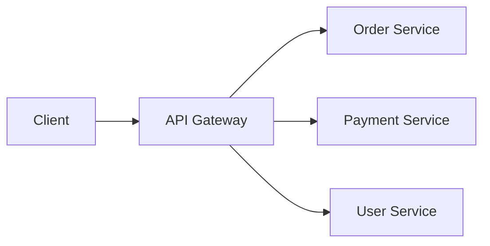

# Микросервисы — базовые паттерны

Переход на микросервисы — это не про технологию, а про организацию. Каждый паттерн микросервисной архитектуры решает конкретную проблему, которая возникает при делении системы на части.

## Проблемы микросервисов

**Сеть — не надёжна.** Сервис может быть недоступен, ответ может прийти с задержкой.

**Транзакции.** Распределённая транзакция — сложность. Нужны саги и компенсирующие действия.

**Данные.** Каждый сервис имеет свою БД. Как сделать отчёт, если данные размазаны по 5 сервисам?

**Поиск.** Где живёт этот endpoint? Service Discovery.

## API Gateway

Единая точка входа для всех микросервисов. Клиент не знает, где живёт каждый сервис — он стучится в Gateway.

**Что делает:** маршрутизация, аутентификация, rate limiting, агрегация ответов.

**Когда нужен:** больше 2–3 микросервисов.

## Service Discovery

Микросервисы появляются и исчезают (масштабирование, падения). Клиенты не могут хардкодить адреса.

**Client-side.** Клиент спрашивает registry (`Eureka`, `Consul`) и получает адрес.

**Server-side.** Балансировщик (`Kubernetes Service`) распределяет запросы.

## Circuit Breaker

Защита от каскадных отказов. Если сервис B не отвечает, сервис A перестаёт в него стучаться и возвращает fallback.

**Состояния:** Closed → Open → Half-Open → Closed.

- **Closed:** всё работает, запросы проходят.
- **Open:** сервис упал, запросы сразу отклоняются.
- **Half-Open:** пробный запрос, если успешен — Closed.

## Saga

Распределённая транзакция через последовательность локальных транзакций.

**Choreography-based.** Каждый сервис публикует событие. Следующий подписывается и делает своё.

**Orchestration-based.** Центральный оркестратор говорит каждому сервису, что делать.

**Compensating transaction.** Если шаг N упал — запускаются компенсирующие действия для шагов 1..N-1.

## Database per Service

Каждый микросервис имеет собственную БД. Нет shared database.

**Плюсы:** слабая связанность, независимые схемы.
**Минусы:** сложные запросы через несколько сервисов, eventual consistency.

## Что дальше

- **CQRS** — разделение чтения и записи для микросервисов
- **Event-Driven Architecture** — асинхронное взаимодействие между сервисами

## Проверь себя

1. Какую проблему решает API Gateway?
2. Зачем нужен Circuit Breaker?
3. Что такое Saga и зачем она нужна?
4. Почему микросервисы не должны делить одну БД?
