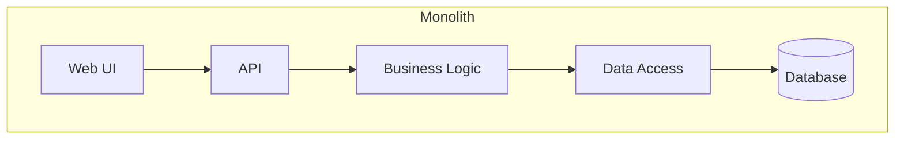
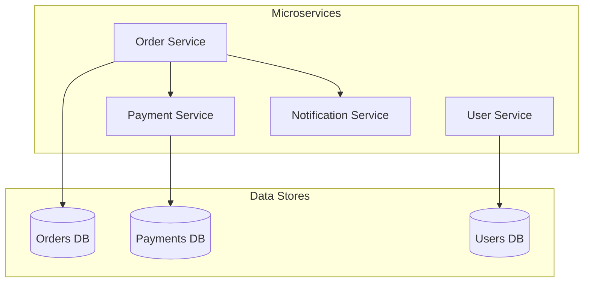

# Монолит vs Микросервисы

Спор «монолит или микросервисы» давно потерял смысл. Это не вопрос технологии, а вопрос компромисса. Оба подхода имеют цену, и выбор зависит от контекста: стадии проекта, размера команды, требований к масштабированию.

## Монолит

Одно приложение, которое делает всё. Один код, один процесс, один способ деплоя.

**Плюсы:**

- Простота разработки и отладки
- Одна точка деплоя
- Нет сетевых задержек между компонентами
- Транзакции — родные, ACID
- Минимальный оверхед на DevOps

**Минусы:**

- Всё падает разом
- Масштабировать можно только целиком
- Технологическое разнообразие ограничено
- Большой код пугает новых разработчиков

## Микросервисы

Несколько независимых приложений, каждое отвечает за свою бизнес-способность. Общаются по сети.

**Плюсы:**

- Каждый сервис можно менять независимо
- Масштабирование только нужных компонентов
- Технологическое разнообразие
- Изоляция сбоев (один сервис упал — остальные работают)
- Команды могут работать параллельно

**Минусы:**

- Сложность в квадрате: сеть, обнаружение, мониторинг
- Распределённые транзакции — боль
- DevOps-нагрузка резко растёт
- Отладка требует связывания логов из десятка сервисов
- Перенос данных между сервисами требует отдельного проектирования

## Когда что выбирать

**Начинайте с монолита.** Большинство проектов умирают до того, как становятся достаточно большими для микросервисов. Монолит быстрее строить, проще менять и легче деплоить.

**Переходите к микросервисам, когда:**

- Команда выросла до 3+ команд (около 15+ разработчиков)
- Монолит стал «бояться» деплоить — слишком много affected-зон
- Разные части системы имеют разный lifecycle (одна обновляется еженедельно, другая — раз в квартал)
- Нужно масштабировать только часть системы

**Остерегайтесь distributed monolith.** Это микросервисы, которые всё равно падают вместе, требуют атомарного деплоя и синхронных вызовов в цепочку. Худшее из обоих миров.

## Роль аналитика

Аналитик не принимает финальное решение об архитектуре, но обеспечивает контекст для принятия решения:

- Собирает нефункциональные требования, критичные для выбора
- Фиксирует границы между потенциальными сервисами (bounded context)
- Описывает сценарии интеграции между сервисами
- Документирует ADR с обоснованием выбора

На практике аналитик помогает ответить на вопрос: **как делить?** — на какие куски резать систему так, чтобы каждый кусок имел смысл с точки зрения бизнеса.

## Ключевые термины

- **Монолит** — единое приложение, включающее всю функциональность
- **Микросервис** — независимое приложение, отвечающее за одну бизнес-способность
- **Распределённая транзакция** — транзакция, затрагивающая несколько сервисов
- **Distributed monolith** — антипаттерн: микросервисы, которые нельзя менять независимо
- **Bounded Context** — граница модели в DDD (подсказывает, как делить систему)

## Что дальше

- **Слоистая архитектура** — как организовать код внутри одного сервиса
- **Проектирование REST API** — как сервисы общаются по сети

## Проверь себя

1. Почему большинству проектов стоит начинать с монолита?
2. Какие три признака указывают, что пора переходить на микросервисы?
3. Что такое distributed monolith и чем он опасен?
