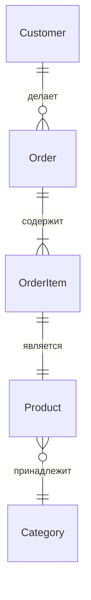
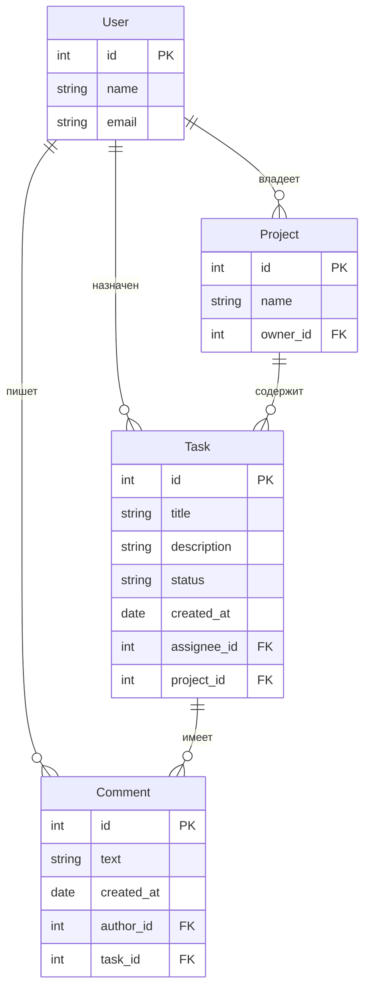

# Моделирование данных (ER)

Моделирование данных — это процесс создания абстрактной схемы, которая описывает, какие сущности существуют в системе, какие у них атрибуты и как они связаны.

## Уровни моделей

**Концептуальная.** Независима от технологий. Только сущности и связи. Строится с заказчиком.

**Логическая.** Добавляет атрибуты, типы данных, первичные и внешние ключи. Понятна аналитику и разработчику.

**Физическая.** Привязана к конкретной БД. Включает индексы, типы SQL, partition-ы, триггеры.

## Сущности и атрибуты

**Сущность (Entity)** — объект реального мира, о котором система хранит данные (Клиент, Заказ, Товар).

**Атрибут** — характеристика сущности (Имя клиента, Дата заказа, Цена товара).

Правила определения сущностей:
- Каждая сущность должна отвечать на вопрос «о чём мы храним данные?»
- Название сущности — существительное в единственном числе (Клиент, а не Клиенты)
- У каждой сущности есть первичный ключ (ID)

## Связи (Relationships)

| Тип | Обозначение | Пример |
|-----|------------|--------|
| One-to-One (1:1) | ——— | Клиент — Паспорт |
| One-to-Many (1:M) | `——<` | Клиент — Заказы |
| Many-to-Many (M:N) | `>——<` | Студент — Курсы |

**M:N разрешается через промежуточную таблицу** (link table).

## Нотация (Crow's Foot)

Самая популярная нотация для ER-диаграмм:

- `||` — обязательный (one and only one)
- `o{` — опциональный (zero or many)
- `}|` — один-к-одному (one and only one с другой стороны)
- `o|` — ноль-или-один (zero or one)

## Пример модели данных: система управления задачами

## Процесс моделирования

1. **Соберите сущности.** Интервью со стейкхолдерами, анализ业务流程.
2. **Определите атрибуты.** Какие характеристики важны для системы?
3. **Найдите связи.** Как сущности связаны? 1:1, 1:M, M:N?
4. **Нормализуйте.** Проверьте 3НФ. Устраните аномалии.
5. **Нарисуйте ER-диаграмму.** Используйте draw.io, DBeaver, PlantUML.
6. **Валидируйте с командой.** Проверьте, что схема покрывает все сценарии.

## Что дальше

- **SQL — основы** — как создать описанную модель в БД
- **Нормализация БД** — как проверить модель на аномалии

## Проверь себя

1. Чем концептуальная модель отличается от логической?
2. Как в Crow's Foot нотации обозначается связь 1:M?
3. Как разрешается связь Many-to-Many?
