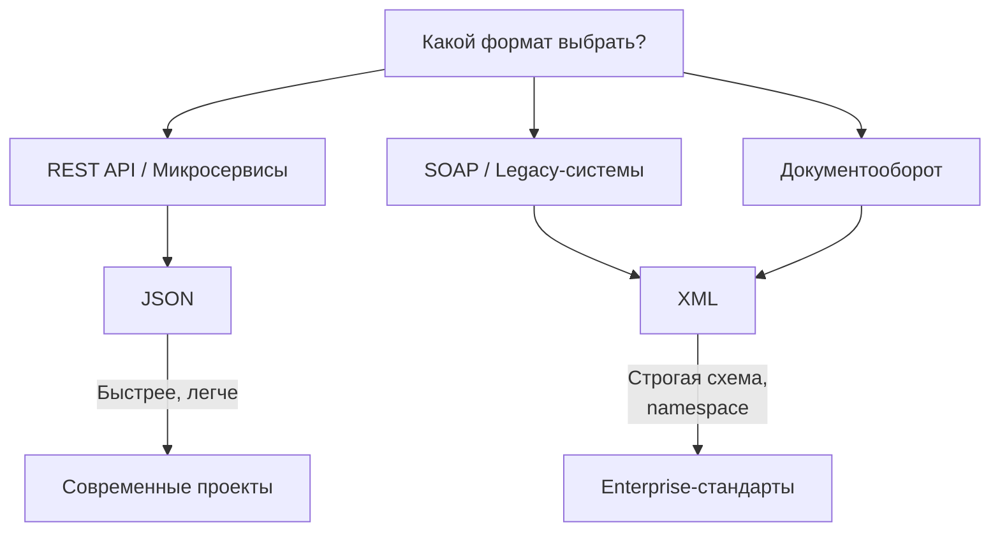

# JSON и XML — форматы данных

:::note
JSON и XML — это текстовые форматы для хранения и передачи структурированных данных. Они позволяют описать сложные объекты (пользователя, заказ, документ) в виде, понятном и человеку, и программе.
:::

Представьте, что вам нужно передать меню ресторана коллеге. Можно написать списком:

```
Салаты: Цезарь, 450 руб.
Горячее: Стейк, 1200 руб.
Напитки: Чай, 200 руб.
```

Но если коллега — программа, ей нужны чёткие правила: где название, где цена, где категория. JSON и XML — это такие правила. Они оговаривают, как именно должны выглядеть данные, чтобы любая программа могла их прочитать.

## JSON

JSON (JavaScript Object Notation) — современный стандарт передачи данных между сервисами. Лёгкий, читаемый, используется в REST API.

Как выглядит JSON:

```json
{
  "client": {
    "id": 123,
    "name": "Иван Петров",
    "email": "ivan@example.com",
    "orders": [
      {"id": 1, "total": 1500, "status": "delivered"},
      {"id": 2, "total": 2300, "status": "pending"}
    ]
  }
}
```

Основные типы данных в JSON: строка (в кавычках), число, булев (true/false), массив (в квадратных скобках), объект (в фигурных скобках), null.

**Где используется:** REST API, конфигурационные файлы, NoSQL-базы (MongoDB), веб-приложения.

## XML

XML (eXtensible Markup Language) — более старый, но всё ещё широко распространённый формат. Похож на HTML, но теги придумываете вы сами.

Как выглядит XML:

```xml
<client id="123">
    <name>Иван Петров</name>
    <email>ivan@example.com</email>
    <orders>
        <order id="1" total="1500" status="delivered"/>
        <order id="2" total="2300" status="pending"/>
    </orders>
</client>
```

**Где используется:** SOAP API, конфигурации (Android, Spring), документооборот, SVG, HTML.

## Сравнение JSON vs XML

| Характеристика | JSON | XML |
|---|---|---|
| Читаемость | Высокая, лаконичный | Средняя, много тегов |
| Размер | Меньше | Больше | |
| Поддержка типов | Есть (числа, булевы) | Только строки | |
| Комментарии | Нет | Есть | |
| Namespaces | Нет | Есть | |
| Schema | JSON Schema | XSD, DTD | |
| Популярность в REST API | Стандарт де-факто | Редко | |
| Популярность в Enterprise | Реже | Часто | |



## Какой формат выбрать

**JSON** выбирайте для REST API, микросервисов, мобильных приложений — почти всегда. **XML** — если работаете с legacy-системами, документооборотом или SOAP. В некоторых индустриях (банкинг, страхование) XML обязателен по стандартам.

## Почему это важно для аналитика

Вы будете читать и писать JSON каждый день: спецификация API, примеры запросов и ответов, конфиги. XML встретится реже, но важно узнавать его и понимать структуру, особенно в интеграциях со старыми системами. Умение прочитать XML-ответ и понять, какие поля там есть, — базовый навык.

## Ключевые термины

- **JSON** — текстовый формат на основе JavaScript, стандарт для API.
- **XML** — расширяемый язык разметки, используется в Enterprise.
- **Сериализация** — преобразование объекта в строку (JSON/XML).
- **Десериализация** — обратное преобразование строки в объект.
- **Schema** — описание структуры и типов данных.

## Что дальше

С JSON вы столкнётесь в [REST API](/docs/integration/api-rest-basics). XML может встретиться при работе с SOAP-сервисами. Подробнее о гибких схемах данных — в статье про NoSQL (планируется).

## Проверь себя

1. В каком формате сегодня чаще всего общаются микросервисы?
2. Когда XML всё ещё остаётся лучшим выбором?
3. Перепишите следующий XML в JSON:
```xml
<book isbn="978-5-12345-678-9">
    <title>Война и мир</title>
    <author>Лев Толстой</author>
    <year>1869</year>
</book>
```

**Ответы:**
1. JSON. Он легче, быстрее парсится, читается человеком.
2. Когда нужны namespaces (для избежания конфликтов имён), схемы (XSD) для строгой валидации, или когда это требование индустриального стандарта.
3. `{ "book": { "isbn": "978-5-12345-678-9", "title": "Война и мир", "author": "Лев Толстой", "year": 1869 } }`
