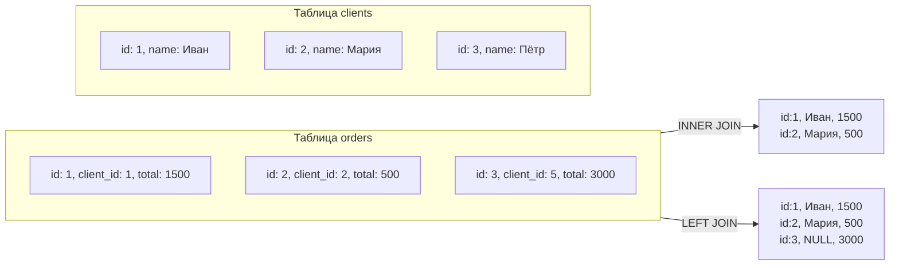

# Основы SQL

:::note
SQL (Structured Query Language) — язык запросов к реляционным базам данных. С его помощью вы можете получать, фильтровать, объединять и изменять данные. Аналитику не нужно писать сложные запросы, но читать и понимать простые SQL — обязательно.
:::

Представьте, что у вас есть таблица с заказами интернет-магазина. Вы хотите узнать: «сколько заказов сделал Иван Петров за последний месяц на сумму больше 1000 рублей?». Вместо того чтобы открывать таблицу и считать вручную, вы пишете короткий запрос — и получаете ответ за секунду. SQL — это язык таких запросов.

Основная команда, которую вы будете использовать, — `SELECT`. Она читает данные из таблиц.

## SELECT — выборка данных

Самый простой запрос:

```sql
SELECT * FROM clients;
```

Звёздочка `*` означает «все колонки». Запрос вернёт всё содержимое таблицы `clients`.

Чтобы выбрать только нужные колонки, перечислите их:

```sql
SELECT first_name, last_name, email FROM clients;
```

## WHERE — фильтрация

`WHERE` отфильтровывает строки по условию:

```sql
SELECT first_name, last_name FROM clients WHERE city = 'Москва';
```

Условия можно комбинировать: `AND`, `OR`, `NOT`:

```sql
SELECT * FROM orders
WHERE total > 1000 AND created_at >= '2024-01-01';
```

Операторы сравнения: `=`, `>`, `<`, `>=`, `<=`, `!=`, `LIKE` (поиск по шаблону), `IN` (проверка вхождения).

## JOIN — объединение таблиц

Данные обычно хранятся в нескольких связанных таблицах. Чтобы получить полную картину, их нужно объединить.

Представьте: есть таблица `orders` (заказы) и таблица `clients` (клиенты). В заказах хранится `client_id`, а имя клиента — в таблице клиентов. `JOIN` подтягивает имя в результат:

```sql
SELECT orders.id, clients.first_name, orders.total
FROM orders
JOIN clients ON orders.client_id = clients.id;
```



Основные типы `JOIN`:
- `INNER JOIN` — только строки, у которых есть совпадение в обеих таблицах.
- `LEFT JOIN` — все строки из левой таблицы, даже если в правой нет совпадения (тогда правые колонки будут `NULL`).
- `RIGHT JOIN` — наоборот, все из правой.

## GROUP BY — группировка

Когда нужно посчитать итоги по группам — сколько заказов у каждого клиента, средний чек, общая сумма:

```sql
SELECT client_id, COUNT(*) as order_count, SUM(total) as total_sum
FROM orders
GROUP BY client_id;
```

Часто `GROUP BY` используют с агрегатными функциями: `COUNT` (количество), `SUM` (сумма), `AVG` (среднее), `MIN`, `MAX`.

## ORDER BY — сортировка

```sql
SELECT * FROM orders ORDER BY created_at DESC;
```

`DESC` — от новых к старым, `ASC` (по умолчанию) — от старых к новым.

## LIMIT — ограничение

```sql
SELECT * FROM orders ORDER BY total DESC LIMIT 10;
```

Вернёт 10 самых дорогих заказов.

## Почему это важно для аналитика

Вы будете постоянно проверять данные: «а сколько у нас пользователей в статусе X?», «сколько заказов приходит в час пик?», «какие товары чаще всего возвращают?». В современной компании данные лежат в БД, и SQL — язык, на котором вы с ними разговариваете. Даже базовое понимание SQL выделит вас среди аналитиков, которые просят разработчика «сделать выгрузку».

## Ключевые термины

- **SELECT** — команда чтения данных.
- **WHERE** — фильтр строк по условию.
- **JOIN** — объединение таблиц по ключу.
- **GROUP BY** — группировка для подсчёта итогов.
- **Агрегатная функция** — вычисление по группе строк (COUNT, SUM, AVG).

## Что дальше

Когда вы освоили SQL, стоит разобраться, в каких форматах данные передаются между системами: [JSON и XML — форматы данных](/docs/data/json-xml).

## Проверь себя

1. Какой запрос покажет имена всех клиентов из Санкт-Петербурга?
2. Чем `LEFT JOIN` отличается от `INNER JOIN`?
3. Напишите запрос, который считает количество заказов по дням за последнюю неделю.

**Ответы:**
1. `SELECT first_name, last_name FROM clients WHERE city = 'Санкт-Петербург';`
2. `INNER JOIN` показывает только строки с совпадением в обеих таблицах. `LEFT JOIN` показывает все строки из левой таблицы, а правые колонки заполняет `NULL`, если совпадения не было.
3. `SELECT DATE(created_at) as day, COUNT(*) FROM orders WHERE created_at >= NOW() - INTERVAL '7 days' GROUP BY day ORDER BY day;`
