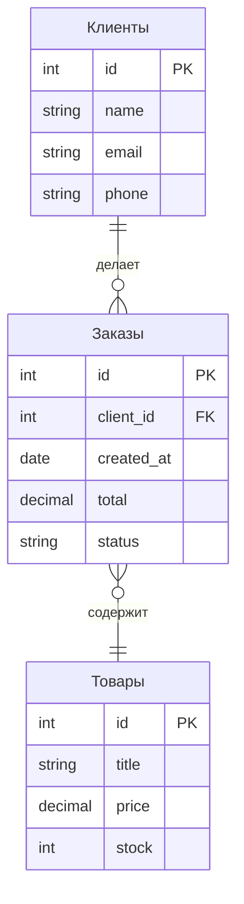

# Что такое база данных

:::note
База данных (БД) — это организованное хранилище информации, которое позволяет эффективно сохранять, изменять и искать данные. Проще говоря: это не просто набор файлов, а система с правилами, как данные хранить и как к ним обращаться.
:::

Представьте библиотеку. Книги можно складывать в штабель на полу — они будут храниться, но найти нужную займёт часы. А можно расставить их по полкам в алфавитном порядке, завести каталог, записать, кто и когда брал книгу. Библиотека с каталогом — это и есть база данных.

Без БД любое приложение хранило бы данные в текстовых файлах. Найти клиента по фамилии? Читать файл целиком. Обновить адрес? Переписать весь файл. Одновременная работа ста пользователей? Коллапс. База данных решает все эти проблемы.

## Как устроена БД

База данных состоит из трёх уровней:

- **Физический** — как данные реально лежат на диске (файлы, блоки, индексы).
- **Логический** — как данные видны пользователю (таблицы, строки, столбцы).
- **Внешний** — как данные видит конкретное приложение или пользователь (представления, отчёты).

Обычно аналитик работает с логическим уровнем: таблицы, связи между ними, правила целостности.

## Основные понятия

**Таблица** — основная структура хранения. Похожа на лист Excel: столбцы (поля) и строки (записи).

**Столбец (поле)** — один атрибут данных. Например, «Имя клиента» или «Дата заказа».

**Строка (запись)** — один экземпляр сущности. Одна строка — один клиент, один заказ.

**Первичный ключ (Primary Key)** — уникальный идентификатор записи. В таблице «Клиенты» это может быть ID клиента. Двух строк с одинаковым ID быть не может.

**Внешний ключ (Foreign Key)** — ссылка на запись в другой таблице. Например, в таблице «Заказы» есть поле «ID клиента», которое ссылается на таблицу «Клиенты».

**СУБД (СУБД)** — система управления базами данных. Это программа, которая управляет БД: PostgreSQL, MySQL, Oracle, Microsoft SQL Server.

## Реляционные vs нереляционные

**Реляционные БД (SQL)** — данные хранятся в связанных таблицах. Хорошо работают для структурированных данных с чёткими связями (финансы, учёт, CRM).

**Нереляционные БД (NoSQL)** — данные хранятся в документах, графах или key-value. Подходят для гибких структур и больших объёмов (логи, каталоги, IoT).

## Почему это важно для аналитика

Вы будете постоянно работать с данными: анализировать требования к хранению, проектировать структуру БД вместе с разработчиками, писать запросы для проверки гипотез. Понимание, что такое таблица, ключ и связь, — база (буквально) для всего остального.

## Ключевые термины

- **База данных** — организованное хранилище данных.
- **СУБД** — программа для управления БД.
- **Таблица** — структура для хранения однотипных записей.
- **Первичный ключ** — уникальный идентификатор записи.
- **Внешний ключ** — ссылка на запись в другой таблице.

## Что дальше

Следующий шаг — научиться доставать данные из БД: [Основы SQL (SELECT, JOIN, WHERE)](/docs/data/sql-basics).

## Проверь себя

1. Чем таблица в БД отличается от листа в Excel?
2. Зачем нужен первичный ключ?
3. В какой ситуации вы выберете NoSQL вместо SQL?

**Ответы:**
1. В Excel нет жёстких типов данных, связей между листами и ограничений целостности. В БД каждая колонка имеет тип, связи контролируются ключами, данные валидируются при записи.
2. Чтобы однозначно идентифицировать каждую запись. Без первичного ключа вы не сможете отличить двух клиентов с одинаковыми именами и фамилиями.
3. Когда структура данных постоянно меняется (JSON-документы), когда данных очень много и нужна горизонтальная масштабируемость, или когда связи между данными — не таблицы, а графы (социальные сети, рекомендации).
