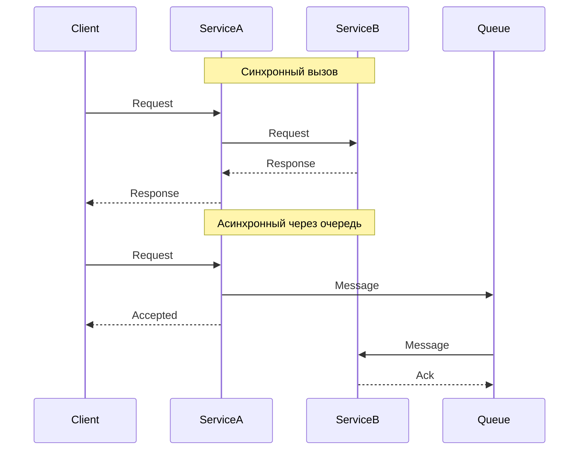

# Асинхронное взаимодействие (Message Queue)

До сих пор мы говорили о синхронном REST: клиент делает запрос и ждёт ответ. Но есть сценарии, где ждать нельзя или не нужно. Для этого существует асинхронное взаимодействие через очереди сообщений.

## Синхронное vs Асинхронное

**Синхронный:** отправитель ждёт ответ и блокируется.
**Асинхронный:** отправитель отправляет сообщение и продолжает работу.

## Когда нужно асинхронное взаимодействие

**Долгие операции.** Отправить email, сгенерировать отчёт, обработать видео — результаты не нужны мгновенно.

**Высокая нагрузка.** Очередь сглаживает пики: если 1000 запросов в секунду, а обработчик может взять только 100 — очередь буферизует.

**Надёжность.** Если обработчик временно недоступен, сообщение остаётся в очереди и будет обработано позже.

**Слабая связанность.** Отправитель и получатель не знают друг о друге. Можно менять обработчики без изменения отправителя.

## Ключевые понятия

**Producer (Publisher)** — кто отправляет сообщение.

**Consumer (Subscriber)** — кто получает и обрабатывает.

**Queue** — буфер, где хранятся сообщения, пока их не заберут.

**Topic / Exchange** — точка маршрутизации. Producer отправляет в exchange, exchange распределяет по очередям.

**Broker** — сервер, управляющий очередями (RabbitMQ, Kafka).

**Ack (Acknowledgment)** — подтверждение, что сообщение обработано. Без ack брокер считает, что сообщение не доставлено.

## Гарантии доставки

**At-most-once.** Сообщение доставляется не более одного раза. Может быть потеряно. Максимальная производительность.

**At-least-once.** Сообщение доставляется как минимум один раз. Может быть продублировано. Нужна идемпотентность.

**Exactly-once.** Сообщение доставляется ровно один раз. Максимальная надёжность, минимальная производительность.

## Что выбрать: RabbitMQ или Kafka

| Критерий | RabbitMQ | Kafka |
|----------|----------|-------|
| Модель | Queue / Exchange | Log / Partition |
| Хранение | Удаляет после ack | Хранит по retention |
| Производительность | Тысячи msg/s | Миллионы msg/s |
| Маршрутизация | Гибкая (routing key) | По partition key |
| Типичное применение | Task queue, RPC | Event streaming, CDC |

## Что дальше

- **RabbitMQ** — практика работы с очередями
- **Kafka** — событийный streaming
- **Event-Driven Architecture** — архитектурный стиль на основе событий

## Проверь себя

1. В каких трёх случаях нужно асинхронное взаимодействие?
2. Чем at-most-once отличается от at-least-once?
3. Какую проблему решает очередь сообщений при пиковой нагрузке?
