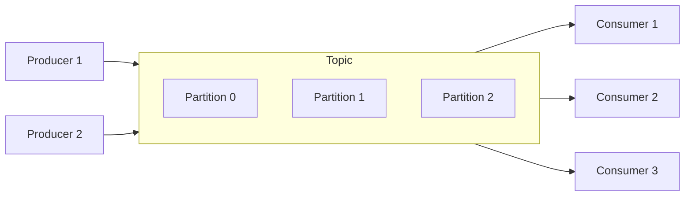

# Kafka — событийный streaming

Apache Kafka — это распределённая платформа для обработки событийных потоков. В отличие от RabbitMQ, Kafka не удаляет сообщения после прочтения — она хранит их в логе определённое время (retention).

## Модель Kafka

**Topic** — категория сообщений (аналог таблицы). **Partition** — единица параллелизма. Сообщения с одним ключом попадают в одну партицию, гарантируя порядок.

## Ключевые концепции

**Log.** Kafka хранит сообщения как последовательный лог. Новые сообщения добавляются в конец. Consumer читает с определённого offset.

**Offset.** Позиция consumer в логе. Consumer сам управляет offset: может читать с начала, с конца или с конкретного места.

**Consumer Group.** Группа consumer'ов, которые вместе читают topic. Каждое сообщение доставляется одному consumer'у в группе. Если consumer'ов больше, чем партиций — часть простаивает.

**Retention.** Kafka хранит сообщения не вечно, а заданное время (по умолчанию 7 дней) или до определённого размера.

## Гарантии в Kafka

- **Порядок сообщений** гарантируется внутри одной партиции
- **At-least-once** — по умолчанию (нужна идемпотентность)
- **Exactly-once** — через idempotent producer + transactional API

## Когда использовать Kafka

**Event Sourcing.** Хранить историю изменений как последовательность событий. Kafka — естественный выбор: лог событий, которые нельзя удалять.

**Stream processing.** Обработка данных в реальном времени (агрегация, фильтрация, трансформация).

**CDC (Change Data Capture).** Отслеживание изменений в базе данных и публикация их как событий.

**Big data.** Kafka — стандарт де-факто для сбора и транспортировки больших объёмов данных.

## RabbitMQ vs Kafka — практический выбор

| Сценарий | Выбор |
|----------|-------|
| Task queue (задачи по одному) | RabbitMQ |
| Broadcast событий | RabbitMQ (fanout) |
| Event sourcing | Kafka |
| High throughput (>100k msg/s) | Kafka |
| Сложная маршрутизация | RabbitMQ |
| Долгое хранение сообщений | Kafka |

## Что дальше

- **Event-Driven Architecture** — архитектура на основе событий
- **Event Storming** — метод моделирования событийных систем

## Проверь себя

1. Чем модель Kafka отличается от модели RabbitMQ?
2. Что такое offset и consumer group?
3. Почему Kafka — естественный выбор для Event Sourcing?
