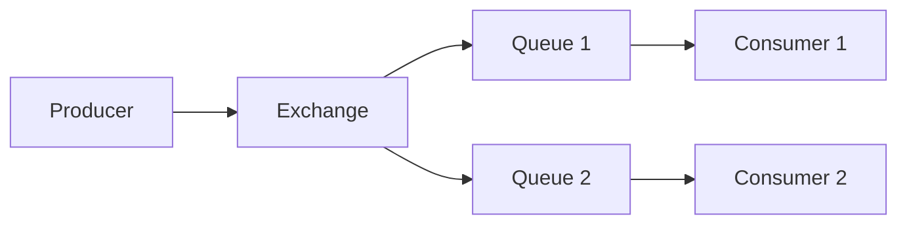

# RabbitMQ — очереди сообщений

RabbitMQ — популярный брокер сообщений. Реализует протокол AMQP 0-9-1. Используется для task queues, RPC, и маршрутизации сообщений по сложным правилам.

## Модель RabbitMQ

**Producer** отправляет сообщение в **Exchange**. Exchange, используя **Binding**, направляет сообщение в одну или несколько **Queue**. **Consumer** читает из очереди.

## Типы Exchange

**Direct.** Сообщение доставляется в очередь, routing key которой совпадает с routing key сообщения.

**Topic.** Маршрутизация по шаблону: `order.*` — все события заказов, `order.created` — только создание.

**Fanout.** Сообщение доставляется во все связанные очереди. Аналог broadcast.

**Headers.** Маршрутизация по заголовкам, а не routing key.

## Dead Letter Queue (DLQ)

Очередь «мёртвых» сообщений. Если consumer отверг сообщение, истёк TTL или очередь переполнена — сообщение отправляется в DLQ. Позволяет не терять проблемные сообщения и анализировать их позже.

## Подтверждения (Ack)

Consumer должен отправить ack после обработки. Если consumer не отправил ack (упал или timeout) — сообщение возвращается в очередь и доставляется другому consumer.

**Manual ack:** consumer сам решает, когда подтвердить. Нужен для долгих операций: обработал → ack.

**Auto ack:** подтверждение сразу после получения. Быстрее, но если consumer упадёт — сообщение потеряно.

## Когда использовать RabbitMQ

- Нужна гибкая маршрутизация (topic exchange)
- Требуется надёжная доставка (ack, DLQ)
- Сообщения должны быть обработаны ровно один раз (task queue)
- Не требуется retention на дни/недели

## Когда НЕ использовать

- Миллионы сообщений в секунду — Kafka лучше
- Нужно повторное чтение старых сообщений — Kafka хранит дольше
- Event sourcing — Kafka спроектирована для этого

## Что дальше

- **Kafka** — альтернатива для высоких нагрузок и event streaming
- **Event-Driven Architecture** — архитектурный стиль на событиях

## Проверь себя

1. Какие четыре типа exchange есть в RabbitMQ?
2. Что такое Dead Letter Queue и зачем она нужна?
3. Чем manual ack отличается от auto ack?
