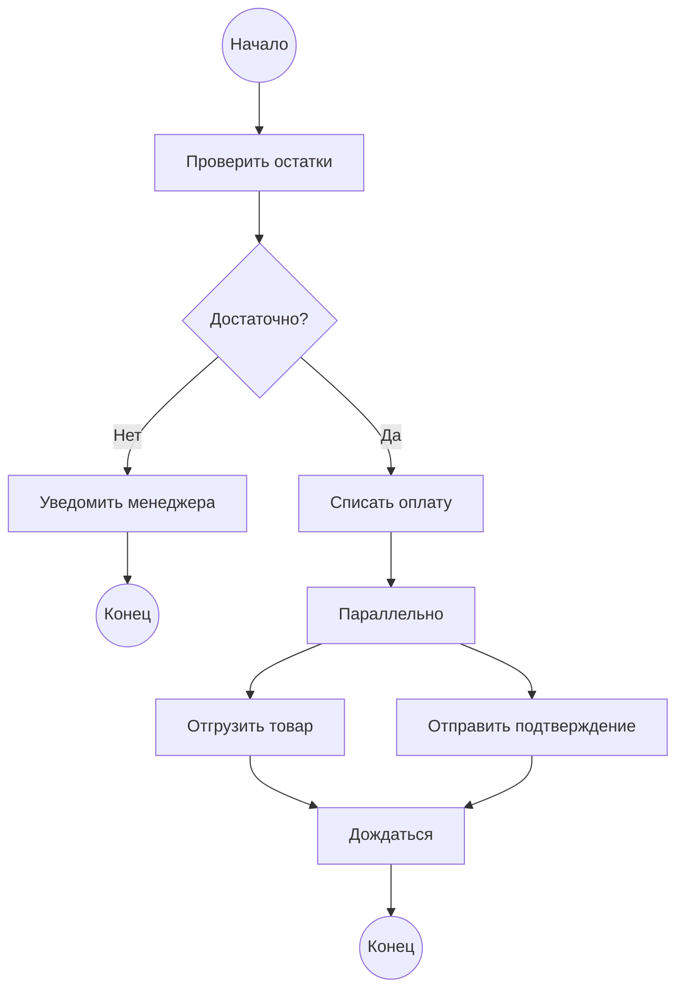

# Activity diagram (UML Activities)

Activity diagram описывает **последовательность действий** в процессе — шаг за шагом, с ветвлениями, параллельными потоками и условиями. Если State diagram — это «жизнь одного объекта», то Activity diagram — «жизнь одного процесса».

## Когда нужен Activity diagram

| Ситуация | Зачем |
|----------|-------|
| Описать бизнес-процесс | Показать, как заявка проходит от создания до закрытия |
| Смоделировать алгоритм / логику | Как система обрабатывает запрос |
| Показать параллельные ветки | Одновременные действия: уведомить менеджера + отправить письмо |
| Роли и зоны ответственности | Кто что делает (дорожки / swimlanes) |

## Основные элементы

| Элемент | Обозначение | Пример |
|---------|-------------|--------|
| **Действие** | Прямоугольник со скруглёнными углами | «Проверить баланс» |
| **Начало** | Закрашенный кружок | |
| **Конец** | Закрашенный кружок в окружности | |
| **Ветвление (Decision)** | Ромб | «Баланс > 0?» |
| **Слияние (Merge)** | Ромб | Точка схождения веток |
| **Разделение (Fork)** | Толстая линия | Запустить параллельные действия |
| **Синхронизация (Join)** | Толстая линия | Дождаться завершения всех потоков |

## Пример: обработка заказа

## Сравнение: Activity diagram vs BPMN

| Критерий | Activity diagram | BPMN |
|----------|-----------------|------|
| Фокус | Логика процесса | Бизнес-процесс с ролями |
| Дорожки | Опционально | Обязательны (пулы и дорожки) |
| События | Только start/end | Таймеры, сообщения, ошибки |
| Сложность | Низкая | Высокая |
| Когда использовать | Быстро показать логику | Формальное описание процесса |
| Инструменты | Любая UML-среда, Mermaid | Camunda, Draw.io, BPMN-редакторы |

## Правила построения

1. **Одно начало и один конец** — не путайте читателя
2. **Каждое ветвление имеет ровно 2+ исходящих потока** с условиями на стрелках
3. **Не смешивайте уровни** — или бизнес-процесс (действия бизнеса), или системная логика (методы)
4. **Дорожки — если важны роли** — иначе Activity diagram без дорожек проще
5. **Параллельные ветки должны синхронизироваться** — не оставляйте потоки «висеть»

## Почему это важно аналитику

- Быстро зарисовать процесс на встрече (на доске или в Miro)
- Показать логику, не углубляясь в BPMN-нотацию
- Activity diagram понимают все: бизнес, разработка, тестировщики

## Что дальше

- [BPMN](/docs/modeling/bpmn) — более формальная нотация для описания процессов
- [State diagram](/docs/modeling/state-diagram) — если нужна жизнь одного объекта
- [Sequence diagram](/docs/modeling/sequence-diagram) — если нужен обмен сообщениями между компонентами

## Проверь себя

1. **Чем Activity diagram отличается от State diagram?**
   *Ответ:* Activity diagram описывает процесс (последовательность действий), State diagram — жизненный цикл одного объекта (состояния и переходы).

2. **Когда использовать Activity diagram, а когда BPMN?**
   *Ответ:* Activity diagram — для быстрых набросков и системной логики. BPMN — для формальных бизнес-процессов с ролями, событиями и сложной логикой.

3. **Что такое Fork и Join в Activity diagram?**
   *Ответ:* Fork (разделение) запускает параллельные потоки. Join (синхронизация) — ожидает завершения всех параллельных потоков перед продолжением.

4. **Почему важно, чтобы у каждого Decision были подписаны исходящие потоки?**
   *Ответ:* Иначе читатель не поймёт, при каком условии идти по какой ветке. Условия на стрелках делают диаграмму читаемой без дополнительных пояснений.
