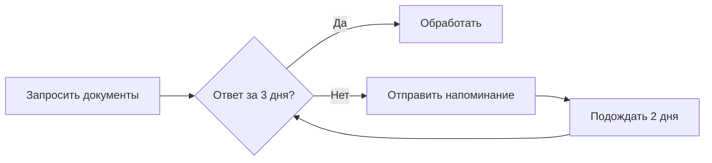

# BPMN — продвинутый уровень

Базовый BPMN покрывает 80%日常ных задач аналитика. Оставшиеся 20% — подпроцессы, события-таймеры, исключения и транзакции — превращают схему из наглядной картинки в формальную спецификацию, по которой можно реализовать процесс.

## Подпроцессы (Subprocess)

Подпроцесс — это задача, которая раскрывается в отдельную диаграмму. Используется, когда шаг достаточно сложен, чтобы описать его на отдельном листе.

**Когда использовать подпроцесс:**

- Шаг состоит из 3+ элементарных действий
- Шаг выполняется по отдельному регламенту
- Шаг требует отдельного описания для разных аудиторий

**Встроенный подпроцесс (embedded).** Детализация на той же диаграмме — внутри раскрывающегося блока. Удобен для чтения, но загромождает схему при 5+ шагах.

**Вызов процесса (call activity).** Ссылка на другую диаграмму BPMN. Утолщённая граница обозначает, что за этим шагом — отдельный процесс.

## События (Events)

BPMN расширяет базовые события старта и завершения специальными типами:

**События-таймеры:**

- `⏰` **Timer Start** — процесс запускается по расписанию (ежедневно в 9:00)
- `⏰` **Timer Intermediate** — ожидание внутри процесса (ждать 3 дня)

**События-сообщения:**

- `✉️` **Message Start** — процесс запускается получением сообщения
- `✉️` **Message Intermediate** — ожидание сообщения от другой системы

**События-ошибки:**

- `⚠️` **Error Intermediate** — возникает в задаче при ошибке
- `⚠️` **Error Boundary** — прикреплён к границе задачи, ловит ошибку

**Пример обработки ошибки по таймеру:**

На BPMN это моделируется через Timer Intermediate Event на потоке и Error Boundary Event на задаче.

## Исключения и транзакции

**Транзакция (Transaction)** — группа задач, которые должны выполниться целиком или не выполниться совсем. Если любая задача в транзакции завершилась ошибкой — все предыдущие откатываются (rollback).

На практике аналитик редко моделирует транзакции в BPMN — это уровень реализации. Но знать, что такой элемент существует, нужно, чтобы корректно описать требование: «если оплата не прошла, заказ не создаётся».

## Шлюзы (Gateways) — сложные сценарии

Кроме базового Exclusive Gateway (XOR), BPMN предлагает:

**Inclusive Gateway (OR).** Один или несколько путей могут быть активны одновременно. Например, после проверки заказа может потребоваться и уточнение данных, и дополнительная верификация.

**Parallel Gateway (AND).** Все пути выполняются параллельно и синхронизируются перед следующим шагом.

**Event-Based Gateway.** Выбор пути по событию (кто первый прислал ответ, того и слушаем).

## Как аналитик выбирает уровень детализации

Не каждую диаграмму нужно доводить до продвинутого уровня. Правило простое: если процесс будет **реализован программно** (в BPM-движке, в коде) — нужны события, исключения, таймеры. Если процесс **исполняется людьми** (по регламенту, устно) — достаточно базовых элементов.

## Ключевые термины

- **Подпроцесс** — составная задача с собственной детализацией
- **Событие-таймер** — ожидание по времени внутри процесса
- **Граничное событие** — событие, прикреплённое к границе задачи
- **Транзакция** — атомарная группа задач с откатом при ошибке
- **Inclusive Gateway** — шлюз, активирующий один или несколько путей

## Что дальше

- **C4 — Context diagram** — взгляд на систему и её окружение
- **State diagram** — альтернативный взгляд на поведение

## Проверь себя

1. Чем встроенный подпроцесс отличается от call activity?
2. Как смоделировать в BPMN ситуацию: «Если ответ не пришёл за 3 дня — отправить напоминание»?
3. Когда нужен Inclusive Gateway вместо Exclusive?
