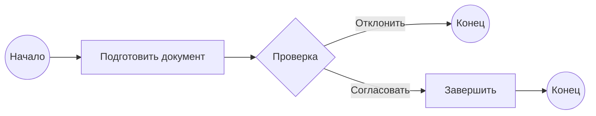

# BPMN — моделирование бизнес-процессов

BPMN (Business Process Model and Notation) — это стандарт моделирования бизнес-процессов, разработанный Object Management Group (OMG). BPMN понятен как аналитикам, так и разработчикам.

## Основные элементы BPMN

### Потоковые объекты

- **События (Events)** — круги. Показывают начало, промежуточные этапы и конец процесса
- **Действия (Activities)** — прямоугольники со скруглёнными углами. Обозначают задачи или подпроцессы
- **Шлюзы (Gateways)** — ромбы. Определяют ветвление, слияние и синхронизацию потоков

### Соединяющие объекты

- **Поток последовательности (Sequence Flow)** — сплошная линия со стрелкой
- **Поток сообщений (Message Flow)** — пунктирная линия со стрелкой
- **Ассоциация (Association)** — пунктирная линия без стрелки

### Роли (дорожки)

- **Пул (Pool)** — контейнер для всего процесса
- **Лейн (Lane)** — подразделение внутри пула для конкретного участника

## Типы шлюзов

| Тип шлюза         | Символ   | Назначение                        |
|-------------------|----------|-----------------------------------|
| Исключающий (XOR) | X        | Выбор одного из нескольких путей  |
| Включающий (OR)   | O        | Один или несколько путей          |
| Параллельный (AND)| +        | Все пути выполняются одновременно |

## Пример процесса на BPMN

Процесс согласования документа с использованием шлюзов:

## Практическое применение

Системный аналитик использует BPMN для:
- Моделирования AS-IS и TO-BE процессов
- Выявления узких мест и неэффективных операций
- Согласования требований с заказчиком
- Передачи спецификаций разработчикам

### Уровни моделирования

BPMN поддерживает три уровня детализации:
1. **Descriptive** — для бизнес-пользователей
2. **Analytical** — для аналитиков
3. **Executable** — для выполнения в BPMS-системах

## Ключевые термины

| Термин | Значение |
|--------|----------|
| Событие (Event) | Круг, обозначающий начало, промежуточный этап или конец процесса |
| Действие (Activity) | Прямоугольник со скруглёнными углами — задача или подпроцесс |
| Шлюз (Gateway) | Ромб, определяющий ветвление или слияние потоков |
| Пул (Pool) | Контейнер для всего процесса |
| Лейн (Lane) | Подразделение внутри пула для конкретного участника |

## Проверь себя

1. **Какие три типа потоковых объектов используются в BPMN?**
   > События, действия и шлюзы.

2. **Чем отличается исключающий шлюз (XOR) от параллельного (AND)?**
   > XOR выбирает один путь из нескольких, AND выполняет все пути одновременно.

3. **Для каких задач системный аналитик использует BPMN?**
   > Моделирование AS-IS и TO-BE, выявление узких мест, согласование требований, передача спецификаций.

## Что дальше

- [Продвинутый BPMN: подпроцессы, исключения, паттерны](/docs/modeling/bpmn-advanced)
- [DFD — моделирование потоков данных](/docs/modeling/dfd)
- [Обзор моделей SDLC](/docs/process/sdlc-models)
