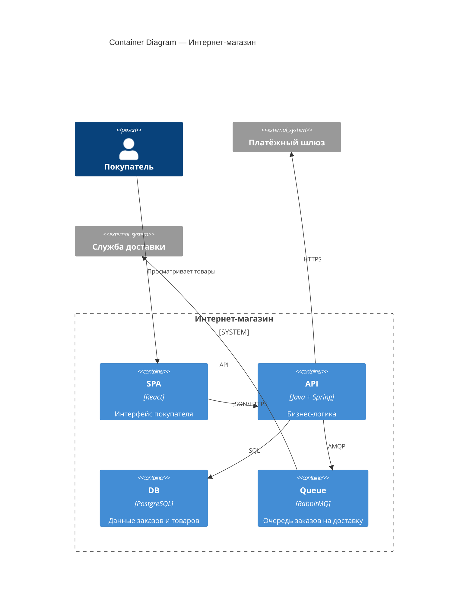

# C4 — Container diagram (уровень 2)

Container diagram показывает, из каких **высокоуровневых блоков** состоит система. Контейнер в C4 — это не Docker, а логическая единица: веб-сервер, база данных, мобильное приложение, очередь сообщений.

## Что такое контейнер в C4

Контейнер — это отдельное развёртываемое звено, которое выполняет свою часть функциональности.

**Примеры контейнеров:**

- Single-page Application (React, Vue)
- Backend API (Java, Python, Go)
- База данных (PostgreSQL, MongoDB)
- Очередь сообщений (RabbitMQ, Kafka)
- Файловое хранилище (S3)

Каждый контейнер может быть запущен независимо, масштабирован отдельно и заменён без остановки всей системы.

## Container diagram для интернет-магазина

## Как аналитик строит Container diagram

1. **Начните с Context diagram.** Поместите свою систему в центр.
2. **Разбейте систему на контейнеры.** Что нужно, чтобы реализовать функциональность? Веб-приложение? API? База данных? Очередь?
3. **Определите протоколы.** Как контейнеры общаются? JSON/HTTPS, SQL, AMQP, gRPC?
4. **Проверьте изоляцию.** Может ли каждый контейнер быть изменён или заменён независимо?

## Технологии на Container diagram

Container diagram — подходящий уровень, чтобы указать технологии. В отличие от Context diagram, здесь уместны названия фреймворков, СУБД и протоколов.

Достаточно указать технологию в скобках после имени контейнера — без версий и деталей конфигурации.

## Container diagram vs Context diagram

| Context | Container |
|---------|-----------|
| Система — один прямоугольник | Система — несколько прямоугольников |
| Нет технологий | Технологии указаны |
| Читают заказчики | Читают разработчики и архитекторы |
| Одна на проект | Может быть несколько (по подсистемам) |

## Роль аналитика

Container diagram — это мост между анализом и архитектурой. Аналитик описывает, **что** должна делать система. Архитектор решает, **как** это реализовать (какие контейнеры выбрать). Container diagram — точка, где эти две картины сходятся.

На практике аналитик:

- Предлагает декомпозицию на контейнеры на основе функциональных требований
- Указывает, какие данные где хранятся и как передаются
- Согласует с архитектором границы контейнеров
- Фиксирует принятые решения в ADR

## Ключевые термины

- **Контейнер (C4)** — отдельно развёртываемая единица системы
- **Протокол взаимодействия** — способ обмена данными между контейнерами
- **Технологический стек** — набор технологий, выбранных для реализации

## Что дальше

- **Слоистая архитектура** — как организовать код внутри контейнера
- **Что такое архитектура ПО** — общий взгляд на дисциплину

## Проверь себя

1. Чем контейнер в C4 отличается от Docker-контейнера?
2. Какая информация появляется на Container diagram, но отсутствует на Context?
3. Почему технологический стек указывается именно на уровне Container, а не Context?
