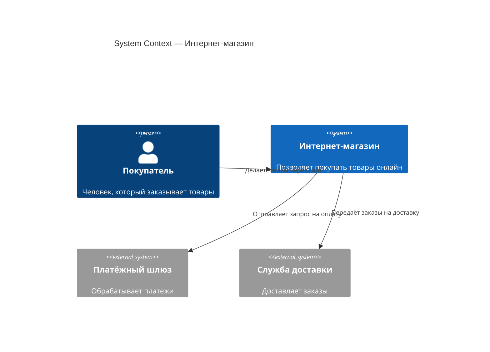

# C4 — Context diagram (уровень 1)

C4 — это не нотация, а иерархия нотаций. Четыре уровня описывают систему с разной степенью детализации: от вида из космоса (Context) до схемы кода (Code). Аналитику достаточно первых двух уровней: Context и Container.

## Уровень 1: System Context diagram

Context diagram — это взгляд на систему с высоты 10 000 метров. На ней нет серверов, баз данных и микросервисов. Есть только **наша система**, **пользователи** и **внешние системы**, с которыми она взаимодействует.

**Что должно быть на Context diagram:**

- Ваша система — в центре (один прямоугольник)
- Пользователи (персоны) — люди, которые взаимодействуют с системой
- Внешние системы — то, с чем ваша система интегрируется
- Стрелки с подписями — основные потоки данных

**Чего НЕ должно быть:**

- Базы данных, кэши, очереди — это уровень Container
- Внутренние компоненты — это уровень Component
- Технологии и фреймворки — это детали реализации

## Как аналитик строит Context diagram

1. **Нарисуйте один прямоугольник — вашу систему.** Подпишите, что она делает (одной строкой).
2. **Выпишите всех, кто с ней взаимодействует.** Пользователи (по ролям) и внешние системы.
3. **Проведите стрелки.** Какие данные передаются? В какую сторону?
4. **Проверьте полноту.** Все ли сценарии из Use Case покрыты? Если есть use case, который не отражён на Context diagram — вы кого-то упустили.
5. **Покажите заказчику.** Context diagram читают non-technical люди. Это отличный инструмент для синхронизации.

## Когда Context diagram полезна аналитику

- **Старт проекта.** Пока вы не понимаете границы системы — вы не знаете, что анализировать.
- **Интеграция с legacy.** Context diagram показывает, куда «втыкается» новая система.
- **Миграция.** Наглядно видно, какие внешние системы нужно переподключать.
- **Документирование.** Новый член команды за 5 минут поймёт ландшафт системы.

## Context diagram vs Use Case diagram

| Context diagram | Use Case diagram |
|----------------|-----------------|
| Система как чёрный ящик | Система как набор сценариев |
| Показывает границы | Показывает функциональность |
| Стрелки — потоки данных | Стрелки — связи актёр/сценарий |
| Одна диаграмма на систему | Несколько на большие системы |

На практике Context diagram и Use Case diagram дополняют друг друга. Context отвечает на вопрос «с кем», Use Case — «что делает».

## Ключевые термины

- **C4 model** — иерархия описания архитектуры: Context → Container → Component → Code
- **System Context** — уровень 1, границы системы и её окружение
- **External System** — внешняя система, которую мы не контролируем

## Что дальше

- **C4 — Container diagram** — следующий уровень детализации
- **Что такое архитектура ПО** — как контекст вписывается в архитектуру

## Проверь себя

1. Какая информация должна быть на Context diagram, а какая — нет?
2. В чём разница между Context diagram и Use Case diagram?
3. Почему Context diagram полезна на старте проекта?
