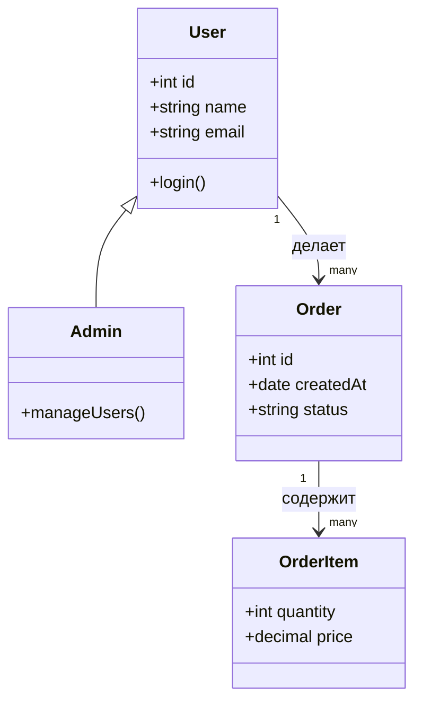

# Class diagram для системного аналитика

Class diagram в UML описывает структуру системы: классы, их атрибуты, методы и отношения между ними. В разработке Class diagram — инструмент архитектора и разработчика. Для аналитика — способ зафиксировать модель предметной области на уровне, достаточно детальном для передачи в разработку.

## Что аналитик видит в Class diagram

Аналитику не нужно рисовать Class diagram для каждого сервиса. Но читать и понимать их необходимо, чтобы:

- Сверять реализацию с требованиями
- Обсуждать с архитектором границы системы
- Понимать, какие данные где хранятся
- Видеть наследование и обобщение там, где оно не очевидно из текста

## Элементы Class diagram

**Класс** — прямоугольник, разделённый на три секции: имя, атрибуты, методы.

```
┌─────────────────┐
│     User        │
├─────────────────┤
│ - id: int       │
│ - name: string  │
│ - email: string │
├─────────────────┤
│ + login()       │
│ + getOrders()   │
└─────────────────┘
```

**Атрибуты** — поля класса. Нотация: `[видимость] имя: тип`.

- `+` public (доступен всем)
- `-` private (доступен только внутри класса)
- `#` protected (доступен классу и наследникам)

**Методы** — операции, которые класс может выполнять.

## Отношения между классами

**Ассоциация (Association).** Класс A знает о классе B. Самое общее отношение.

**Агрегация (Aggregation).** Часть может существовать без целого. Например, `Команда` содержит `Аналитиков`, но аналитик может перейти в другую команду.

**Композиция (Composition).** Часть не существует без целого. `Заказ` содержит `Позиции заказа`. Если заказ удалён — позиции тоже.

**Наследование (Generalization).** Класс-потомок расширяет класс-родителя. `Пользователь` → `Администратор`, `Менеджер`.



## Когда аналитик использует Class diagram

**На этапе анализа требований.** Вы описали сущности в ER-диаграмме, но нужно показать не только данные, но и поведение. Class diagram добавляет методы к сущностям.

**На этапе уточнения контракта.** Разработчики предлагают архитектуру, и аналитик проверяет, все ли бизнес-правила учтены в структуре классов.

**При документировании существующей системы.** Если системы нет, но нужно понять, как она устроена — Class diagram по коду (reverse engineering) даёт общую картину.

## Class diagram vs ER-диаграмма

| Class diagram | ER-диаграмма |
|---------------|-------------|
| Атрибуты + методы | Только атрибуты |
| Наследование и полиморфизм | Только связи |
| Ориентация на ООП | Ориентация на данные |
| Читают разработчики | Читают аналитики и заказчики |

На практике аналитик чаще использует ER-диаграмму для описания данных, а Class diagram — когда нужно обсудить архитектуру с разработчиками.

## Ключевые термины

- **Класс** — шаблон для создания объектов
- **Ассоциация** — связь между классами («знает о»)
- **Агрегация** — отношение «часть-целое» с независимыми частями
- **Композиция** — отношение «часть-целое» с зависимыми частями
- **Наследование** — отношение «является разновидностью»

## Что дальше

- **C4 — Context diagram** — взгляд на систему с высоты птичьего полёта
- **ER-диаграммы** — модель данных для аналитика

## Проверь себя

1. Чем композиция отличается от агрегации?
2. Когда аналитику полезен Class diagram?
3. Чем Class diagram отличается от ER-диаграммы?
