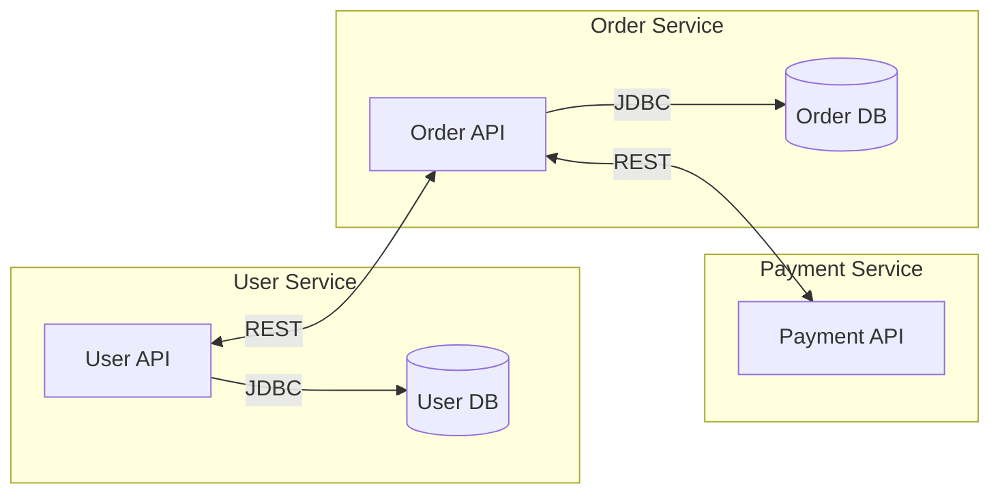

# UML — Component diagram

Component diagram показывает, как компоненты системы связаны друг с другом через интерфейсы. Это мост между логической моделью (классы) и физической (деплой).

## Что такое компонент

Компонент — это модуль с чёткой ответственностью и контрактом. В разных контекстах компонентом может быть:

- Микросервис
- Библиотека
- Модуль внутри монолита
- Плагин
- Внешняя система

**Правило:** компонент можно заменить на другой, реализующий тот же интерфейс, и система продолжит работать.

## Элементы диаграммы

| Элемент | Обозначение | Описание |
|---------|------------|----------|
| Component | Прямоугольник с значком | Модуль с интерфейсами |
| Interface | Шар / розетка | Контракт, который компонент предоставляет или требует |
| Dependency | Пунктирная стрелка | Зависимость между компонентами |
| Port | Квадрат на границе | Точка входа в компонент |

## Пример Component diagram

**Provided Interface** — что компонент предоставляет (User API).
**Required Interface** — что компоненту нужно от других (Payment API).

## Component diagram vs Class diagram

| Component | Class |
|-----------|-------|
| Крупные модули | Конкретные классы |
| Показывает интерфейсы | Показывает методы и атрибуты |
| Связи через контракты | Связи через ассоциации |
| Уровень архитектуры | Уровень реализации |

## Когда использовать

- Документирование микросервисной архитектуры
- Показ интеграций между модулями
- Onboarding новых разработчиков
- ADR — как иллюстрация архитектурного решения

## Component vs C4 Container

C4 Container — это тот же компонент, но в нотации C4. Разница:

- **Component diagram (UML)** — строгая нотация, интерфейсы явные.
- **C4 Container** — свободнее, проще для заказчика, быстрее рисуется.

Выбор зависит от аудитории. Для команды — UML Component. Для заказчика — C4.

## Что дальше

- **C4 — Container diagram** — альтернативная нотация
- **Data Flow Diagram** — потоки данных между компонентами

## Проверь себя

1. Что такое Provided Interface и Required Interface?
2. Чем Component diagram отличается от Class diagram?
3. В каком случае Component diagram предпочтительнее C4?
