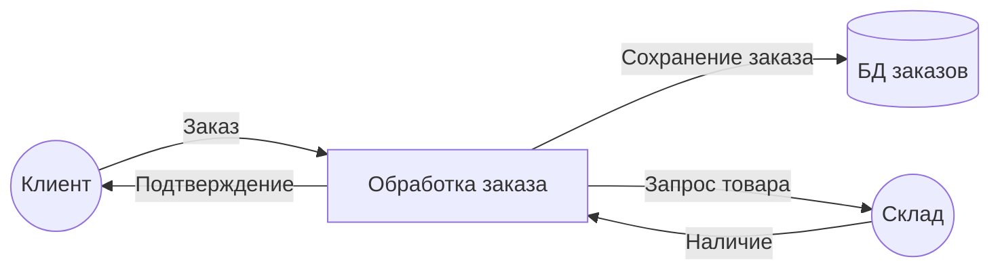

# Data Flow Diagram (DFD)

DFD — диаграмма потоков данных. Показывает, как данные движутся между процессами, хранилищами и внешними сущностями. В отличие от BPMN, DFD фокусируется на данных, а не на последовательности шагов.

## Элементы DFD

| Элемент | Нотация | Описание |
|---------|---------|----------|
| Process | Круг / прямоугольник со скруглениями | Действие, преобразующее данные |
| External Entity | Квадрат | Внешняя система, пользователь, источник данных |
| Data Store | Две параллельные линии | Хранилище данных (БД, файл) |
| Data Flow | Стрелка | Движение данных между элементами |

## Пример DFD (уровень 1)

## Уровни DFD

**Context Diagram (уровень 0).** Вся система — один процесс. Показывает внешние сущности и потоки данных на границе.

**Level 1.** Система декомпозирована на основные процессы. Каждый процесс — подсистема.

**Level 2 и далее.** Детализация каждого процесса из предыдущего уровня.

**Правило:** на каждом уровне не больше 7–9 процессов (правило человеческого восприятия).

## DFD vs BPMN

| DFD | BPMN |
|-----|------|
| Фокус: данные | Фокус: процесс |
| Нет временной последовательности | Есть timeline |
| Нет ролей (swimlanes) | Есть роли |
| Показывает хранилища данных | Не показывает |
| Проще | Детальнее |

## Когда использовать

- Проектирование интеграции между системами
- Анализ передачи данных (какие данные куда идут)
- На этапе Technical Design
- Когда нужно показать не последовательность шагов, а потоки данных

## Что дальше

- **UML — Component diagram** — как компоненты обмениваются данными
- **C4 — Container diagram** — архитектурный взгляд на потоки

## Проверь себя

1. Какие четыре элемента есть в DFD?
2. Чем DFD отличается от BPMN?
3. Что показывает Context Diagram (уровень 0)?
