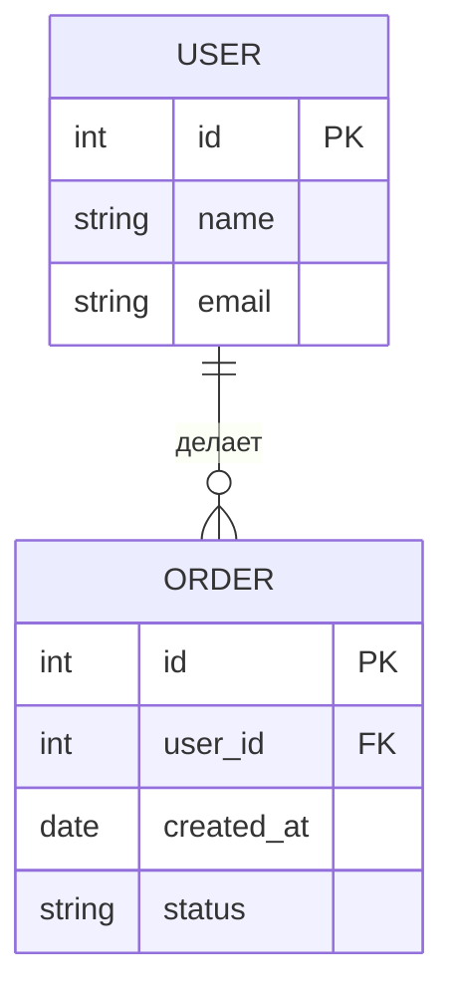

# ER-диаграммы (Entity-Relationship)

ER-диаграмма — это способ описать данные системы на уровне сущностей и связей между ними. Если Use Case diagram отвечает на вопрос «кто что делает», то ER-диаграмма — «с какими данными работает система».

## Основные понятия

**Сущность (Entity)** — объект, о котором система хранит данные. Пользователь, заказ, товар, платёж.

**Атрибут (Attribute)** — свойство сущности. У пользователя: имя, email, телефон, дата регистрации.

**Связь (Relationship)** — логическое соединение между сущностями. Пользователь «делает» заказ.

**Ключ (Key)** — уникальный идентификатор сущности. Обычно `id`.

## Нотация Чена (классическая)

Сущность — прямоугольник, атрибут — овал, связь — ромб.

Mermaid-диаграмма выше показывает: один пользователь может сделать много заказов, каждый заказ принадлежит одному пользователю.

## Типы связей

| Тип | Обозначение | Пример |
|-----|------------|--------|
| One-to-One (1:1) | `||--||` | Пользователь — Паспортные данные |
| One-to-Many (1:M) | `||--o&#123;` | Пользователь — Заказы |
| Many-to-Many (M:M) | `&#125;o--o&#123;` | Студент — Курсы |

**One-to-One.** Одному пользователю соответствует ровно одна запись с паспортными данными. В базе — внешний ключ с unique-ограничением.

**One-to-Many.** Один пользователь может сделать несколько заказов. Самый частый тип связи.

**Many-to-Many.** Студент может учиться на нескольких курсах, на курсе — много студентов. В базе нужна промежуточная таблица (student_course).

## Как аналитик строит ER-диаграмму

1. **Соберите существительные** из требований. Пользователь, заказ, товар, категория, платёж — это кандидаты в сущности.
2. **Отсеките не-сущности.** «Цвет», «статус» — атрибуты, а не сущности. «Отправка письма» — процесс, а не сущность.
3. **Определите связи.** Как сущности соотносятся друг с другом? Используйте бизнес-правила: «один заказ содержит много товаров».
4. **Назначьте атрибуты.** Для каждой сущности выпишите поля, которые нужны системе.
5. **Проверьте на нормализацию.** Нет ли повторяющихся групп? Не хранится ли одно и то же в двух местах?

## Распространённые ошибки

- **Атрибут вместо сущности.** Телефон пользователя — атрибут. Но если система хранит историю телефонов — это отдельная сущность `PhoneHistory`.
- **Избыточность.** Если поле можно вычислить из других данных (total = price × quantity), оно не нужно в модели.
- **Отсутствие связей.** Сущности не висят в воздухе — у каждой должна быть связь хотя бы с одной другой.
- **Слишком детально.** ER-диаграмма для аналитика — не физическая модель БД. Не нужно указывать типы полей и индексы.

## Ключевые термины

- **Entity** — сущность, объект предметной области
- **Attribute** — свойство сущности
- **Primary Key (PK)** — уникальный идентификатор записи
- **Foreign Key (FK)** — ссылка на ключ другой сущности
- **Cardinality** — количество элементов связи (один, много)

## Что дальше

- **Основы SQL** — как описанная модель превращается в таблицы базы данных
- **Class diagram для SA** — альтернативный способ моделирования данных

## Проверь себя

1. Чем сущность отличается от атрибута?
2. Какой тип связи используется, если студент может учиться на нескольких курсах?
3. Зачем нужна промежуточная таблица при Many-to-Many?
