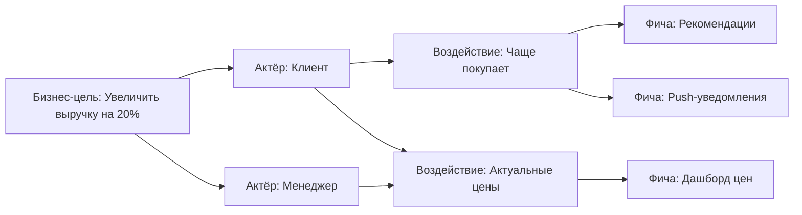

# Impact Mapping

Impact Mapping — стратегическая техника: как бизнес-цели связаны с поведением пользователей и конкретной функциональностью.

## Идея

Каждая фича должна быть обоснована: зачем мы это делаем, на чьё поведение хотим повлиять и как это приближает к бизнес-цели.

## Четыре уровня

1. **Goal (цель).** Почему мы это делаем? SMART-цель.
2. **Actor (актёр).** Кто может повлиять на цель? (пользователи, партнёры, система)
3. **Impact (воздействие).** Как актёр должен изменить поведение?
4. **Deliverable (фича).** Что мы сделаем, чтобы вызвать это воздействие?

## Как строить

1. **Сформулируйте цель.** «Увеличить конверсию в оплату с 2% до 5% за квартал».
2. **Назовите актёров.** Клиент, менеджер, кассир.
3. **Определите воздействие.** Что каждый актёр должен делать иначе?
4. **Предложите фичи.** Какая функциональность вызовет воздействие?

## Impact Mapping vs User Story Mapping

| Impact Mapping | User Story Mapping |
|----------------|-------------------|
| Стратегический уровень | Тактический уровень |
| От цели к фичам | От сценария к задачам |
| Отвечает на «зачем» | Отвечает на «что» |
| 1–2 часа с заказчиком | 2–4 часа с командой |
| Результат: roadmap | Результат: backlog |

## Когда использовать

- **На старте продукта.** Определить, что строить.
- **При изменении стратегии.** Пересмотреть приоритеты.
- **Перед крупным эпиком.** Понять, какие фичи действительно нужны.

## Что дальше

- **User Story Mapping** — детализация после Impact Mapping
- **User Stories** — запись конкретных фич

## Проверь себя

1. Какие четыре уровня в Impact Mapping?
2. Чем Impact Mapping отличается от Story Mapping?
3. Какой вопрос помогает не строить лишние фичи?
