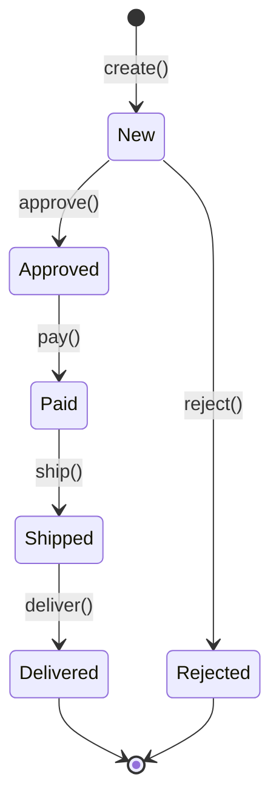
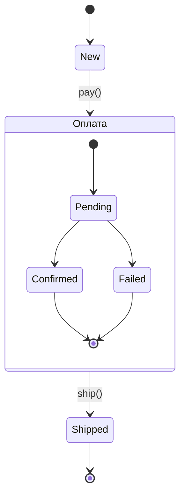

# State diagram (UML States)

State diagram описывает **жизненный цикл одного объекта**: через какие состояния он проходит и что вызывает переход между ними. Если Sequence diagram показывает взаимодействие объектов во времени, то State diagram — поведение одного объекта под воздействием событий.

## Когда нужен State diagram

State diagram полезен, когда у сущности есть **чёткие состояния** и **правила переходов** между ними:

- Заказ: `новый → подтверждён → оплачен → отправлен → доставлен`
- Задача в трекере: `открыта → в работе → на ревью → закрыта`
- Пользователь: `зарегистрирован → активирован → заблокирован`

Если у сущности 2–3 состояния и тривиальные переходы — State diagram избыточен. Если состояний больше 5 и есть развилки — диаграмма обязательна.

## Элементы State diagram

**Стартовое состояние** (`[*]`) — объект только что создан.

**Конечное состояние** (`[*]`) — жизненный цикл завершён.

**Состояние** — прямоугольник со скруглёнными углами, описывающий ситуацию, в которой объект находится в данный момент.

**Переход** — стрелка с подписью-событием, которое вызывает переход.

## Составные состояния

Одно состояние может содержать вложенные подсостояния:

Такой подход помогает не загромождать верхний уровень диаграммы.

## Как аналитик строит State diagram

1. **Выберите объект.** Не пытайтесь описать всю систему одной диаграммой. Одна диаграмма — один класс объектов.
2. **Выпишите состояния.** Какие устойчивые фазы проходит объект? «В обработке» — не состояние, а деятельность. Состояние — когда объект ждёт следующего события.
3. **Определите переходы.** Какое событие переводит объект из одного состояния в другое?
4. **Найдите ветвления.** Из одного состояния может быть несколько переходов — это нормально.
5. **Проверьте полноту.** Что происходит с объектом в каждой точке? Нет ли «зависших» состояний, из которых нет выхода?

## Антипаттерны

- **Состояние-свалка.** Если из одного состояния ведёт больше 5 переходов — скорее всего, внутри скрываются подсостояния.
- **God Object.** Если диаграмма описывает «Систему» или «Процесс» — вы рисуете не State, а Activity diagram.
- **Магические переходы.** Переход без события (или с событием «само по себе») — повод перепроверить требования.

## State vs BPMN

| State diagram | BPMN |
|---------------|------|
| Один объект | Много участников |
| Состояния и события | Действия и потоки |
| Нет ролей | Есть дорожки (lanes) |
| Хорош для жизненных циклов | Хорош для бизнес-процессов |

State diagram и BPMN не заменяют, а дополняют друг друга. State описывает поведение одного объекта, BPMN — взаимодействие нескольких участников.

## Ключевые термины

- **Состояние** — устойчивая фаза жизненного цикла объекта
- **Переход** — перемещение между состояниями по событию
- **Составное состояние** — состояние с вложенными подсостояниями
- **Событие** — триггер, вызывающий переход

## Что дальше

- **BPMN — продвинутый** — как моделировать сложные бизнес-процессы
- **Class diagram для SA** — структурный взгляд на систему

## Проверь себя

1. Чем State diagram отличается от BPMN?
2. Какие элементы обязательно есть на State diagram?
3. Что делать, если из одного состояния ведёт больше 5 переходов?
