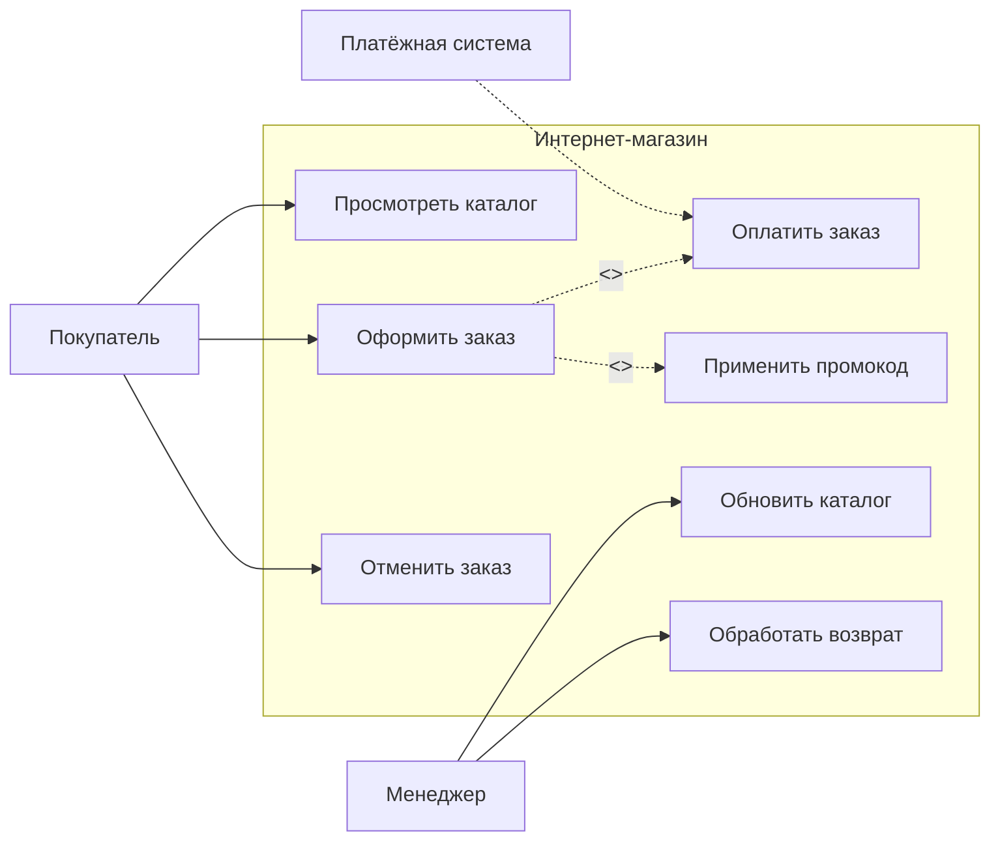

# Use Case diagram

:::note
Use Case diagram (диаграмма вариантов использования) показывает, кто взаимодействует с системой и какие действия может выполнять. Это самая верхнеуровневая модель системы — взгляд с высоты птичьего полёта.
:::

Представьте, что вы пришли в ресторан. Вы — посетитель (актёр), официант — тоже актёр. Вы можете сделать заказ, оплатить счёт, попросить добавку. Официант может принять заказ, принести блюдо, выписать счёт. Это и есть варианты использования — всё, что можно сделать в рамках системы «ресторан».

Use Case diagram не показывает, *как именно* работает система. Она показывает *кто* и *что может делать*.

## Основные элементы

**Актёр (Actor)** — человек, другая система или устройство, которое взаимодействует с системой. Обозначается человечком или прямоугольником с меткой `<<actor>>`. Актёр всегда находится *снаружи* системы.

**Вариант использования (Use Case)** — конкретная последовательность действий, которая приносит ценность актёру. Обозначается овалом. Название — глагол в инфинитиве: «Оформить заказ», «Оплатить счёт».

**Граница системы (System boundary)** — прямоугольник, внутри которого варианты использования, снаружи — актёры.

**Связи:**
- `association` — линия между актёром и use case (кто что делает).
- `extend` — пунктирная стрелка с `<<extend>>` — дополнительное поведение, которое включается по условию.
- `include` — пунктирная стрелка с `<<include>>` — обязательный шаг, который вызывается из другого use case.

## Пример

Система: «Интернет-магазин».

Актёры: Покупатель, Менеджер, Платёжная система.

## Как читать диаграмму

Читайте слева направо: актёры слева, варианты использования в центре. Актёры инициируют действия, система на них реагирует. Если use case включает другой — сначала выполняется основной, потом включённый. Если расширяет — дополнительный сценарий запускается только при выполнении условия.

## Когда использовать

Use Case diagram хорошо работает на старте проекта, когда нужно:
- Согласовать границы системы с заказчиком.
- Показать, кто будет работать с системой.
- Выявить основные функции до того, как углубляться в детали.

## Когда НЕ использовать

- Для описания сложной логики внутри одного варианта (используйте Sequence или BPMN).
- Для показа архитектуры системы или потоков данных.

## Почему это важно для аналитика

Use Case diagram — ваш первый инструмент, когда вы начинаете новый проект. Вместо того чтобы спрашивать «какие у вас требования?», вы рисуете актёров и варианты использования и обсуждаете с заказчиком: «Вот кто будет работать с системой. Вот что они смогут делать. Ничего не забыли?»

## Ключевые термины

- **Актёр** — внешняя сущность, взаимодействующая с системой.
- **Вариант использования (Use Case)** — описание последовательности действий, приносящих результат актёру.
- **Граница системы** — рамка, отделяющая систему от внешнего мира.
- **include** — обязательный вызов другого use case.
- **extend** — опциональное расширение поведения.

## Что дальше

После того как вы определили варианты использования, следующий шаг — детализировать их с помощью [Sequence diagram](/docs/modeling/sequence-diagram).

## Проверь себя

1. Чем отличается `include` от `extend`?
2. Почему актёр всегда находится за границей системы?
3. Нарисуйте Use Case diagram для банкомата: какие актёры и варианты использования?

**Ответы:**
1. `include` — обязательная часть основного сценария (оформление заказа включает оплату). `extend` — опциональное поведение, которое добавляется только при условии (применить промокод — только если он есть).
2. Актёр — внешняя сущность, он взаимодействует с системой, но не является её частью. Граница системы показывает, за что система отвечает, а за что — нет.
3. Актёры: Клиент, Банк, Инкассатор. Варианты использования: «Снять наличные», «Пополнить счёт», «Проверить баланс», «Перевести деньги».
