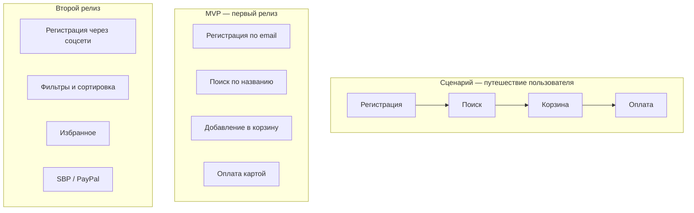

# User Story Mapping

User Story Mapping — техника визуализации продукта через пользовательские истории, организованные по сценариям использования. Придумал Jeff Patton.

## Проблема плоского бэклога

Обычный Product Backlog — это список:

1. Регистрация пользователя
2. Вход в систему
3. Просмотр каталога
4. Поиск товара
5. Добавление в корзину
6. Оформление заказа
7. Оплата
8. ...

Проблема: не видно целостной картины. PO видит список, но не понимает, где пробелы и какие сценарии не покрыты.

## User Story Map

Карта историй — это двумерная сетка. По горизонтали — сценарий использования (шаги пользователя). По вертикали — детализация (приоритеты).

**Backbone (скелет)** — ключевые шаги пользователя слева направо.
**Walking Skeleton** — минимальный сквозной сценарий (первая строка снизу).
**Детализация** — каждый шаг раскрывается сверху вниз по приоритету.

## Как строить

1. **Определите пользователя.** Для кого делаем?
2. **Напишите сценарий.** Что пользователь делает? Шаг за шагом. Это backbone.
3. **Декомпозируйте.** Для каждого шага — конкретные user stories.
4. **Приоритизируйте.** Снизу вверх: первая строка — MVP, выше — позже.
5. **Разметьте релизы.** Где граница MVP, v2, v3?

## Роль аналитика

Аналитик часто фасилитирует Story Mapping с PO и командой:

- Готовит доску (Miro) — backbone заранее
- Помогает декомпозировать эпики на stories
- Пишет Acceptance Criteria в процессе
- Фиксирует результат (оцифровка доски)

## Story Mapping vs Product Backlog

| Критерий | Story Map | Backlog |
|----------|-----------|---------|
| Целостность | Видно весь сценарий | Список без контекста |
| Приоритеты | Визуально | Через номер приоритета |
| Пробелы | Очевидны | Не видны |
| Коммуникация | Понятна заказчику | Понятна команде |

## Что дальше

- **Impact Mapping** — связь stories с бизнес-целями
- **User Stories** — как писать хорошие stories для карты

## Проверь себя

1. Чем Story Map отличается от Product Backlog?
2. Что такое walking skeleton?
3. Как определить границу MVP с помощью Story Map?
