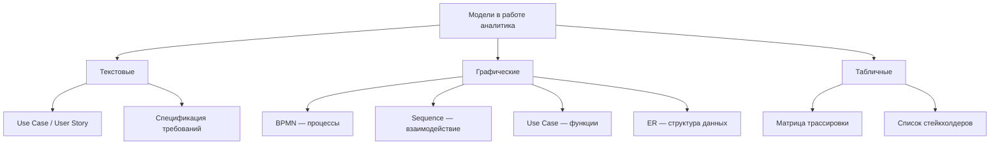

# Что такое модель и зачем моделировать

:::note
Модель — это упрощённое представление реальности, созданное для того, чтобы лучше понять, проанализировать или спроектировать что-то. Модель не обязана быть точной копией — она должна быть полезной.
:::

Представьте, что вам нужно объяснить другу планировку своей квартиры. Вы не будете чертить её в масштабе 1:1 — возьмёте листок и нарисуете схему: комнаты, двери, окна. На схеме не будет цвета обоев или материала пола, но она ответит на главный вопрос — где что находится. Это и есть модель.

Системные аналитики строят модели по той же причине: чтобы показать заинтересованным сторонам, как устроена система, как она работает и кто с кем взаимодействует. Модель помогает увидеть общую картину, не утонув в деталях.

## Зачем моделировать

Моделирование решает три задачи:

**Понимание.** Когда вы рисуете схему процесса или архитектуры, вы сами начинаете глубже понимать предмет. Неясности и противоречия всплывают на поверхность.

**Коммуникация.** Модель — это общий язык между бизнесом, аналитиками и разработчиками. Вместо того чтобы описывать словами «потом система проверяет статус и если он подтверждён, то…», вы показываете диаграмму, где всё видно за секунду.

**Документирование.** Готовая модель остаётся артефактом, к которому можно вернуться через месяц, чтобы вспомнить, как было задумано.

## Что может быть моделью

Моделью может быть что угодно: текст, схема, таблица, математическая формула. В работе системного аналитика чаще всего встречаются:

- **Текстовые модели** — use case, user story, спецификация требований.
- **Графические модели** — диаграммы: BPMN, Use Case, Sequence, ER.
- **Табличные модели** — матрицы трассировки, списки стейкхолдеров.

Каждый тип модели хорош для своей задачи. Текстом удобно описывать сценарии, графикой — показывать потоки и связи, таблицами — структурировать большие объёмы данных.

## Хорошая модель vs плохая

Хорошая модель:
- Отвечает на конкретный вопрос (не пытается объять необъятное).
- Понятна тем, для кого создана (заказчик поймёт схему процесса, разработчик — диаграмму классов).
- Имеет ровно столько деталей, сколько нужно для задачи (ни太少, ни太多).

Плохая модель:
- Пытается показать всё сразу — получается свалка, которую никто не читает.
- Использует сложную нотацию там, где хватило бы стрелочек и квадратиков.

## Почему это важно для аналитика

Моделирование — основной инструмент работы системного аналитика. Вы не пишете код, вы не управляете людьми — вы строите модели, которые превращают хаос требований в понятную структуру. Умение выбрать правильный тип модели и нарисовать её так, чтобы её поняли, — ключевой навык.

## Ключевые термины

- **Модель** — упрощённое представление реальности.
- **Нотация** — формальный язык моделирования (BPMN, UML).
- **Абстракция** — выделение главного и отбрасывание несущественного.
- **Уровень детализации** — степень подробности модели.

## Что дальше

Прочитайте следующую статью: [Use Case diagram](/docs/modeling/use-case-diagram) — первый тип диаграммы, который осваивает начинающий аналитик.

## Проверь себя

1. Почему модель не должна быть точной копией реальности?
2. Какие три задачи решает моделирование?
3. Приведите пример плохой модели, которую вы видели в работе или учёбе.

**Ответы:**
1. Точная копия — это сама реальность. Модель нужна, чтобы отбросить лишнее и сфокусироваться на главном. Если модель содержит все детали, она перестаёт быть полезной.
2. Понимание (разобраться самому), коммуникация (объяснить другим), документирование (сохранить знание).
3. Например, диаграмма, на которой нарисованы одновременно процессы, база данных, интерфейс и сетевые протоколы. Такую «свалку» невозможно прочитать.
