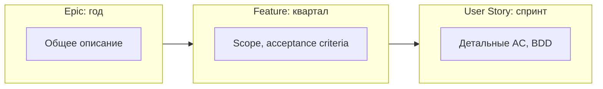

# Требования в Agile

В Agile требования не собираются один раз «в начале проекта». Они уточняются постоянно, от спринта к спринту. Это не хаос — это управляемый процесс, где глубина проработки соответствует времени до начала разработки.

## Just-in-Time (JIT) requirements

Принцип: требования уточняются непосредственно перед тем, как попасть в разработку, а не за три месяца до.

**Зачем:** требования дешевеют, когда их пишут вовремя, а не заранее. Бизнес меняется, и то, что было актуально в январе, может быть не нужно в марте.

**Риск:** команда может начать разрабатывать, не понимая, что делает. Задача аналитика — обеспечить достаточно деталей для старта и уточнять по мере работы.

## Level of Detail (LoD)

Глубина проработки зависит от горизонта планирования:

| Горизонт | Документ | Детализация |
|----------|----------|-------------|
| Roadmap (год) | Epic | Краткое описание, бизнес-ценность |
| Quarterly (квартал) | Feature | Acceptance Criteria, scope |
| Sprint (2 недели) | User Story | BDD-сценарии, детальные AC, прототипы |

## Backlog Refinement (Grooming)

Регулярная встреча (обычно раз в неделю), где команда и PO уточняют и приоритизируют бэклог.

**Что делают:**
- Декомпозируют крупные PBI на мелкие
- Уточняют Acceptance Criteria
- Оценивают (SP)
- Меняют приоритеты

**Роль аналитика:**
- Готовит детальные описания до grooming
- Отвечает на вопросы команды
- Фиксирует договорённости

## Как меняется документация

В Agile документация не исчезает — она становится легче.

- ADR — вместо толстых specs
- BDD-сценарии — вместо ТЗ на 100 страниц
- Sequence diagrams — вместо описания взаимодействия текстом
- Wiki (Confluence) — вместо папок с Word-документами

Документируется то, что:
- Меняется редко (архитектура, API-контракты)
- Нужно для compliance (регуляторные требования)
- Критично для понимания системы (ADR)

## Взаимодействие с PO

В Agile аналитик часто работает бок о бок с PO. Разделение такое:

| PO | Аналитик |
|----|----------|
| Отвечает за «зачем» и «что» | Отвечает за «как именно» |
| Приоритизирует бэклог | Детализирует требования |
| Общается с бизнесом | Общается с командой |
| Принимает решение о scope | Проверяет соответствие DoD |

Граница размыта. В некоторых командах SA выполняет функции PO. В некоторых PO пишет стори сам, а SA только уточняет.

## Что дальше

- **Scrum — детально** — как все события Scrum работают с требованиями
- **Ретроспективы** — как улучшать процесс управления требованиями

## Проверь себя

1. Что такое JIT requirements и зачем они нужны?
2. Какой уровень детализации нужен для Epic, Feature и Story?
3. Чем различаются роли PO и аналитика в Agile?
