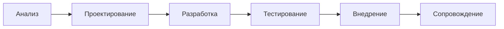
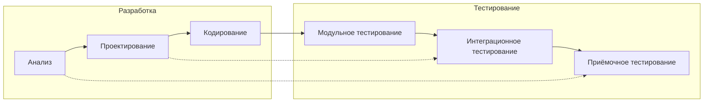
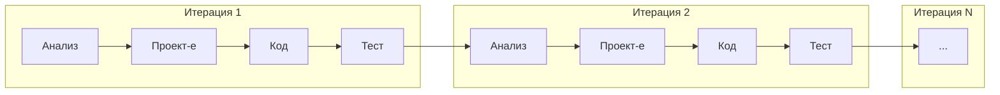

# SDLC — модели разработки

Жизненный цикл ПО (SDLC) — это последовательность этапов, через которые проходит проект от идеи до вывода из эксплуатации. Конкретная модель SDLC определяет, как эти этапы организованы во времени.

## Waterfall (каскадная)

Классическая модель: каждый этап завершается полностью до начала следующего.

**Когда работает:** проект с чёткими, неизменными требованиями — госзаказ, военная разработка, ERP-системы.

**Когда не работает:** любой проект, где требования уточняются в процессе. А это почти все современные проекты.

**Роль SA:** SA участвует на этапе анализа и проектирования. Составляет полную документацию до начала разработки. Риск — требования устаревают к моменту внедрения.

## V-model

Эволюция Waterfall. Каждому этапу разработки соответствует этап тестирования того же уровня.

**Когда работает:** проекты с высокими требованиями к качеству и надёжности — медицинское ПО, авионика, банковские системы.

**Роль SA:** SA участвует в анализе и приёмочном тестировании. Документация нужна полная до старта кодирования.

## Iterative (итеративная)

Проект делится на итерации (обычно 2–4 недели). Каждая итерация включает полный цикл: анализ → проектирование → разработка → тестирование.

**Когда работает:** почти всегда. Особенно когда требования не до конца ясны в начале.

**Важный нюанс:** итеративная модель — это не Scrum. Scrum — это фреймворк, реализующий итеративный подход с конкретными правилами. Итеративная модель описывает общий принцип.

**Роль SA:** требования уточняются от итерации к итерации. SA работает в цикле: собрал → описал → получил обратную связь → уточнил.

## Сравнение

| Модель | Гибкость | Риск | Документация | Когда выбрать |
|--------|----------|------|-------------|---------------|
| Waterfall | Низкая | Высокий | Много | Требования стабильны |
| V-model | Низкая | Средний | Много | Критична надёжность |
| Iterative | Высокая | Низкий | По мере необходимости | Требования уточняются |

## Что дальше

- **Scrum — основы** — практический фреймворк для итеративной разработки
- **Kanban — основы** — альтернатива для потоковой работы

## Проверь себя

1. В каком случае Waterfall оправдан?
2. Чем V-model отличается от Waterfall?
3. Почему итеративная модель снижает риск?
