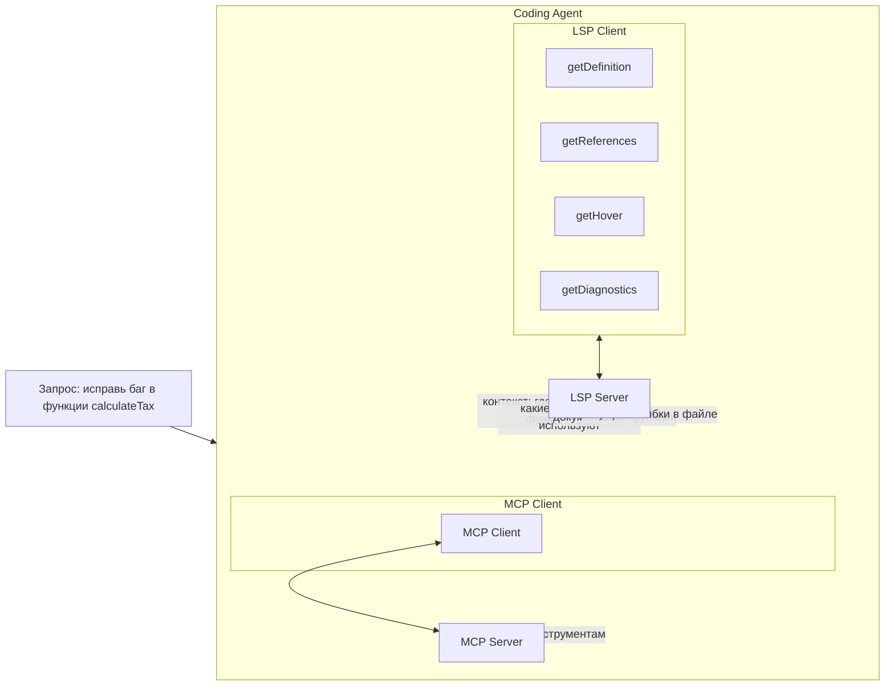
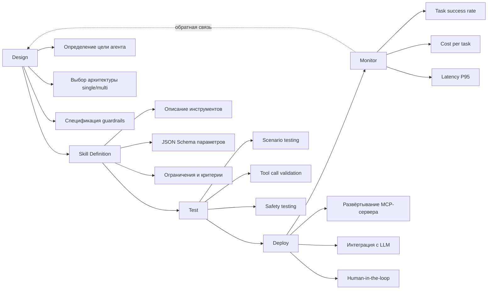
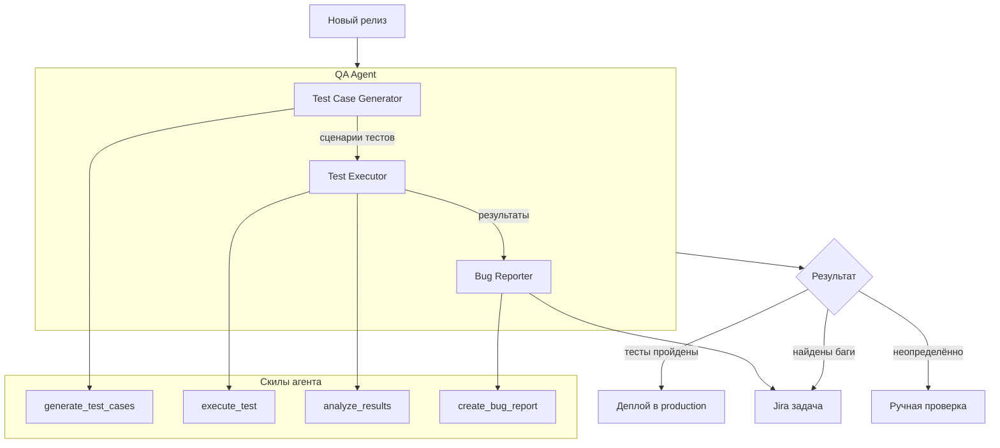

:::info TL;DR
Проектирование AI-агента для продакшна требует не только понимания LLM и инструментов, но и навыков спецификации: как описывать скилы (skills), как обеспечивать надёжность, как тестировать и мониторить. Аналитик отвечает за требования к поведению агента, его ограничениям, качеству и безопасности. LSP (Language Server Protocol) — важный пример того, как агенты получают контекст для работы с кодом.
:::

## Для кого эта статья

- Системные аналитики, специфицирующие скилы и ограничения AI-агентов
- Разработчики, проектирующие архитектуру агентных систем
- Tech leads, оценивающие надёжность и стоимость агентных решений
- QA-инженеры, тестирующие AI-агентов

## После прочтения вы узнаете

- Как проектировать скилы (skills) агента: структура, типы, требования
- Как LSP помогает кодинг-агентам работать с кодовой базой
- Какие фреймворки существуют для разработки агентов (LangGraph, CrewAI, AutoGen)
- Как обеспечивать надёжность и тестировать агентов
- Какие ключевые решения принимает аналитик при проектировании агентной системы

## Скилы агента: проектирование инструментов

**Skill** (или capability) — это описание того, что агент умеет делать. Каждый скил реализуется через один или несколько инструментов.

### Структура скила

При спецификации скила аналитик должен описать:

```yaml
Skill: Анализ документации
Description: Ищет информацию в корпоративной базе знаний и выдаёт краткое резюме
Tools:
  - search_knowledge_base(query, top_k)
  - summarize_text(text, max_length)
Limitations:
  - Работает только с документами, загруженными в систему
  - Не анализирует PDF-изображения (только текст)
  - Максимум 3 релевантных документа за один запрос
Quality criteria:
  - Ответ должен содержать ссылки на источники
  - Если ответа нет в базе — сообщить, а не галлюцинировать
  - Краткость: не более 3 абзацев
```

### Типы скилов

| Тип | Описание | Пример |
|-----|----------|--------|
| **Read** | Чтение данных без изменений | Поиск, чтение файла, SQL SELECT |
| **Write** | Создание/изменение данных | Создать задачу, отправить письмо |
| **Compute** | Вычисления без внешних эффектов | Математика, анализ текста |
| **Control** | Управление другими агентами | Запустить подчинённого агента |
| **Sensory** | Получение информации из внешней среды | Погода, курс валют, статус сервиса |

### Требования к каждому скилу

1. **Idempotency** — можно ли вызывать скил несколько раз без негативных последствий
2. **Cost** — сколько токенов/денег стоит один вызов
3. **Latency** — ожидаемое время выполнения
4. **Error modes** — какие ошибки возможны и как агент должен на них реагировать
5. **Access level** — какие данные доступны, какие — нет

## LSP и контекст для кодинг-агентов

**LSP (Language Server Protocol)** — протокол Microsoft для интеграции редакторов кода с языковыми серверами, которые предоставляют автодополнение, переход к определению, рефакторинг и другие возможности IDE.

Для кодинг-агентов (Copilot, Cursor, Claude Code) LSP критичен, потому что:



### Что LSP даёт агенту

| Возможность LSP | Что агент получает | Пример использования |
|----------------|-------------------|---------------------|
| go-to-definition | Знает, где объявлена функция | «Обнови сигнатуру функции calculateTax» |
| find-references | Знает, где используется | «Проверь все вызовы после рефакторинга» |
| hover | Типы и документация | «Что возвращает эта функция?» |
| completion | Предложения по коду | «Напиши вызов этой функции с правильными параметрами» |
| diagnostics | Ошибки и предупреждения | «Исправь ошибки компиляции в этом файле» |
| code actions | Рефакторинг | «Переименуй функцию везде» |

### Требования к LSP-интеграции для агентов

При спецификации кодинг-агента аналитик должен учесть:

- **Какие языки поддерживает LSP-сервер** (TypeScript, Python, Java, Go)
- **Есть ли доступ к проекту** (локальный файл, git-репозиторий)
- **Лимиты** — максимальное количество файлов для анализа
- **Контекст** — сколько строк кода агент «видит» одновременно
- **Безопасность** — может ли агент изменять код без подтверждения

## Фреймворки для разработки агентов

### LangGraph (от LangChain)

Графовый подход: шаги агента — узлы графа, переходы — рёбра.

**Когда использовать:** нужен детальный контроль над логикой агента, сложные multi-step сценарии.
**Роль аналитика:** специфицировать граф состояний: узлы (что делает агент) и переходы (условия перехода).

### CrewAI

Мультиагентный фреймворк с ролевым подходом.

**Когда использовать:** быстрая сборка мультиагентной системы с чёткими ролями.
**Роль аналитика:** определить роли агентов, их цели, инструменты и правила взаимодействия.

### AutoGen (от Microsoft)

Гибкий фреймворк для мультиагентных conversation-based систем.

**Когда использовать:** агенты, которые общаются естественным языком для решения задач.
**Роль аналитика:** специфицировать протокол диалога, условия завершения, механизмы эскалации.

## Надёжность агентов

### Проблемы и решения

| Проблема | Описание | Решение |
|----------|----------|---------|
| **Hallucination** | Агент выдумывает результат инструмента | Всегда показывать реальный результат инструмента, валидировать JSON |
| **Infinite loop** | Агент вызывает инструменты бесконечно | Max steps guard, timeout, budget limit |
| **Wrong tool** | Агент вызывает не тот инструмент | Улучшить описание инструментов, тестировать на edge cases |
| **Prompt injection** | Пользователь пытается взломать агента | Input sanitization, guardrails, separation of system/user messages |
| **Cost explosion** | Агент тратит слишком много токенов | Cost limit per session, мониторинг, алерт |

### Тестирование агентов

Традиционное unit-тестирование не работает для агентов (результат недетерминирован). Вместо этого:

1. **Scenario testing** — тестовые сценарии с ожидаемым поведением
2. **Tool call validation** — проверка, что агент вызвал правильные инструменты с правильными параметрами
3. **Output quality** — экспертная оценка качества ответов (или LLM-as-judge)
4. **Edge case testing** — что агент делает при ошибке инструмента, при пустом результате, при timeout
5. **Safety testing** — попытки prompt injection, тесты guardrails

### Метрики качества агента

| Метрика | Что измеряет | Как собирать |
|---------|-------------|-------------|
| **Task success rate** | Доля успешно выполненных задач | Автоматически (по completion status) |
| **Average steps** | Среднее количество шагов на задачу | Из логов |
| **Tool accuracy** | Доля правильных вызовов инструментов | Экспертная/автоматическая проверка |
| **Human escalation rate** | Доля переданных человеку | Из логов |
| **Average cost** | Средняя стоимость задачи | Мониторинг токенов |
| **Latency P95** | Время выполнения | Метрики |

## Ключевые технические решения для аналитика

При проектировании агентной системы аналитик принимает решения по:

1. **Один агент или мультиагент?** — по сложности задачи и экспертизе
2. **Какие скилы нужны?** — read/write/compute/control
3. **Какие guardrails?** — что агент не может делать
4. **Human-in-the-loop?** — где нужен человек
5. **Как тестировать?** — scenario testing, tool call validation
6. **Как мониторить?** — success rate, cost, latency, safety
7. **Какие протоколы?** — MCP (инструменты), LSP (код), API

## Процесс разработки AI-агента



## Ключевые термины

- **Skill** — описание возможности агента: инструменты, ограничения, критерии качества
- **LSP (Language Server Protocol)** — протокол для контекста кода (типы, определения, ошибки)
- **Tool calling** — механизм вызова LLM внешних функций
- **Guardrails** — программные ограничения на действия агента
- **Scenario testing** — тестирование агента на типовых сценариях (не unit-тесты)
- **Prompt injection** — атака, при которой пользователь пытается переопределить поведение агента

## Практический кейс: Разработка AI-агента для QA-тестирования

### Контекст

Продуктовая IT-компания «СофтВерификация» выпускает 50 релизов в месяц. Ручное QA-тестирование занимает 200 часов в неделю, при этом пропускается 15% багов. Решение — разработать AI-агента для автоматизации QA-процесса.

### Архитектура решения



### Результаты

| Метрика | До внедрения | После внедрения | Улучшение |
|---------|-------------|----------------|-----------|
| Скорость тестирования | 200 часов/нед | 1000 тестов/час | 10x |
| Bug detection rate | 85% | 92% | +7% |
| False positive rate | 12% | 8% | -33% |
| Время от релиза до отчёта | 24 часа | 45 минут | 97% |
| Cost на один релиз | $4,000 | $600 | -85% |

**ROI:** При 50 релизах/месяц и cost $4,000 → $600 экономия составляет $170,000/месяц. Агент обрабатывает 1000 тестов в час с точностью обнаружения багов 92% и всего 8% ложных срабатываний. Окупаемость — 1 месяц.

### Вывод

AI-агент для QA-тестирования увеличил скорость проверки релизов в 10 раз (1000 тестов/час), повысил точность обнаружения багов до 92% и снизил стоимость одного релиза на 85%.

## Что дальше

- [Мультиагентные системы](/docs/specialization/ai-agents-multi) — распределение задач между агентами
- [MCP — Model Context Protocol](/docs/specialization/ai-agents-mcp) — стандарт подключения инструментов
- [Этика и регуляторика ИИ](/docs/specialization/ai-ethics) — bias и безопасность агентов

## Проверь себя

1. **Что такое skill агента и из чего он состоит?**
   *Ответ:* Skill — описание возможности агента: набор инструментов, ограничения, критерии качества, стоимость, уровень доступа.

2. **Как LSP помогает кодинг-агенту?**
   *Ответ:* LSP предоставляет контекст о коде: где объявлены функции, как они используются, какие ошибки компиляции, типы и документация. Без LSP агент «слепой» в кодовой базе.

3. **Почему unit-тесты не подходят для агентов?**
   *Ответ:* Результат агента недетерминирован — LLM может дать разные ответы на один запрос. Вместо этого используют scenario testing (тестовые сценарии) и tool call validation (проверка вызова инструментов).

4. **Какие пять типов скилов агента существуют?**
   *Ответ:* Read (чтение), Write (запись), Compute (вычисления), Control (управление), Sensory (внешняя среда).

5. **Какие метрики качества агента нужно отслеживать в продакшне?**
   *Ответ:* Task success rate, Average steps, Tool accuracy, Human escalation rate, Average cost, Latency P95.

## Ссылки

1. [LangChain — Agent development guide](https://python.langchain.com/docs/how_to/#agents)
2. [Microsoft AutoGen — Getting Started](https://microsoft.github.io/autogen/stable/)
3. [OpenAI Agents SDK documentation](https://platform.openai.com/docs/guides/agents)
4. [Anthropic — Tool use (function calling)](https://docs.anthropic.com/en/docs/build-with-claude/tool-use)
5. [CrewAI — Building multi-agent systems](https://docs.crewai.com/)
