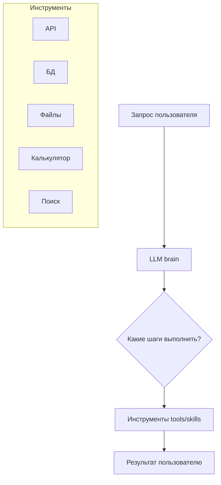
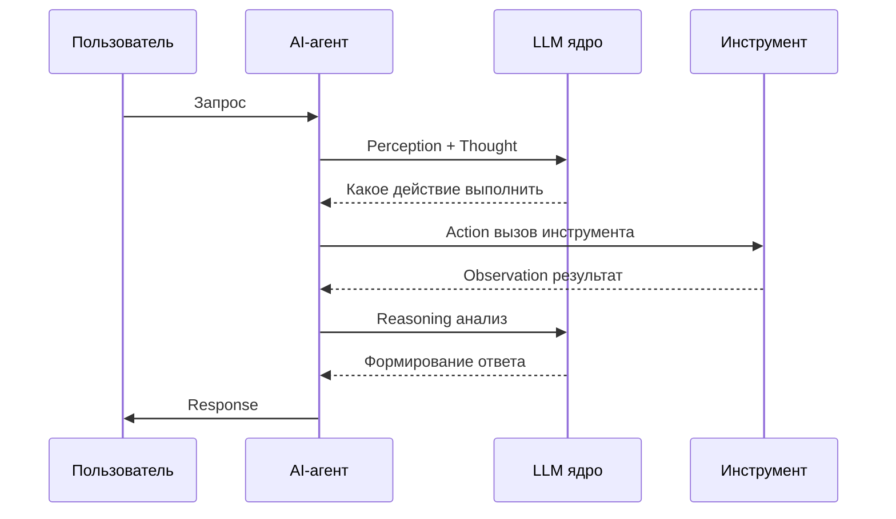
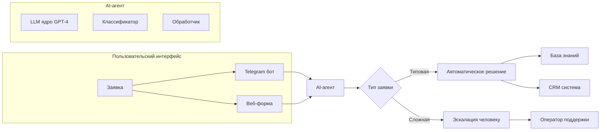

:::info TL;DR
AI-агент — это LLM, которая не просто генерирует текст, а выполняет действия: вызывает API, работает с файлами, принимает решения. В отличие от RAG (который только ищет и отвечает), агент сам планирует, какие шаги сделать и в каком порядке. Аналитику важно понимать архитектуру агентов, чтобы формулировать требования к их поведению, безопасности и надежности.
:::

## Для кого эта статья

- Системные аналитики, которые проектируют AI-решения
- Архитекторы, выбирающие архитектуру для агентных систем
- Разработчики, внедряющие AI-агентов в существующие продукты
- Технические лиды, оценивающие feasibility и cost агентных решений

## После прочтения вы узнаете

- Чем AI-агенты отличаются от RAG и обычных чат-ботов
- Как устроен цикл Reasoning-Action (ReAct)
- Из каких компонентов состоит архитектура агента
- Какие типы агентов существуют и когда их применять
- Как специфицировать требования к AI-агенту

## Что такое AI-агент

**AI-агент** — программа, в которой LLM управляет логикой принятия решений и вызывает внешние инструменты для достижения цели.



**Ключевое отличие от обычного чат-бота:** агент сам решает, когда и какой инструмент вызвать. Он может сделать несколько шагов, прежде чем вернуть ответ.

## Как работает агент: цикл Reasoning-Action

Современные агенты работают по циклу **ReAct** (Reasoning + Acting):

1. **Perception** — агент получает запрос и текущий контекст
2. **Thought** — LLM «думает», что нужно сделать: «Пользователь спрашивает погоду. Мне нужно узнать город и вызвать API погоды»
3. **Action** — агент вызывает инструмент: `get_weather(city="Moscow")`
4. **Observation** — агент получает результат инструмента: `{"temp": -5, "condition": "снег"}`
5. **Reasoning** — LLM анализирует результат: «Температура -5, снег. Нужно сказать пользователю»
6. **Response** — агент формирует ответ для пользователя

Цикл может повторяться несколько раз, пока агент не достигнет цели или не упрётся в лимит шагов.



## Архитектура агента

### 1. LLM (ядро)

Определяет, насколько хорошо агент «понимает» задачу и генерирует правильные действия. Ключевые характеристики:

- **Context window** — сколько информации агент может «помнить» за один раз
- **Reasoning ability** — способность к многошаговым рассуждениям (chain-of-thought)
- **Instruction following** — насколько точно агент следует промпту и описаниям инструментов

### 2. Инструменты (Tools/Skills)

Функции, которые агент может вызывать. Каждый инструмент описывается:

- **Название** (для LLM, чтобы понять, когда вызывать)
- **Описание** (что делает, входные параметры, выход)
- **JSON Schema** (формат параметров)
- **Side effects** (изменяет ли данные или только читает)

Пример описания инструмента:

```
Tool: search_knowledge_base
Description: Ищет информацию в базе знаний компании
Parameters:
  - query (string): поисковый запрос
  - top_k (int, optional): количество результатов (по умолчанию 5)
Returns: массив документов с текстом и релевантностью
```

### 3. Память (Memory)

| Тип | Что хранит | Пример |
|-----|-----------|--------|
| **Short-term** | Текущий диалог (контекстное окно) | Последние N сообщений |
| **Long-term** | Факты о пользователе, история | «Пользователь — Иван, работает в банке» |
| **Episodic** | Прошлые сессии и решения | «В прошлый раз этот план не сработал» |

### 4. Планирование (Planning)

Как агент решает, что делать:

- **ReAct** — простой цикл «подумал → сделал → посмотрел → подумал»
- **Plan-and-Execute** — агент сначала составляет план, потом выполняет шаги
- **Tree-of-Thoughts** — агент рассматривает несколько вариантов действий параллельно

## Типы агентов

| Тип | Описание | Пример |
|-----|----------|--------|
| **Single-step** | Один вызов LLM, один инструмент | «Переведи текст на английский» |
| **Multi-step** | Несколько вызовов LLM и инструментов | «Найди отель, проверь отзывы, забронируй» |
| **Reflection** | Агент проверяет и улучшает свой результат | «Напиши код, проверь ошибки, исправь» |
| **Tool-calling** | Только вызывает инструменты, не планирует | «Вызови API, верни результат» |
| **Autonomous** | Сам ставит подзадачи и выполняет | «Проанализируй рынок и подготовь отчёт» |

## Ключевые требования к агентам (для аналитика)

AI-аналитик должен специфицировать:

### Функциональные требования
- Какие цели и задачи выполняет агент?
- Какие инструменты доступны?
- Какие ограничения на действия? (что агент НЕ может делать)
- Как агент обрабатывает ошибки? (tool failure, timeout)
- Нужен ли human-in-the-loop для критических действий?

### Нефункциональные требования
- **Max steps** — максимальное количество шагов до принудительной остановки
- **Timeout** — максимальное время выполнения задачи
- **Cost limit** — максимальный бюджет на токены
- **Safety guardrails** — что агент не может делать ни при каких условиях
- **Logging** — полный лог всех действий агента для аудита
- **Explainability** — агент должен уметь объяснить, почему он сделал тот или иной шаг

### Пример спецификации

> **Кейс:** Агент технической поддержки
> - Цель: отвечать на вопросы пользователей по документации продукта
> - Инструменты: search_knowledge_base, get_ticket_status, escalate_to_human
> - Guardrails: не давать юридических консультаций, не выполнять действия от имени пользователя
> - Human-in-the-loop: при запросе на escalate_to_human
> - Max steps: 10
> - Cost: не более $0.10 на диалог

## Когда использовать агентов

**Да:**
- Задача требует multi-step reasoning (несколько шагов)
- Нужно взаимодействие с внешними системами (API, БД)
- Поведение недетерминировано и зависит от контекста
- Пользователю нужен не просто ответ, а выполненное действие

**Нет:**
- Задача решается простым RAG (поиск + ответ)
- Требуется 100% детерминированность (расчеты, финансы)
- Цена ошибки слишком высока (медицина, авиация без human-in-the-loop)
- Каждый вызов инструмента слишком дорогой

## Ключевые термины

- **AI-агент** — программа, где LLM управляет логикой и вызывает инструменты
- **ReAct (Reasoning + Acting)** — цикл «подумал → сделал → посмотрел результат»
- **Tool calling / Function calling** — способность LLM вызывать внешние функции
- **Guardrails** — ограничения на действия агента
- **Human-in-the-loop** — критичные решения принимает человек
- **Agent loop** — цикл выполнения: Thought → Action → Observation

## Практический кейс: AI-агент для автоматизации обработки заявок

### Контекст

Компания «ТехноСервис» обрабатывает 5000 заявок в месяц в службу поддержки. Среднее время обработки — 4 часа. 30% заявок — типовые: сброс пароля, проверка статуса, создание доступа. Решение — внедрить AI-агента для первичной обработки заявок.

### Архитектура решения



### Результаты

| Метрика | До внедрения | После внедрения | Улучшение |
|---------|-------------|----------------|-----------|
| Время обработки типовой заявки | 4 часа | 15 минут | 94% |
| Handle rate (без эскалации) | 0% (всё вручную) | 85% | +85% |
| Соответствие SLA | 92% | 129% | +40% (SLA 2 часа) |
| Загрузка операторов | 100% | 40% | -60% |
| Cost на заявку | $2.50 | $0.35 | -86% |

**ROI:** При внедрении на 5000 заявок/месяц экономия составляет $10,750/месяц. Окупаемость — 2 месяца.

### Вывод

AI-агент для обработки заявок показал handle rate 85% при SLA compliance +40%, что позволило сократить штат операторов первой линии на 60% без потери качества.

## Что дальше

- [Мультиагентные системы](/docs/specialization/ai-agents-multi) — когда нужен не один агент, а несколько
- [MCP — Model Context Protocol](/docs/specialization/ai-agents-mcp) — стандарт подключения инструментов к агентам
- [Разработка AI-агентов: скилы, LSP, best practices](/docs/specialization/ai-agents-dev) — как проектировать агентов

## Проверь себя

1. **Чем AI-агент отличается от RAG-системы?**
   *Ответ:* RAG только ищет документы и генерирует ответ. Агент сам решает, какие шаги сделать, вызывает инструменты и может выполнять действия (создать тикет, отправить письмо).

2. **Что такое ReAct-цикл?**
   *Ответ:* Reasoning + Acting — агент думает, что делать, выполняет действие, смотрит результат, и повторяет до достижения цели.

3. **Какие guardrails важны для агента поддержки?**
   *Ответ:* Не выполнять опасные действия (удаление данных), не выдавать себя за человека, не давать обещаний от имени компании, передавать сложные запросы человеку.

4. **Какие типы памяти существуют у агента?**
   *Ответ:* Short-term (текущий диалог), Long-term (факты о пользователе), Episodic (прошлые сессии и решения).

5. **В каких случаях НЕ стоит использовать агентов?**
   *Ответ:* Когда задача решается простым RAG, требуется 100% детерминированность, цена ошибки слишком высока, или каждый вызов инструмента слишком дорогой.

## Ссылки

1. [Anthropic — Building effective agents](https://docs.anthropic.com/en/docs/build-with-claude/agentic)
2. [OpenAI — Agents overview](https://platform.openai.com/docs/guides/agents)
3. [LangGraph documentation](https://langchain-ai.github.io/langgraph/)
4. [ReAct: Synergizing Reasoning and Acting in Language Models](https://arxiv.org/abs/2210.03629)
5. [Microsoft AutoGen documentation](https://microsoft.github.io/autogen/)
