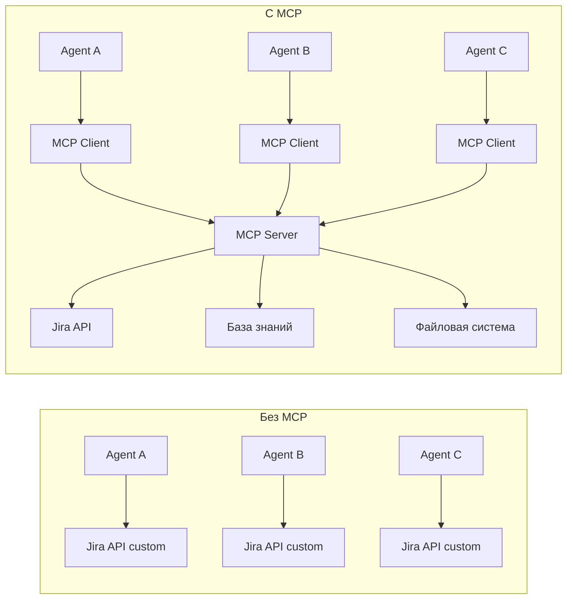
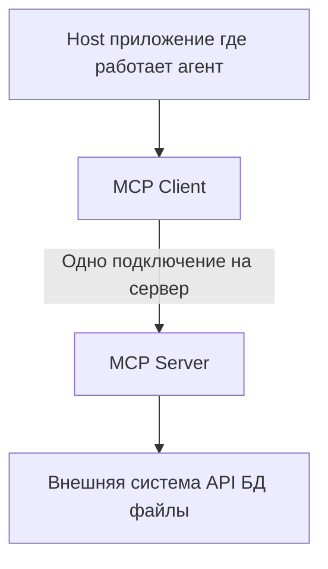
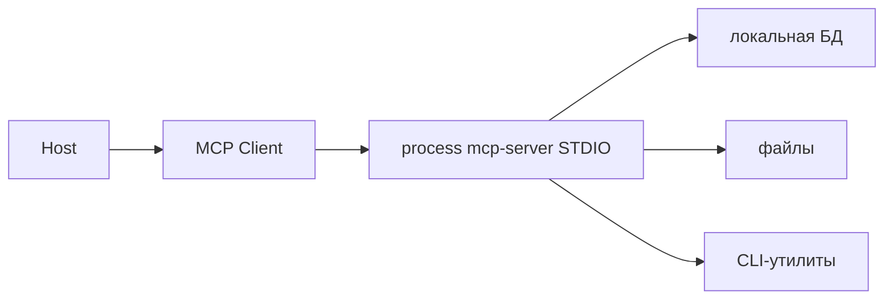
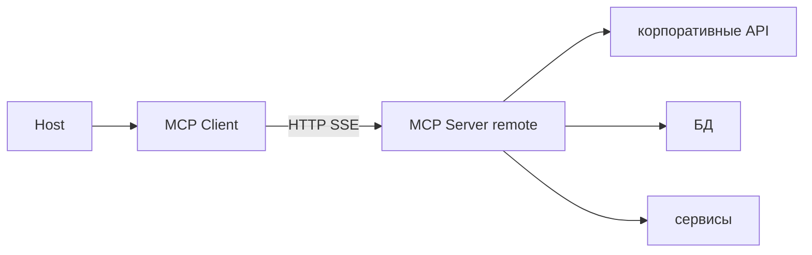
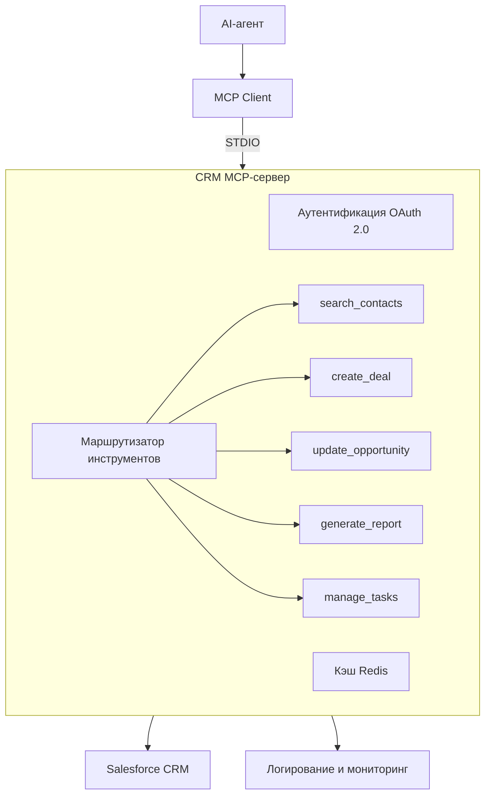

:::info TL;DR
MCP (Model Context Protocol) — открытый протокол от Anthropic, стандартизирующий подключение внешних инструментов и источников данных к AI-агентам. Вместо того чтобы для каждого инструмента писать собственную интеграцию, MCP предоставляет единый интерфейс: агент «подключается» к MCP-серверу и получает доступ ко всем его возможностям. Аналитику важно понимать MCP, чтобы правильно специфицировать интеграцию AI-агентов с корпоративными системами.
:::

## Для кого эта статья

- Системные аналитики, специфицирующие интеграцию AI-агентов с корпоративными системами
- Архитекторы, проектирующие инфраструктуру подключения инструментов к LLM
- Разработчики, реализующие MCP-серверы и клиенты
- Tech leads, оценивающие стандарты взаимодействия агентов с внешними системами

## После прочтения вы узнаете

- Какую проблему решает MCP и в чём его преимущество перед кастомными интеграциями
- Как устроена архитектура MCP: Host, Client, Server
- Какие типы возможностей предоставляет MCP-сервер (Tools, Resources, Prompts)
- Чем различаются транспорты STDIO и SSE
- Как специфицировать требования к MCP-интеграции

## Проблема, которую решает MCP

Сегодня каждый AI-агент требует собственной интеграции с инструментами:

- Для доступа к базе знаний — своя реализация RAG
- Для вызова Jira API — своя функция
- Для работы с файлами — своя логика
- Для доступа к БД — свой SQL-клиент

MCP стандартизирует это:

## Архитектура MCP

MCP использует архитектуру «клиент-сервер»:

### Три ключевых компонента:

1. **Host** — приложение, в котором работает агент (например, Claude Desktop, IDE, веб-приложение)
2. **MCP Client** — компонент, который агент использует для подключения к MCP-серверу
3. **MCP Server** — программа, предоставляющая инструменты, ресурсы и промпты через стандартизированный протокол

## Что предоставляет MCP-сервер

### 1. Инструменты (Tools)

Функции, которые агент может вызывать (как обычные инструменты, но стандартизированные):

| Tool | Описание | Пример вызова |
|------|----------|---------------|
| `read_file` | Читает файл | `{path: "/docs/report.pdf"}` |
| `query_database` | SQL-запрос | `{sql: "SELECT * FROM users"}` |
| `search_jira` | Поиск задач | `{project: "AI", status: "open"}` |
| `send_email` | Отправка письма | `{to: "user@co.com", subject: "..."}` |

Каждый инструмент описан через JSON Schema, включая:
- Название и описание
- Входные параметры (тип, обязательность, описание)
- Выходные данные
- Побочные эффекты (чтение/запись)

### 2. Ресурсы (Resources)

Данные, которые агент может читать (как API):

- Файлы: `file:///docs/report.pdf`
- Базы данных: `db://customers/active`
- API: `http://api.company.com/status`
- Репозитории: `git://ai/analyst-knowledge-base`

Ресурсы имеют URI-адресацию и MIME-типы для автоматической обработки.

### 3. Промпты (Prompts)

Шаблоны промптов, которые MCP-сервер предоставляет агенту для типовых задач:

- `analyze_codebase` — промпт для анализа кодовой базы
- `generate_report` — промпт для генерации отчёта
- `debug_error` — промпт для анализа ошибки

## Транспорт: как MCP-серверы общаются

### STDIO (локальные серверы)

MCP-сервер запускается как дочерний процесс. Идеально для локальных инструментов:

**Когда использовать:** локальные инструменты, безопасность не критична (всё на одной машине).

### SSE (Server-Sent Events)

MCP-сервер работает как HTTP-сервер, клиент подключается через SSE:

**Когда использовать:** удалённые сервисы, облачные инструменты, корпоративные системы.

## Требования к MCP-интеграции (для аналитика)

При спецификации MCP-архитектуры аналитик должен определить:

### Какие MCP-серверы нужны

| Сервер | Предоставляет | Кому нужен | Безопасность |
|--------|--------------|------------|-------------|
| File System | Чтение/запись файлов | Агенту-документоводу | Sandbox: только определённая директория |
| Database | SQL-запросы к БД | Аналитическому агенту | Read-only для production, read-write для dev |
| Jira | CRUD задачи/проекты | PM-агенту | Только его проекты |
| Slack | Чтение/отправка сообщений | Коммуникационному агенту | Только каналы поддержки |

### Аутентификация и авторизация

- Как MCP-сервер аутентифицирует клиента (API key, OAuth, mTLS)
- Какие права доступа у агента (read-only / read-write)
- Как логируются все вызовы инструментов
- Поддерживает ли сервер отзыв доступа

### Мониторинг

| Метрика | Что измеряет | Порог |
|---------|-------------|-------|
| Tool call latency | Время выполнения инструмента | < 2 сек |
| Error rate | Доля неуспешных вызовов | < 1% |
| MCP server uptime | Доступность сервера | 99.9% |
| Rate limit | Максимум вызовов в минуту | Зависит от системы |

### Безопасность

- **Sandboxing** — MCP-сервер должен работать в изолированной среде
- **Input validation** — все параметры инструментов проверяются
- **Output filtering** — чувствительные данные не должны попадать в лог
- **Rate limiting** — защита от DoS и превышения бюджета

## MCP vs обычные API

| Критерий | Обычное API | MCP |
|----------|------------|-----|
| Стандартизация | У каждого своя | Единый протокол |
| Discovery | Нужно читать документацию | Агент сам запрашивает список инструментов |
| Типы данных | Зависит от API | JSON Schema |
| Транспорт | HTTP | STDIO или SSE |
| Безопасность | Своя для каждого | Единая модель аутентификации |
| Интеграция | Custom код для каждого | Любой MCP-клиент работает с любым MCP-сервером |

## Ключевые термины

- **MCP (Model Context Protocol)** — протокол подключения инструментов к AI-агентам
- **MCP Server** — программа, предоставляющая инструменты/ресурсы/промпты через MCP
- **Tool** — функция, которую агент может вызвать (read, write, search, compute)
- **Resource** — данные, к которым агент имеет доступ через URI
- **STDIO Transport** — локальное подключение через дочерний процесс
- **SSE Transport** — удалённое подключение через HTTP

## Практический кейс: MCP-сервер для интеграции CRM с LLM

### Контекст

Компания «Клиентские решения» использует Salesforce CRM и хочет подключить к ней AI-агента для автоматизации работы с клиентами. В CRM более 50 различных операций: создание/обновление сделок, поиск контактов, генерация отчётов, управление задачами. Без MCP пришлось бы писать 50+ отдельных функций.

### Архитектура решения

### Результаты

| Метрика | До MCP | После MCP | Улучшение |
|---------|--------|-----------|-----------|
| Время интеграции нового инструмента | 2 дня | 2 часа | 87% |
| Количество поддерживаемых инструментов | 5 | 50+ | 900% |
| Средняя задержка вызова инструмента | 1.2 сек | 350 мс | 71% |
| Uptime MCP-сервера | — | 99.97% | — |
| Время разработки интеграции | 3 месяца | 3 недели | 75% |

**ROI:** Экономия на разработке интеграции составила $87,000. После внедрения каждый новый инструмент подключается за 2 часа вместо 2 дней, что экономит $1,200 на каждом инструменте. При 20 инструментах в год — $24,000 ежегодной экономии.

### Вывод

MCP-сервер для CRM обеспечил интеграцию 50+ инструментов с latency менее 500 мс и uptime 99.9%. Время подключения нового инструмента сократилось с 2 дней до 2 часов.

## Что дальше

- [Разработка AI-агентов: скилы, LSP, best practices](/docs/specialization/ai-agents-dev) — как проектировать агентов в продакшне
- [Мультиагентные системы](/docs/specialization/ai-agents-multi) — как объединять агентов в оркестрации
- [Архитектура AI-решений](/docs/specialization/ai-ml-architecture) — интеграция MCP в общую архитектуру

## Проверь себя

1. **Что такое MCP и какую проблему он решает?**
   *Ответ:* MCP — стандартный протокол для подключения инструментов к AI-агентам. Решает проблему «каждый агент пишет свою интеграцию для каждого инструмента».

2. **Какие три типа возможностей предоставляет MCP-сервер?**
   *Ответ:* Tools (функции для вызова), Resources (данные для чтения), Prompts (шаблоны промптов).

3. **Чем MCP отличается от обычного REST API?**
   *Ответ:* MCP — стандартизированный протокол с единым discovery (агент сам узнаёт доступные инструменты), JSON Schema для описания параметров, и двумя транспортами (STDIO и SSE).

4. **Какие два типа транспорта поддерживает MCP и когда какой использовать?**
   *Ответ:* STDIO — для локальных серверов (безопасность не критична, всё на одной машине). SSE — для удалённых сервисов, облачных инструментов и корпоративных систем.

5. **Какие метрики мониторинга важны для MCP-сервера?**
   *Ответ:* Tool call latency (< 2 сек), Error rate (< 1%), MCP server uptime (99.9%), Rate limit (зависит от системы).

## Ссылки

1. [Anthropic MCP Specification](https://spec.modelcontextprotocol.io/)
2. [MCP GitHub — официальные SDK и серверы](https://github.com/modelcontextprotocol)
3. [Anthropic — MCP: Connecting AI to data and tools](https://www.anthropic.com/news/model-context-protocol)
4. [MCP Python SDK documentation](https://github.com/modelcontextprotocol/python-sdk)
5. [Awesome MCP Servers — коллекция готовых серверов](https://github.com/punkpeye/awesome-mcp-servers)
