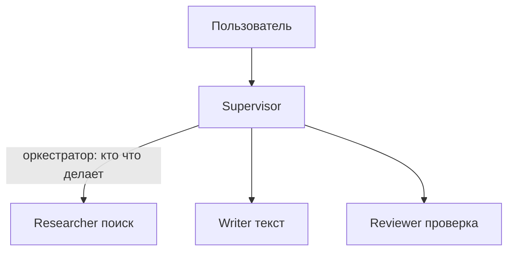
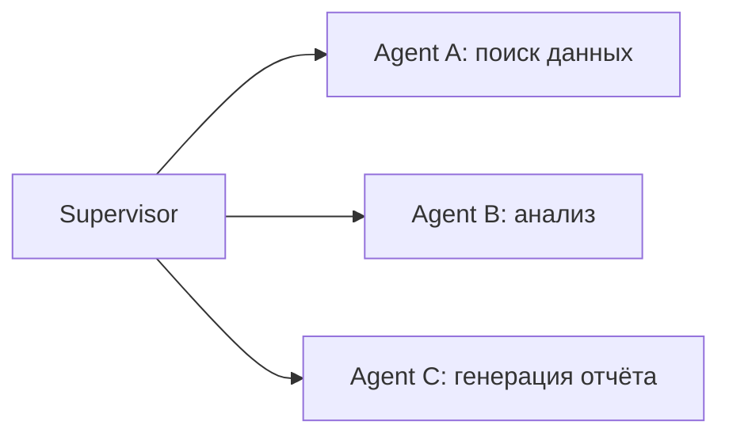
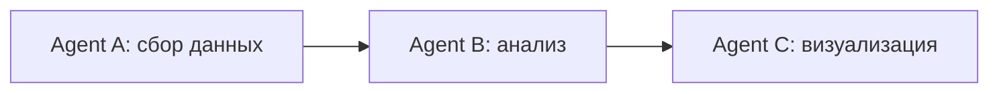
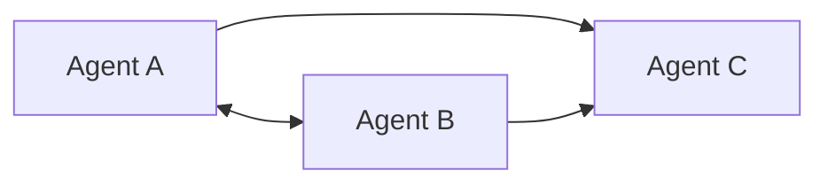
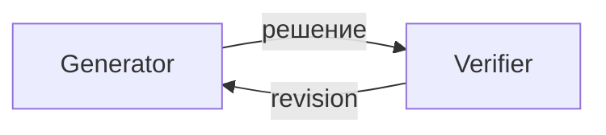
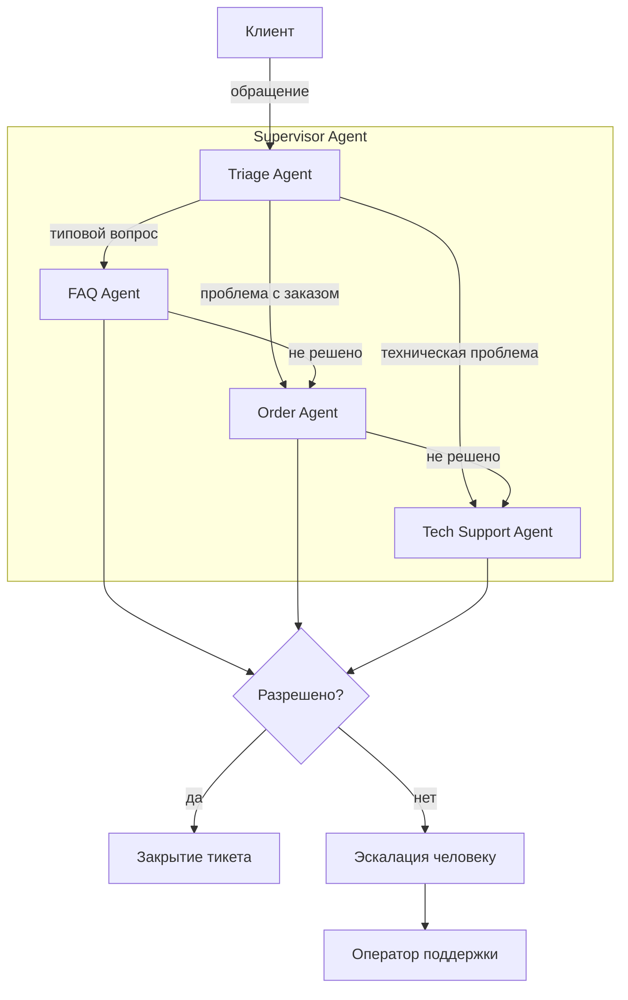

:::info TL;DR
Мультиагентная система — это несколько AI-агентов, которые взаимодействуют друг с другом для решения сложных задач. Каждый агент имеет свою роль и набор инструментов, а оркестратор управляет их взаимодействием. Аналитику важно понимать паттерны мультиагентных систем, чтобы выбирать правильную архитектуру и формулировать требования к коммуникации и безопасности.
:::

## Для кого эта статья

- Системные аналитики, проектирующие мультиагентные архитектуры
- Архитекторы, выбирающие паттерн оркестрации для сложных AI-решений
- Разработчики, реализующие взаимодействие между агентами
- Технические лиды, оценивающие trade-offs мультиагентных систем

## После прочтения вы узнаете

- Зачем нужны мультиагентные системы и какие проблемы они решают
- Основные архитектурные паттерны: Supervisor, Chain, Swarm, Debate
- Как организована коммуникация между агентами
- Как разрешать конфликты между агентами
- Какие метрики и требования важны для мультиагентных систем

## Зачем нужны мультиагентные системы

Один агент может сделать многое, но у него есть ограничения:

- **Context window** — агент «забывает» предыдущие шаги
- **Single expertise** — один LLM не может быть экспертом во всём
- **Single tool set** — все инструменты в одном агенте = риск ошибок
- **Single point of failure** — если агент ошибается, вся задача провалена

Мультиагентный подход решает эти проблемы через разделение ответственности:



## Архитектурные паттерны

### 1. Supervisor (орактуратор)

Один главный агент решает, какие агенты-подчинённые вызвать и в каком порядке.



**Когда использовать:** задача состоит из разнородных шагов, каждый требует специализации.
**Роль аналитика:** специфицировать, какие агенты нужны, какие у них полномочия, как supervisor принимает решения (по правилам или через LLM).

### 2. Round-robin / цепочка

Агенты вызываются последовательно, каждый передаёт результат следующему.



**Когда использовать:** конвейер обработки с фиксированными шагами.
**Роль аналитика:** специфицировать формат данных на входе и выходе каждого агента (контракты).

### 3. Swarm (равноправные агенты)

Агенты общаются напрямую, без центрального оркестратора. Каждый агент сам решает, кому передать задачу.



**Когда использовать:** задача требует гибкого распределения работы, агенты могут заменять друг друга.
**Роль аналитика:** специфицировать протокол коммуникации, формат сообщений, механизм разрешения конфликтов.

### 4. Debate / Verifier

Два агента с разными ролями: один генерирует решение, другой проверяет и критикует.



**Когда использовать:** критически важное качество результата (код, юридические документы).
**Роль аналитика:** специфицировать критерии проверки, максимальное число итераций, эскалация при недостижении консенсуса.

## Коммуникация между агентами

### Форматы сообщений

Агенты обмениваются структурированными сообщениями:

```json
{
  "from": "researcher",
  "to": "writer",
  "type": "result",
  "payload": {
    "query": "рынок AI 2024",
    "findings": ["размер рынка $184 млрд", "CAGR 36%"],
    "sources": ["report1.pdf", "report2.pdf"]
  },
  "metadata": {
    "timestamp": "2024-01-15T10:30:00Z",
    "confidence": 0.92
  }
}
```

**Требования к протоколу, которые специфицирует аналитик:**
- Формат сообщений (JSON schema)
- Типы сообщений (request, response, error, escalation)
- Timeout на ответ агента
- Retry-логика при сбоях
- Логирование всех сообщений

### Разрешение конфликтов

Когда два агента дают противоречивые результаты (например, Researcher нашёл одни данные, а DataAgent — другие):

- **Voting** — третий агент оценивает оба результата
- **Confidence check** — сравнивается confidence score
- **Escalation** — передача человеку
- **Consensus** — повторный запрос с дополнительным контекстом

## Ключевые требования для мультиагентных систем

### Оркестрация

| Требование | Описание |
|-----------|----------|
| Agent discovery | Как агенты узнают друг о друге |
| Task assignment | Кто решает, какой агент что делает |
| State management | Кто хранит общее состояние системы |
| Error handling | Что делать, если агент не ответил / ошибся |
| Scalability | Как добавить нового агента без остановки системы |

### Безопасность

| Требование | Описание |
|-----------|----------|
| Isolation | Агенты не должны иметь доступ к данным друг друга без необходимости |
| Authentication | Каждый агент должен подтверждать свою идентичность |
| Rate limiting | Ограничение на количество запросов между агентами |
| Audit trail | Полный лог всех коммуникаций для расследования инцидентов |

### Производительность и стоимость

| Метрика | Что измеряет | Типичный порог |
|---------|-------------|----------------|
| End-to-end latency | Время от запроса до ответа | < 30 сек для асинхронных задач |
| Cost per task | Суммарная стоимость токенов всех агентов | < $0.50 для типовой задачи |
| Agent efficiency | Доля успешных завершений | > 90% |
| Escalation rate | Доля задач, переданных человеку | < 10% |

## Типовые use cases для мультиагентных систем

### Разработка ПО
- **PM Agent** — пишет user stories
- **Dev Agent** — пишет код
- **Reviewer Agent** — проверяет код
- **QA Agent** — пишет и запускает тесты

### Аналитика и отчёты
- **Research Agent** — собирает данные
- **Analyst Agent** — анализирует, строит гипотезы
- **Visualizer Agent** — строит дашборды
- **Writer Agent** — оформляет отчёт

### Поддержка клиентов
- **Triage Agent** — классифицирует запрос
- **FAQ Agent** — отвечает на типовые вопросы
- **Escalation Agent** — передаёт сложные случаи человеку
- **Follow-up Agent** — проверяет, решена ли проблема

## Ключевые термины

- **Оркестратор (Supervisor)** — главный агент, распределяющий задачи между подчинёнными
- **Swarm** — архитектура без центрального управления, агенты общаются напрямую
- **Debate pattern** — два агента спорят для повышения качества результата
- **Agent contract** — формат сообщений и ожидаемое поведение агента
- **Escalation** — передача задачи человеку при невозможности решить автоматически

## Практический кейс: Multi-agent система для поддержки клиентов

### Контекст

Платформа электронной коммерции «МаркетПлюс» получает 15,000 обращений в месяц от клиентов. Проблемы: высокое время ответа (в среднем 45 минут), низкое разрешение с первой линии (только 55%), высокая нагрузка на операторов (каждый обрабатывает 80+ диалогов в день).

### Архитектура решения



### Результаты

| Метрика | До внедрения | После внедрения | Улучшение |
|---------|-------------|----------------|-----------|
| Resolution rate первой линии | 55% | 90% | +35% |
| Среднее время ответа | 45 минут | 2 минуты | 96% |
| Cost на обращение | $3.20 | $1.92 | -40% |
| Доля эскалированных человеку | 45% | 10% | -78% |
| Нагрузка на оператора | 80 диалогов/день | 25 диалогов/день | -69% |

**ROI:** При 15,000 обращений/месяц и cost $3.20 → $1.92 экономия составляет $19,200/месяц. Потребовалось 4 агента (Supervisor + 3 специализированных). Окупаемость — 1.5 месяца.

### Вывод

Multi-agent система с Supervisor и тремя специализированными агентами повысила resolution rate на 35% и снизила стоимость обработки обращения на 40%, при этом 90% обращений решаются без участия человека.

## Что дальше

- [MCP — Model Context Protocol](/docs/specialization/ai-agents-mcp) — как агенты подключают инструменты
- [Разработка AI-агентов: скилы, LSP, best practices](/docs/specialization/ai-agents-dev) — как проектировать агентов для продакшна

## Проверь себя

1. **В чём разница между Supervisor и Swarm паттернами?**
   *Ответ:* Supervisor: центральный агент распределяет задачи. Swarm: агенты сами решают, кому передать работу. Supervisor проще контролировать, Swarm — гибче.

2. **Какие метрики важны для мультиагентной системы?**
   *Ответ:* End-to-end latency, cost per task, agent efficiency (% успешных завершений), escalation rate (% переданных человеку).

3. **Когда использовать Debate pattern?**
   *Ответ:* Когда критично качество результата и допустимы дополнительные затраты на токены. Пример: генерация юридических документов, код для финансовой системы.

4. **Какие существуют механизмы разрешения конфликтов между агентами?**
   *Ответ:* Voting (третий агент оценивает), Confidence check (сравнение score), Escalation (передача человеку), Consensus (повторный запрос с контекстом).

5. **Какие способы коммуникации между агентами нужно специфицировать аналитику?**
   *Ответ:* Формат сообщений (JSON schema), типы сообщений (request, response, error, escalation), timeout на ответ, retry-логика, логирование всех сообщений.

## Ссылки

1. [Microsoft AutoGen documentation](https://microsoft.github.io/autogen/)
2. [CrewAI documentation](https://docs.crewai.com/)
3. [LangGraph Multi-Agent Systems](https://langchain-ai.github.io/langgraph/tutorials/multi_agent/)
4. [OpenAI Swarm (experimental)](https://github.com/openai/swarm)
5. [Anthropic — Building effective agents](https://docs.anthropic.com/en/docs/build-with-claude/agentic)
