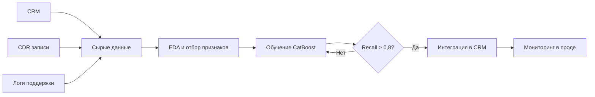
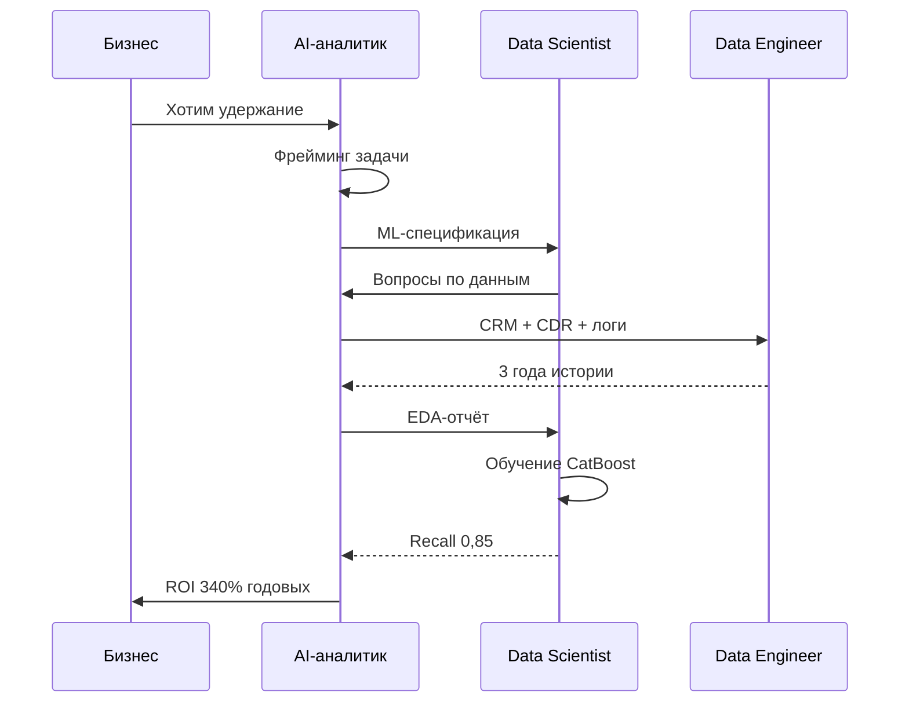

:::info TL;DR
AI-аналитик — это системный аналитик, специализирующийся на продуктах и системах с искусственным интеллектом. Он отвечает за сбор требований к ML-компонентам, спецификацию данных, формулировку метрик качества модели и согласование ожиданий между бизнесом и Data Science командой.
:::

## Для кого эта статья

- Системные аналитики, переходящие в AI/ML-направление
- Продуктовые аналитики, желающие понять роль AI-аналитика в ML-проектах
- Junior Data Scientists, которым нужна системность в работе с требованиями

## После прочтения вы узнаете

- Чем AI-аналитик отличается от Data Scientist и ML Engineer
- Как устроен жизненный цикл ML-проекта и где точка входа аналитика
- Какие hard skills и soft skills нужны для успешной работы

## Кто такой AI-аналитик

Представьте, что бизнес просит «сделать ИИ, который будет предсказывать отток клиентов». Data Scientist начинает крутить Python-ноутбуки, а через месяц выдаёт модель с точностью 94%. Бизнес говорит: «Отлично!», а через неделю выясняется, что модель работает на исторических данных, которые нельзя собирать в реальном времени, а её предсказания никто не умеет интерпретировать.

Это классическая проблема разрыва между бизнесом и ML-командой. AI-аналитик — человек, который этот разрыв закрывает.

**AI-аналитик** (Analytics & AI Analyst) — это специалист, который:

- Формулирует бизнес-задачу как ML-задачу (или доказывает, что ML не нужен)
- Специфицирует требования к данным: источники, качество, разметка, объём
- Определяет критерии успеха ML-модели на языке бизнеса
- Проектирует интеграцию ML-компонента в существующую архитектуру
- Участвует в валидации модели: не переобучена ли, честна ли, объяснима ли
- Описывает нефункциональные требования: latency, throughput, стоимость инференса

## Чем AI-аналитик отличается от других ролей

| Роль | Фокус | Результат |
|------|-------|-----------|
| **Data Scientist** | Исследование данных, обучение модели | Модель, ноутбук, эксперимент |
| **ML Engineer** | Продакшн, пайплайны, MLOps | Сервис инференса, пайплайн |
| **Data Engineer** | Инфраструктура данных | DWH, пайплайны данных |
| **AI-аналитик** | Требования, метрики, архитектура, коммуникация | SRS, ML-спецификация, метрики |
| **Product Manager AI** | Стратегия продукта, roadmap | OKR, приоритеты, ROI |

AI-аналитик — это **не замена** этим ролям, а связующее звено. Он говорит с бизнесом на языке денег и метрик, с Data Scientist — на языке данных и признаков, с инженерами — на языке API и инфраструктуры.

## Жизненный цикл ML-проекта

Вот типовые этапы, где AI-аналитик участвует напрямую:

1. **Проблемная формулировка** — бизнес говорит «хочу ИИ», аналитик выясняет «зачем» и «что изменится»
2. **Фрейминг ML-задачи** — превращаем бизнес-проблему в ML-задачу (классификация, регрессия, кластеризация, ранжирование)
3. **Требования к данным** — какие данные нужны, где взять, какой качество, как размечать
4. **Критерии успеха** — бизнес-метрики (ROI, LTV) и ML-метрики (precision, recall)
5. **Проектирование решения** — архитектура: где живёт модель, как вызывается, что на входе/выходе
6. **Валидация и тестирование** — проверка модели на адекватность, bias, объяснимость
7. **Мониторинг и эволюция** — модель дрейфует, данные меняются, аналитик инициирует переобучение

Каждый этап требует артефакта: от ML-спецификации до чек-листа приёмки модели.

## Что должен знать AI-аналитик

**Hard skills:**
- Основы ML: типы задач, метрики, переобучение, валидация
- Работа с данными: SQL, качество данных, EDA
- Архитектура AI-решений: REST, gRPC, очереди, feature store
- LLM и RAG: промпт-инжиниринг, пайплайны генерации
- MLOps: CI/CD для моделей, мониторинг, A/B тесты

**Soft skills:**
- Коммуникация с Data Scientists (понимание ограничений моделей)
- Управление ожиданиями (ML не магия, а вероятностное предсказание)
- Фасилитация воркшопов по ML-фреймингу
- Переговоры о trade-off: точность vs скорость, качество vs стоимость

## Ключевые термины

- **Фрейминг (ML framing)** — перевод бизнес-задачи в ML-формализм: что предсказываем, на каких данных, как измеряем успех
- **Feature engineering** — создание признаков из сырых данных для обучения модели
- **Inference** — работа обученной модели в продакшне (приём запроса, выдача предсказания)
- **Model drift** — ухудшение качества модели со временем из-за изменения данных
- **Bias** — систематическая ошибка модели, приводящая к несправедливым или неточным результатам

## Кейс: ML-проект предсказания оттока для телеком-оператора

### Контекст

Крупный телеком-оператор (2 млн активных абонентов) ежемесячно терял 3,5% клиентов — около 52 000 абонентов. Стоимость привлечения нового клиента — 350 руб., средний LTV удержанного — 16 800 руб. (14 месяцев × 1 200 руб./мес). Маркетинговый отдел тратил 18 млн руб. в месяц на привлечение, но не имел инструментов предиктивного удержания.

### Задача

AI-аналитик сформулировал ML-задачу как бинарную классификацию: предсказать отток клиента в течение следующих 30 дней на основе истории звонков, тарифного плана, платёжной дисциплины и обращений в поддержку.

### Решение

Из CRM, CDR-записей, биллинга и логов поддержки за 3 года сгенерировано 78 признаков. После EDA отобрано 34 релевантных. Модель градиентного бустинга (CatBoost) прошла кросс-валидацию и показала recall 0,85 и precision 0,62 на тестовой выборке.

### Результаты и ROI

| Показатель | Значение |
|-----------|----------|
| Ежемесячный отток до ML | 52 000 абонентов |
| Спасено моделью (recall 85%) | 44 200 абонентов/мес |
| Расход на удержательную кампанию | 150 руб./абонент |
| LTV спасённого абонента | 16 800 руб. |
| Чистая экономия в месяц | ~12,5 млн руб. |
| ROI годовой | 340% |

### Архитектура взаимодействия

## Что дальше

- [Сбор требований для ML-систем](/docs/specialization/ai-ml-requirements) — как специфицировать ML-компонент
- [Данные для ML](/docs/specialization/ai-ml-data) — качество, разметка, пайплайны
- [Метрики ML-продуктов](/docs/specialization/ai-ml-metrics) — от accuracy до ROI

## Проверь себя

1. **Чем AI-аналитик отличается от Data Scientist?**
   *Ответ:* Data Scientist исследует данные и строит модели, AI-аналитик формулирует требования и специфицирует, что должна делать модель, — это задача системного аналитика, а не исследователя.

2. **На каком этапе ML-проекта AI-аналитик определяет метрики?**
   *Ответ:* На этапе «Критерии успеха» — до начала обучения модели, чтобы у команды была цель, а не «улучшаем accuracy, пока не скажут стоп».

3. **Почему ML-проекты требуют особого подхода к требованиям?**
   *Ответ:* Результат ML-модели — вероятностный, а не детерминированный. Нельзя сказать «модель будет работать с точностью 100%». Требования должны описывать приемлемый порог качества, а не гарантию.

4. **Какие нефункциональные требования важны для ML-системы?**
   *Ответ:* Latency инференса (P99), throughput запросов, объяснимость предсказаний (SHAP, LIME), fairness (отсутствие дискриминации), стоимость инференса, SLA доступности.

5. **Что такое model drift и почему за ним нужно следить?**
   *Ответ:* Model drift — ухудшение качества модели со временем из-за изменения распределения данных. Без мониторинга модель, работавшая с recall 0,85, может через полгода давать 0,6.

## Ссылки

- [CRISP-DM — методология ML-проектов](https://www.ibm.com/docs/en/spss-modeler/17.0.0?topic=mining-crisp-dm)
- [Rules of ML — Google](https://developers.google.com/machine-learning/guides/rules-of-ml)
- [Scikit-learn: выбор модели](https://scikit-learn.org/stable/tutorial/machine_learning_map/)
- [CatBoost: официальная документация](https://catboost.ai/docs/)
- [Model Drift — Neptune.ai](https://neptune.ai/blog/model-drift)
