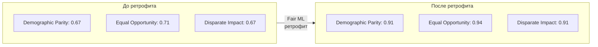
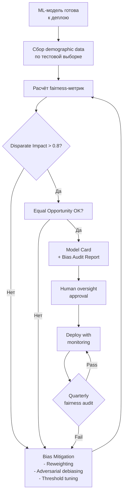

:::info TL;DR
AI-системы могут дискриминировать, нарушать приватность и принимать необъяснимые решения. Регуляторы (EU AI Act, ГОСТы) вводят обязательные требования к «высокорисковым» ИИ-системам. AI-аналитик отвечает за то, чтобы эти требования были специфицированы и проверены, — так же как для безопасности или производительности.
:::

## Для кого эта статья

- AI-аналитики, специфицирующие требования к ML-моделям
- Compliance- и risk-менеджеры AI-продуктов
- Data Scientist, внедряющие fairness-проверки
- Все, кто работает над внедрением EU AI Act и этических стандартов

## После прочтения вы узнаете

- Какие виды bias существуют и как их обнаружить
- Как измерять fairness модели с помощью метрик
- Какие требования EU AI Act применимы к AI-продуктам
- Как специфицировать требования к объяснимости и приватности

## Почему AI-этика — часть работы аналитика

Когда Data Scientist обучает модель на исторических данных, модель может «выучить» и усилить существующие предубеждения. Примеры из реальной практики:

- **Amazon hiring model** — модель отсеивала резюме женщин, потому что обучалась на исторических данных, где большинство инженеров — мужчины
- **COMPAS (US justice)** — алгоритм оценки рецидивизма давал более высокий риск для афроамериканцев при тех же исходных данных
- **Apple Card** — алгоритм кредитного лимита давал женщинам лимиты в 10-20 раз ниже, чем мужчинам с тем же доходом

Во всех этих случаях проблема не в технологии, а в требованиях: никто не специфицировал, что модель обязана быть fair по отношению к защищённым группам.

## Bias: виды и источники

**Bias (смещение)** — систематическая ошибка модели, которая приводит к несправедливым результатам для определённых групп.

| Тип bias | Описание | Пример |
|----------|----------|--------|
| **Data bias** | Обучающие данные не отражают реальное распределение | Модель распознаёт только белых мужчин, потому что в датасете 90% таких фото |
| **Label bias** | Разметчики субъективно оценивают данные | Два разметчика по-разному маркируют токсичные комментарии |
| **Algorithmic bias** | Алгоритм усиливает существующие неравенства | Рекомендательная система предлагает мужчинам IT-вакансии, женщинам — HR |
| **Confirmation bias** | Модель подтверждает ожидания пользователя | Поиск выдаёт новости, соответствующие политическим взглядам пользователя |
| **Deployment bias** | Модель применяется не для той аудитории | Система диагностики болезней обучалась на данных одной клиники, а применяется в другой |

## Fairness-метрики

AI-аналитик должен уметь специфицировать fairness-требования. Для этого есть количественные метрики:

| Метрика | Суть | Формула |
|---------|------|---------|
| **Demographic parity** | Вероятность положительного исхода одинакова для всех групп | P(ŷ=1 | A=a) = P(ŷ=1 | A=b) |
| **Equal opportunity** | True positive rate одинаков для всех групп | P(ŷ=1 | y=1, A=a) = P(ŷ=1 | y=1, A=b) |
| **Equalized odds** | TPR и FPR одинаковы для всех групп | TPR_a = TPR_b, FPR_a = FPR_b |
| **Disparate impact** | Отношение вероятностей положительного исхода между группами | min(P(ŷ=1|A=a), P(ŷ=1|A=b)) / max(...) > 0.8 |

**Требование к fairness в ML-спецификации:**
> «Модель должна проходить проверку на disparate impact: отношение вероятности положительного исхода для защищённой группы к общей вероятности должно быть не менее 0.8. Аудит проводится ежегодно или при каждом переобучении».

## Регуляторика

### EU AI Act

Первый в мире всеобъемлющий закон об ИИ (вступил в силу в 2024 году, поэтапное применение до 2027). Классифицирует AI-системы по уровню риска:

| Категория риска | Примеры | Требования |
|-----------------|---------|------------|
| **Минимальный** | Спам-фильтры, AI-игры | Нет обязательных требований |
| **Ограниченный** | Чат-боты, deepfake | Прозрачность (пользователь должен знать, что общается с AI) |
| **Высокий** | Кредитный скоринг, меддиагностика, найм | Обязательная оценка соответствия, documentation, human oversight |
| **Недопустимый** | Социальный скоринг, манипулятивное ИИ | Запрещены |

**Что это значит для AI-аналитика:** для высокорисковых систем нужно специфицировать:
- **Risk assessment** — оценка рисков для здоровья, безопасности, фундаментальных прав
- **Technical documentation** — описание архитектуры, данных, метрик
- **Human oversight** — где и как человек может остановить или отменить решение модели
- **Accuracy, robustness, cybersecurity** — требования к точности, устойчивости к ошибкам и атакам

### Российское регулирование

В России действует **Национальная стратегия развития ИИ до 2030 года** и Кодекс этики ИИ. Для государственных информационных систем — обязательные требования к объяснимости и безопасности AI-компонентов.

### GDPR и приватность

GDPR (и российский закон 152-ФЗ) требуют:
- **Right to explanation** — пользователь имеет право получить объяснение решения, принятого алгоритмом
- **Data minimization** — модель не должна использовать больше данных, чем необходимо
- **Right to be forgotten** — данные пользователя должны быть удалены из обучающего датасета по запросу (технически сложно)

## Требования к объяснимости

Для многих AI-систем (особенно высокорисковых) регуляторы требуют explainability:

| Уровень объяснимости | Что нужно | Пример |
|----------------------|-----------|--------|
| L1 — Глобальная | Понимание, как модель работает в целом | Какие признаки самые важные? (SHAP summary) |
| L2 — Локальная | Почему модель приняла конкретное решение | Почему этому клиенту отказали в кредите? (LIME) |
| L3 — Контрафактическая | Что изменилось бы, если бы вход был другим | Если бы доход был на 10K выше, решение было бы положительным |

**Требование:** AI-аналитик фиксирует, какой уровень объяснимости требуется для продукта. Для кредитного скоринга — минимум L2, для рекомендаций музыки — достаточно L1.

## Практические артефакты AI-этики

Вот что реально делает AI-аналитик:

1. **AI Ethics Checklist** — чек-лист для каждого ML-проекта: проверка bias, fairness, приватности
2. **Model Card** — документ с описанием модели: назначение, ограничения, fairness-метрики, рекомендованные сценарии использования
3. **Bias Audit Report** — результаты проверки модели на fairness-метриках
4. **Risk Assessment** — анализ рисков внедрения модели для разных групп пользователей

## Кейс: Bias detection в модели отбора резюме

**Компания:** Платформа для поиска работы «КарьерныйРост»
**Задача:** Проверить ML-модель ранжирования кандидатов на fairness

**Исходные данные:**
- Модель: градиентный бустинг (XGBoost) на 120 признаках
- Датасет: 50K резюме за 2 года, целевая метрика — приглашение на собеседование
- Признаки: опыт, образование, навыки, пол (неявно через ФИО), возраст

**Обнаруженный bias:**
- Женщины на 23% реже проходили отбор при равном опыте и навыках
- Кандидаты 45+ на 17% реже — при аналогичной квалификации
- Disparate impact ratio по полу: 0.67 (ниже порога 0.8)

**Сравнение fairness-метрик до и после ретрофита:**

**Процесс этического аудита AI-системы:**

**Результаты ретрофита:**
- 1. Применён adversarial debiasing — удаление корреляции между полом и предсказанием
- 2. Threshold tuning для подгрупп — разный порог срабатывания для компенсации bias
- 3. Добавлен feature «деперсонализация» — удалены признаки, коррелирующие с полом (ФИО, хобби)
- 4. Fairness-метрики после ретрофита: Demographic Parity 0.91, Equal Opportunity 0.94, Disparate Impact 0.91
- 5. Quality модели (NDCG@10) снизился на 2% — приемлемая цена за fairness
- 6. Дополнительно: внедрён ежеквартальный fairness audit с автоматическим алертом при падении DI < 0.82
- 7. Стоимость ретрофита: 2.8M руб (3 недели работы команды)

## Что дальше

- [Архитектура AI-решений](/docs/specialization/ai-ml-architecture) — как имплементировать требования этики на уровне архитектуры
- [Управление рисками](/docs/process/risk-management) — общий подход к рискам в проектах
- [Нефункциональные требования](/docs/requirements/nfr) — как специфицировать NFR для AI-систем

## Проверь себя

1. **Что такое disparate impact и как он измеряется?**
   *Ответ:* Disparate impact — метрика, показывающая, не ущемляет ли модель одну группу относительно другой. Считается как отношение вероятностей положительного исхода для групп. Порог обычно > 0.8.

2. **Какие AI-системы считаются высокорисковыми по EU AI Act?**
   *Ответ:* Кредитный скоринг, медицинская диагностика, системы найма, биометрическая идентификация — всё, что влияет на жизнь и права людей.

3. **Зачем нужна explainability в AI-продуктах?**
   *Ответ:* Чтобы соответствовать регуляторным требованиям, доверять модели, отлаживать ошибки и объяснять пользователям причины решений.

4. **В чём разница между Demographic Parity и Equal Opportunity?**
   *Ответ:* Demographic Parity требует одинаковой вероятности положительного исхода для всех групп независимо от факта. Equal Opportunity требует одинакового True Positive Rate — модель должна одинаково хорошо находить положительные примеры во всех группах.

5. **Какие три уровня explainability существуют и какой минимум нужен для кредитного скоринга?**
   *Ответ:* L1 — глобальная (как модель работает в целом), L2 — локальная (почему принято конкретное решение), L3 — контрафактическая (что изменило бы решение). Для кредитного скоринга минимум L2 (локальная объяснимость).

## Ссылки

1. [EU AI Act — Official Text](https://artificialintelligenceact.eu/)
2. [Google — Fairness Indicators](https://www.tensorflow.org/responsible_ai/fairness_indicators/guide)
3. [SHAP — Explainability Library](https://shap.readthedocs.io/en/latest/)
4. [NIST — AI Risk Management Framework](https://www.nist.gov/artificial-intelligence/executive-order-safe-secure-and-trustworthy-artificial-intelligence)
5. [Microsoft — Responsible AI Resources](https://www.microsoft.com/en-us/ai/responsible-ai)
