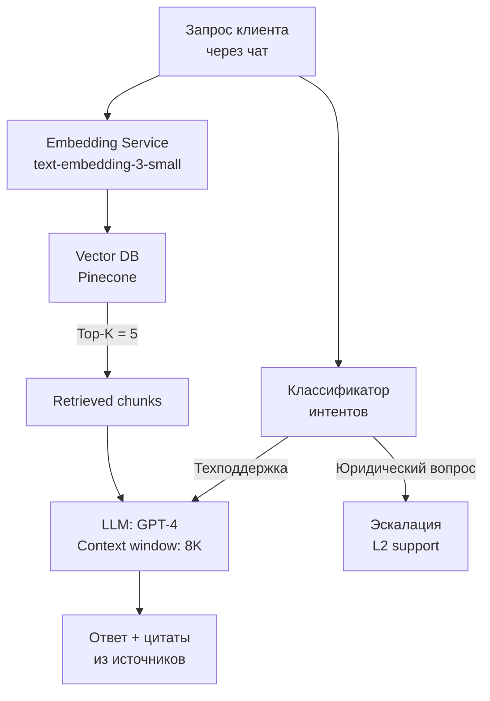
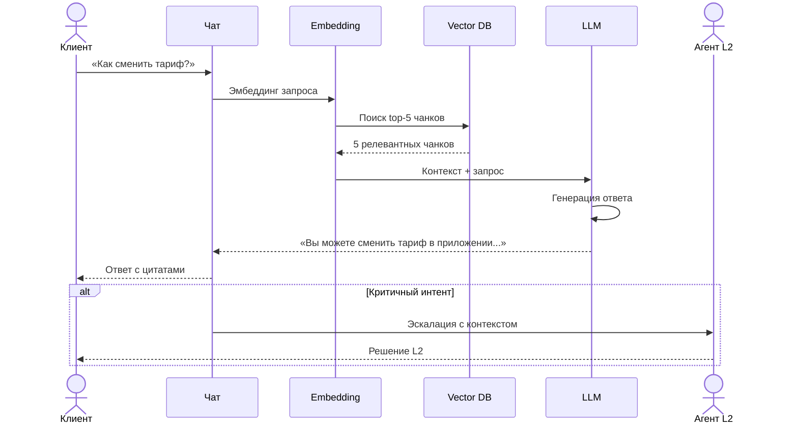

:::info TL;DR
Большие языковые модели (LLM) и RAG-архитектура — ключевые технологии современных AI-продуктов. AI-аналитик должен понимать, как работают LLM, чем RAG отличается от fine-tuning, и как формулировать требования к системам на базе генеративных моделей.
:::

## Для кого эта статья

- AI-аналитики, проектирующие системы на базе LLM
- Product-менеджеры GenAI-продуктов
- Разработчики, внедряющие RAG-архитектуру
- Все, кто хочет разобраться в отличиях RAG от fine-tuning

## После прочтения вы узнаете

- Как работает LLM и чем RAG отличается от fine-tuning
- Как специфицировать требования к RAG-системе
- Как формулировать требования к промптам и AI-агентам
- Какие нефункциональные требования критичны для LLM-продуктов

## Как работают LLM

Large Language Model (LLM) — это нейросеть, обученная предсказывать следующее слово в тексте на огромном корпусе данных. GPT-4, YandexGPT, Llama — всё это LLM.

**Ключевые характеристики, которые важно понимать аналитику:**

- **LLM не «думает»** — она предсказывает наиболее вероятное продолжение текста. Ответ выглядит осмысленным, но модель может «галлюцинировать» (выдавать уверенный, но неверный ответ).
- **Контекстное окно** — максимальная длина текста, который модель может «помнить» за один запрос (от 4K до 128K+ токенов у современных моделей). Всё, что выходит за окно, модель «забывает».
- **Температура** — параметр случайности ответа. 0 = детерминированный ответ (всегда одинаковый на один запрос), 1 = креативный, >1 = хаотичный.
- **Токены** — единицы текста, которыми оперирует модель. Не слова, а подслова (например, «аналитик» = 3 токена). Важно для расчёта стоимости и ограничений контекста.

## RAG: Retrieval-Augmented Generation

RAG — архитектурный паттерн, который дополняет LLM знаниями из внешнего источника:

```mermaid
flowchart TD
    A[Запрос пользователя] --> B[Search<br/>(retrieve)]
    B -->|Поиск эмбеддингов| C[База знаний<br/>Векторная БД]
    C -->|Документы, FAQ,<br/>API specs| B
    B --> D[Контекст + Запрос]
    D --> E[LLM]
    E --> F[Ответ с опорой<br/>на контекст]
```

**Как это работает:**
1. Пользователь задаёт вопрос
2. Система ищет релевантные фрагменты в базе знаний (через семантический поиск — эмбеддинги)
3. Найденные фрагменты подставляются в промпт LLM как контекст
4. LLM генерирует ответ на основе этого контекста

**Почему RAG, а не fine-tuning:**

| Критерий | RAG | Fine-tuning |
|----------|-----|-------------|
| Обновление знаний | Мгновенно — обновил базу | Недели — переобучение модели |
| Контроль фактов | Высокий — ответ строится на документах | Низкий — модель может галлюцинировать |
| Стоимость | Дешевле (не нужно обучать) | Дороже (нужны GPU) |
| Качество для узкой темы | Среднее (зависит от поиска) | Высокое (если данных достаточно) |
| Конфиденциальность | Данные не уходят в модель | Данные уходят в обучающий датасет |

**Когда RAG необходим по требованиям бизнеса:** когда критична достоверность ответов (юридические консультации, медицинские рекомендации, поддержка продуктов) и когда знания меняются чаще, чем раз в месяц.

## Требования к RAG-системе

Если вы специфицируете RAG-продукт, в требованиях должны быть:

### 1. Источники знаний
- Какие документы загружаются (форматы: PDF, DOCX, HTML, Markdown)
- Как часто обновляются
- Кто отвечает за актуальность
- Права доступа: кто что видит

### 2. Chunking (разбиение документов)
- Стратегия разбиения: по абзацам, по токенам, семантическое
- Размер чанка (обычно 256-1024 токенов)
- Перекрытие чанков (overlap) для сохранения контекста

### 3. Поиск (retrieval)
- Алгоритм поиска: семантический (через эмбеддинги) + гибридный (с keyword search)
- Количество возвращаемых чанков (top-K, обычно 3-10)
- Порог релевантности (минимальный score для показа)
- Мультимодальность: поиск по таблицам, изображениям

### 4. Генерация ответа
- Промпт-шаблон: инструкция LLM, как формировать ответ
- Источники: должен ли ответ содержать ссылки на документы
- Обработка «не знаю»: что делать, если в базе нет ответа
- Цитирование: обязан ли ответ указывать абзац из документа

### 5. Нефункциональные требования
- **Latency:** максимальное время ответа (типично: 2-5 секунд для чата, 500 мс для API)
- **Cost:** бюджет на токены (входные + выходные) и эмбеддинги
- **Accuracy ответов:** метрика правильности (экспертная оценка ответов на тестовом наборе)
- **Halucination rate:** допустимый процент галлюцинаций (< 1% для критичных доменов)

## Промпт-инжиниринг для аналитика

AI-аналитик не обязан писать промпты как инженер, но должен понимать устройство промпта, чтобы специфицировать поведение LLM:

**Структура промпта:**
```
System message:   «Ты — ассистент поддержки банка. Отвечай только на основе 
                  предоставленных документов. Если ответа нет — скажи, что 
                  не знаешь. Будь вежлив и краток.»

Context:          <результаты поиска по базе знаний>

User message:     «Как заблокировать карту через приложение?»
```

**Требования к промпту, которые фиксирует аналитик:**
- Роль модели (system message)
- Ограничения (на чём НЕ отвечать, стиль, объём)
- Формат ответа (JSON, Markdown, чистый текст)
- Instruction to cite sources
- Fallback при отсутствии информации

## AI Agents — следующий уровень

LLM + RAG + возможность вызывать инструменты = AI Agent. Агент не просто отвечает на вопросы, а выполняет действия:

- Вызывает API для получения данных
- Заполняет формы
- Создаёт тикеты в Jira
- Принимает решения в рамках заданных правил

**Требования к AI Agent:**
- Какие инструменты (tools) доступны агенту
- Сценарии: когда агент действует сам, когда спрашивает человека (human-in-the-loop)
- Oversight: как логируются и аудируются действия агента
- Safety guardrails: что агент НЕ может делать ни при каких условиях (например, удалять данные)

## Кейс: RAG-система для поддержки клиентов

**Компания:** Телеком-оператор «СвязьВсем»
**Задача:** Снизить нагрузку на первую линию поддержки через AI-ассистента

**Исходные данные:**
- 50K документов в базе знаний (тарифы, инструкции, FAQ, регламенты)
- 15K обращений в день в первую линию
- Среднее время обработки (AHT): 12 минут на обращение

**Архитектура RAG-системы:**



**Процесс обработки запроса:**



**Результаты:**
- Answer accuracy выросла с 78% до 94% (по оценке экспертов на тестовом наборе из 500 вопросов)
- Среднее время обработки (handle time) сократилось на 60% (с 12 мин до 4.8 мин)
- First Contact Resolution (FCR) улучшился с 45% до 72%
- 35% обращений полностью автоматизировано (без участия человека)
- Halucination rate после внедрения RAG: 0.8% (против 7% без RAG)
- Экономия: 4.5M руб/мес на FTE первой линии (сокращение 12 операторов)
- ROI за 8 месяцев: 5.7× с учётом стоимости токенов GPT-4

## Что дальше

- [Этика, bias и регуляторика ИИ](/docs/specialization/ai-ethics) — риски LLM: токсичность, bias, приватность
- [Архитектура AI-решений](/docs/specialization/ai-ml-architecture) — как выстроить инфраструктуру для RAG
- [Prompt engineering (задача)](/tasks/design-rag-pipeline) — практика проектирования RAG-пайплайна

## Проверь себя

1. **Что такое RAG и зачем он нужен?**
   *Ответ:* RAG — паттерн, в котором LLM генерирует ответ, опираясь на найденные в базе знаний документы. Нужен, чтобы модель не галлюцинировала и отвечала на основе актуальных данных.

2. **Чем RAG отличается от fine-tuning?**
   *Ответ:* RAG не требует переобучения модели — знания обновляются через базу документов. Fine-tuning меняет веса модели, но дороже и дольше.

3. **Почему у LLM бывают галлюцинации?**
   *Ответ:* LLM — это модель предсказания следующего слова, а не база фактов. Она может выдать правдоподобный, но неверный ответ, потому что такой паттерн статистически вероятен в обучающих данных.

4. **Что такое семантический поиск в RAG и как он работает?**
   *Ответ:* Семантический поиск превращает текст в эмбеддинги (векторные представления) и ищет ближайшие векторы в векторной БД. В отличие от keyword search, он понимает смысл запроса, а не точное совпадение слов.

5. **Почему для RAG критичен размер чанка и overlap?**
   *Ответ:* Слишком маленький чанк — потеря контекста. Слишком большой — превышение контекстного окна LLM. Overlap (перекрытие) нужен, чтобы смысл не терялся на границах чанков. Оптимум: 256-1024 токена с overlap 10-20%.

## Ссылки

1. [LangChain — RAG Documentation](https://python.langchain.com/docs/tutorials/rag/)
2. [OpenAI — Prompt Engineering Guide](https://platform.openai.com/docs/guides/prompt-engineering)
3. [Pinecone — Vector Database Documentation](https://docs.pinecone.io/)
4. [Hugging Face — Embedding Models](https://huggingface.co/blog/getting-started-with-embeddings)
5. [Microsoft — RAG Pattern in Azure](https://learn.microsoft.com/en-us/azure/architecture/ai-ml/guide/rag/rag-solution-design)
