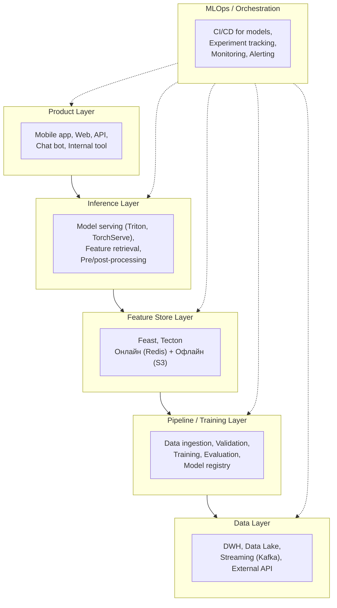
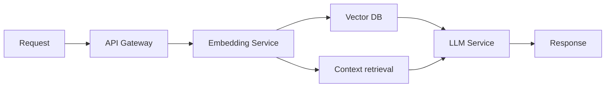
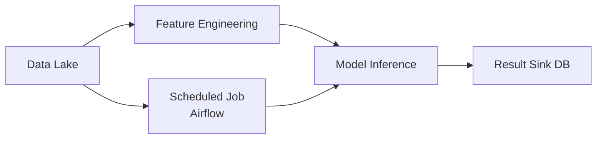
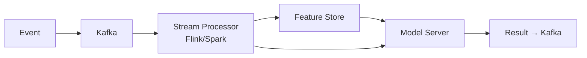
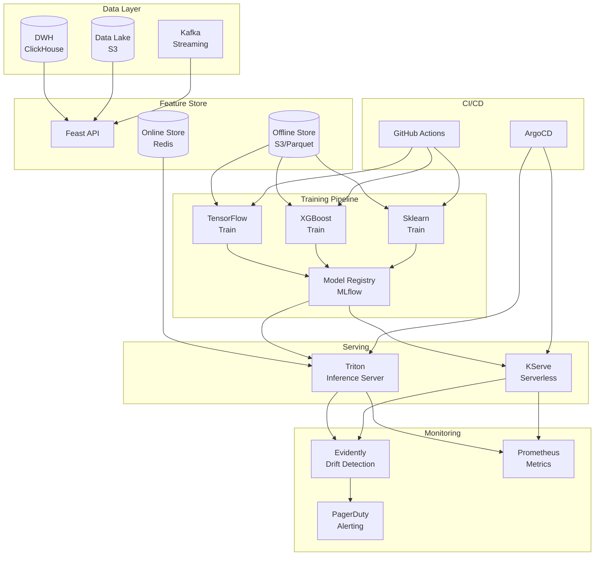
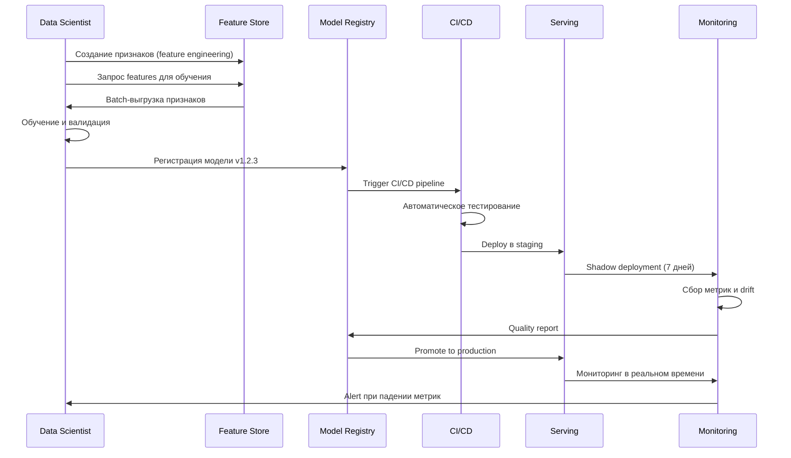

:::info TL;DR
AI-решение в продакшне — это не Jupyter-ноутбук, а распределённая система из нескольких компонентов: пайплайн данных, хранилище признаков, сервис инференса, мониторинг и MLOps-инфраструктура. AI-аналитик специфицирует архитектуру на уровне компонентов, их взаимодействие и нефункциональные характеристики.
:::

## Для кого эта статья

- Senior AI-аналитики и архитекторы AI-решений
- ML-инженеры, переходящие к проектированию систем
- Технические лиды и Team Lead AI-направлений
- Все, кто специфицирует нефункциональные требования к ML-инфраструктуре

## После прочтения вы узнаете

- Из каких слоёв состоит продакшн ML-система
- Как специфицировать требования к feature store и MLOps
- Чем отличаются архитектуры для batch, online и LLM-инференса
- Какие NFR критичны для AI-систем и как их формулировать

## Архитектура ML-системы: общая схема

Современное AI-решение в продакшне состоит из следующих слоёв:

## Роль AI-аналитика в проектировании архитектуры

Аналитик не проектирует инфраструктуру (это задача ML Engineer / DevOps), но отвечает за:

1. **Компонентную архитектуру** — какие компоненты нужны, как они связаны, какие данные передают
2. **Требования к каждому компоненту** — latency, throughput, consistency, доступность
3. **Сценарии взаимодействия** — синхронный запрос (REST/gRPC) или асинхронный (event-driven)
4. **Data flow** — схема движения данных от источника до предсказания
5. **Non-functional requirements** — SLA, cost, scalability, security

## Варианты архитектур ML-сервисов

### 1. Embedding-модель (для RAG)

**Требования от аналитика:**
- Embedding Service: latency < 200ms на запрос, поддерживает batch
- Vector DB: top-K поиск за < 100ms, поддерживает фильтрацию по метаданным
- LLM Service: latency < 3s, стоимость инференса < $X за 1K запросов

### 2. Batch-предсказание (offline scoring)

**Требования от аналитика:**
- Job frequency: ежедневно в 03:00
- Window: обработать 10M записей за < 2 часа
- SLA: результат должен быть в БД к 06:00
- Alert: если job не завершился за 3 часа

### 3. Реалтайм-инференс (online scoring)

**Требования от аналитика:**
- Event processing: P99 latency < 500ms от получения события до выдачи предсказания
- Consistency: exactly-once processing для финансовых сценариев
- Availability: 99.9% для critical path
- Fallback: если модель недоступна — использовать rule-based baseline

## Feature store: центральное хранилище признаков

**Feature store** — компонент, который решает проблему разрыва между признаками для обучения и признаками для инференса:

| Задача | Без feature store | С feature store |
|--------|------------------|-----------------|
| Признаки для обучения | Data Scientist пишет SQL-запросы | Те же признаки доступны через API |
| Признаки для инференса | ML Engineer дублирует логику | Feature store выдаёт готовые признаки |
| Консистентность | Признаки могут отличаться между обучением и инференсом | Online/offline признаки гарантированно одинаковы |
| Версионирование | Нет | Каждая версия признаков сохранена |

**Требования к feature store:**
- Online store: Redis / DynamoDB — latency < 10ms на запрос
- Offline store: S3 / Parquet — для batch-обучения
- Point-in-time join: возможность получить признаки на любой момент времени (чтобы избежать data leakage)

## MLOps: CI/CD для ML

MLOps — это практика применения DevOps-принципов к ML-системам:

**Компоненты MLOps, которые важны для спецификации:**
- **Experiment tracking** — MLflow, Weights & Biases: логирование экспериментов
- **Model registry** — версионирование моделей, promotion (staging → production)
- **Pipeline orchestration** — Airflow, Prefect, Kubeflow: запуск пайплайнов обучения
- **Model serving** — Triton, TorchServe, BentoML: инференс-сервер
- **Monitoring** — WhyLabs, Evidently, Собственное: drift, метрики, алерты

**Требования:**
- **CI/CD pipeline:** при изменении кода или данных — автоматический retrain + валидация
- **Model registry:** promotion-процесс — только модель, прошедшая validation, попадает в prod
- **Shadow deployment:** новая модель работает параллельно с текущей, без влияния на пользователей
- **A/B testing framework:** возможность сравнивать две версии модели на реальном трафике

## Мониторинг ML-системы

AI-аналитик специфицирует, что и как мониторить:

| Слой | Что мониторить | Типичный алерт |
|------|---------------|----------------|
| **Data** | Объём, качество, дрейф распределения | «Feature X — KS-test p-value < 0.01» |
| **Model** | Метрики (accuracy, precision), drift предсказаний | «Accuracy упала ниже baseline» |
| **Infrastructure** | Latency, throughput, ошибки | «P99 latency > 500ms, HTTP 503» |
| **Business** | Business KPI | «Conversion без изменений 2 недели» |

Для каждой метрики мониторинга аналитик фиксирует:
- **Source метрики** — откуда берём (логи, БД, external tool)
- **Frequency** — как часто измеряем
- **Threshold** — порог срабатывания алерта
- **Severity** — P0 (ночной звонок) vs P3 (утренняя проверка)
- **Runbook** — что делать при срабатывании

## Типовые нефункциональные требования для AI-систем

| Категория | Требование | Типичное значение |
|-----------|-----------|-------------------|
| **Latency** | P99 время инференса | < 200ms (online), < 2s (LLM) |
| **Throughput** | Запросов в секунду | scalable до 1000 RPS |
| **Availability** | Uptime ML-сервиса | 99.9% (3 nines) |
| **Cost** | Стоимость 1K предсказаний | < $0.10 |
| **Freshness** | Максимальный возраст признаков | < 5 минут (online), < 24h (batch) |
| **Explainability** | Минимальный уровень | L2 (локальная) для кредитного скоринга |
| **Fairness** | Disparate impact | > 0.8 |
| **Audit** | Хранение логов предсказаний | 1 год |

## Кейс: MLOps-платформа для 50 ML-моделей

**Компания:** Ритейл-сеть «ТоварыРядом»
**Задача:** Построить MLOps-платформу для управления ML-моделями в едином контуре

**Исходные данные:**
- 50 ML-моделей в продакшне (рекомендации, скоринг, прогноз спроса, детекция аномалий)
- 15 Data Scientist, 5 ML Engineer, 3 AI-аналитика
- Инфраструктура: AWS + Kubernetes

**Целевая архитектура:**

**Процесс жизненного цикла модели:**

**Результаты:**
- **Feature store:** единый репозиторий 1.2K признаков, время заведения нового признака сократилось с 5 дней до 3 часов
- **Model registry:** версионирование всех моделей, автоматический promotion через staging → production
- **A/B testing infra:** возможность запуска A/B-теста любой пары моделей за 15 минут
- **Drift monitoring:** автоматическое обнаружение дрейфа — среднее время реакции сократилось с 2 дней до 15 минут
- **Время вывода модели в продакшн:** с 4 недель до 3 дней (благодаря CI/CD и стандартизации)
- **Cost:** инфраструктура платформы — 1.2M руб/мес, экономия от автоматизации — 4.5M руб/мес
- **ROI за 12 месяцев:** 7.3×
- **SLA платформы:** 99.95% (отказоустойчивость через multi-AZ deployment)

## Что дальше

- [Этика, bias и регуляторика ИИ](/docs/specialization/ai-ethics) — compliance-требования к AI-архитектуре
- [Проектирование REST API](/docs/integration/api-design-detailed) — как спроектировать API для ML-сервиса
- [Проектирование RAG-пайплайна (задача)](/tasks/design-rag-pipeline) — практическая задача

## Проверь себя

1. **Зачем нужен feature store в ML-архитектуре?**
   *Ответ:* Чтобы гарантировать, что признаки для обучения и для инференса совпадают, и не дублировать логику feature engineering.

2. **Чем shadow deployment отличается от A/B-теста?**
   *Ответ:* Shadow deployment: новая модель работает параллельно, её предсказания логируются, но не влияют на продукт. A/B-тест: часть пользователей получает предсказания новой модели, и мы измеряем бизнес-метрики.

3. **Какие слои обязательны в продакшн ML-системе?**
   *Ответ:* Data Layer, Pipeline/Training, Feature Store, Inference, Monitoring/MLOps. Product Layer — зависит от сценария использования.

4. **Чем online feature store отличается от offline и зачем нужны оба?**
   *Ответ:* Online store (Redis) — для realtime-инференса, latency < 10ms. Offline store (S3) — для batch-обучения, хранит историю признаков. Оба нужны, чтобы признаки для обучения и инференса были консистентны.

5. **Что такое point-in-time join в feature store и какую проблему он решает?**
   *Ответ:* Point-in-time join позволяет получить признаки на любой момент времени в прошлом. Решает проблему data leakage: когда мы используем будущие данные как признаки для обучения модели.

## Ссылки

1. [MLflow — Model Registry Documentation](https://mlflow.org/docs/latest/model-registry.html)
2. [Feast — Feature Store](https://docs.feast.dev/)
3. [Kubeflow — MLOps Documentation](https://www.kubeflow.org/docs/)
4. [Evidently AI — ML Monitoring](https://docs.evidentlyai.com/)
5. [AWS — MLOps Framework](https://docs.aws.amazon.com/sagemaker/latest/dg/mlops.html)
