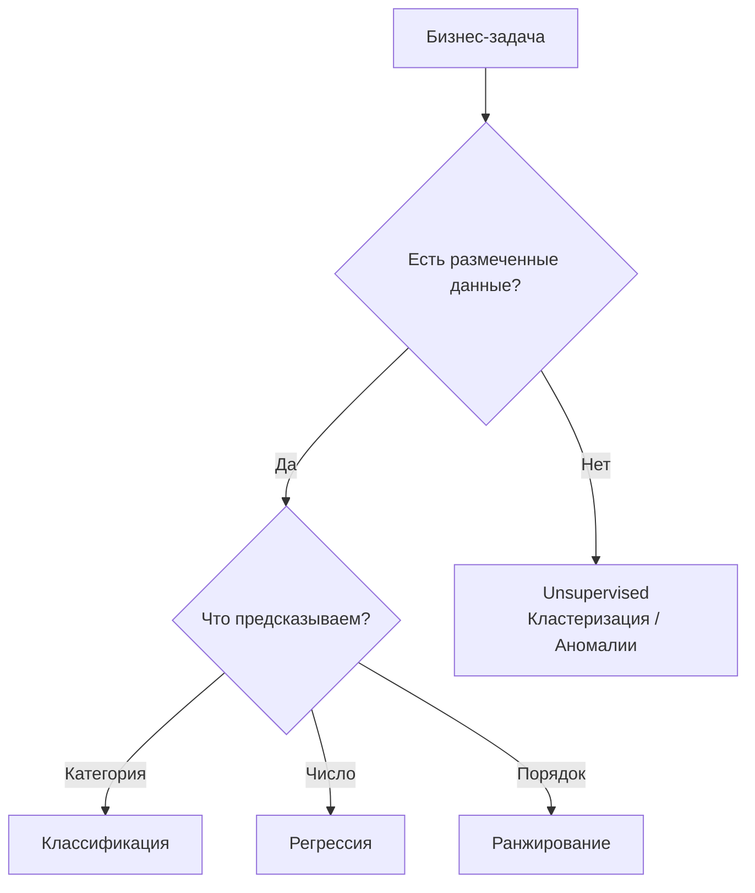
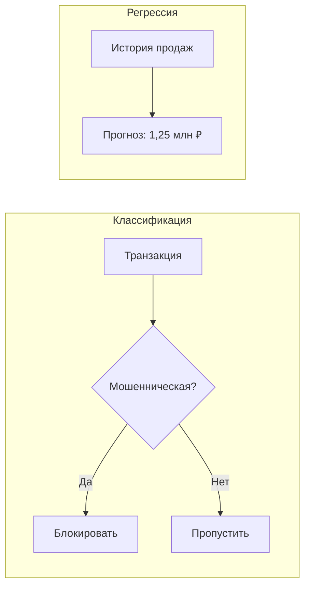
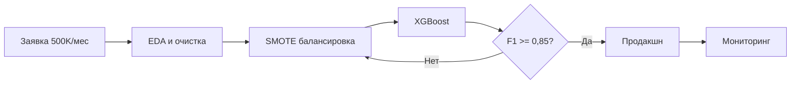
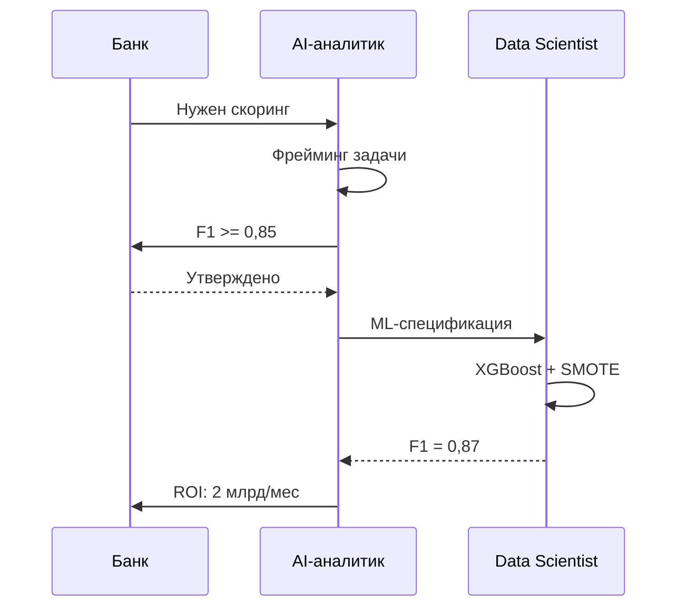

:::info TL;DR
Machine Learning — это подход, при котором программа не следует жёстким правилам, а «учится» на данных: находит закономерности и применяет их к новым примерам. Аналитику важно понимать типы ML-задач, метрики качества и способы валидации, чтобы корректно формулировать требования к ML-компонентам.
:::

## Для кого эта статья

- Системные аналитики, начинающие работать с ML-командами
- Продукт-менеджеры AI-продуктов, желающие понимать техническую базу
- Junior-разработчики, переходящие в Data Science

## После прочтения вы узнаете

- Какие типы ML-задач существуют и как их различать
- Чем классификация отличается от регрессии и кластеризации
- Что такое overfitting, underfitting и как их обнаружить
- Как устроена валидация ML-моделей

## Что такое Machine Learning

Обычная программа работает по правилам: «если сумма чека > 5000 → применить скидку 10%». ML-модель работает иначе: она смотрит на тысячи примеров «сумма чека → была ли применена скидка» и сама находит закономерность.

**Простая аналогия:** Вы не объясняете ребёнку правила грамматики — он сам учится говорить, слушая взрослых. ML работает так же: вместо правил — данные, вместо изучения языка — обучение модели.

## Три типа ML

| Тип | Суть | Пример задачи | Когда нужен |
|-----|------|--------------|-------------|
| **Supervised** (обучение с учителем) | Модель учится на размеченных парах «вход → правильный ответ» | Предсказать отток клиента по его истории | Есть исторические данные с известным результатом |
| **Unsupervised** (обучение без учителя) | Модель ищет структуру в данных без подсказок | Сегментировать клиентов по поведению | Нет размеченных данных, нужно найти группы |
| **Reinforcement** (обучение с подкреплением) | Модель учится методом проб и ошибок, получая «награду» за правильные действия | Обучить робота ходить, бота играть в шахматы | Задача — последовательность действий с обратной связью |

Для 90% задач системного аналитика актуален **Supervised** — именно его чаще всего требуют бизнес-заказчики.

## Типы задач в Supervised Learning

### Классификация (Classification)

Модель относит объект к одной из категорий:

| Подтип | Пример | Выход |
|--------|--------|-------|
| Бинарная | «Транзакция мошенническая?» | Да / Нет |
| Многоклассовая | «К какому типу относится обращение?» | Жалоба / Вопрос / Предложение |
| Многозначная | «Какие теги подходят к статье?» | Несколько тегов |

**Метрики:** accuracy, precision, recall, F1, AUC-ROC

### Регрессия (Regression)

Модель предсказывает число:

| Пример | Выход |
|--------|-------|
| Прогноз продаж на следующий месяц | 1 250 000 ₽ |
| Время выполнения задачи | 4.5 часа |
| Оценка вероятности оттока | 0.87 |

**Метрики:** MAE (средняя абсолютная ошибка), RMSE (среднеквадратичная ошибка), R²

### Кластеризация (Clustering)

Модель группирует похожие объекты без подсказок:

| Пример | Результат |
|--------|-----------|
| Сегментация клиентов | 3 кластера: «экономные», «активные», «премиум» |
| Поиск аномалий | Транзакции, непохожие на обычные |

**Метрики:** Silhouette score, инерция (для K-means)

### Ранжирование (Ranking)

Модель упорядочивает объекты по релевантности:

| Пример | Результат |
|--------|-----------|
| Поисковая выдача | Товары, отсортированные по вероятности покупки |
| Рекомендации | 10 фильмов, наиболее подходящих пользователю |

**Метрики:** NDCG, MAP, MRR

## Ключевые концепты

### Overfitting (переобучение)

Модель выучила обучающие данные «наизусть», но не может обобщить на новые. Как студент, который запомнил ответы на билеты, но не понимает предмет.

**Признаки:** отличные метрики на обучении, плохие — на тесте.

### Underfitting (недообучение)

Модель слишком простая и не улавливает закономерности даже в обучающих данных.

**Признаки:** плохие метрики и на обучении, и на тесте.

### Bias-Variance Tradeoff

- **High bias** — модель слишком простая, систематически ошибается (underfitting)
- **High variance** — модель слишком сложная, чувствительна к шуму в данных (overfitting)

Задача Data Scientist — найти баланс.

## Валидация модели

### Train / Validation / Test Split

Данные делятся на три части:

| Выборка | Доля | Назначение |
|---------|------|------------|
| Train | 70-80% | Обучение модели |
| Validation | 10-15% | Настройка гиперпараметров |
| Test | 10-15% | Финальная оценка качества (не участвует в обучении) |

**Важно:** тестовая выборка — священная корова. Её нельзя использовать для настройки модели, иначе оценка качества будет нечестной.

### Cross-Validation (кросс-валидация)

Данные делятся на K частей (обычно 5 или 10). Модель обучается K раз, каждый раз используя K-1 часть для обучения и 1 часть для валидации. Итоговая метрика — средняя по всем K запускам.

**Когда важно:** данных мало, нужна стабильная оценка качества.

### Data Leakage

Ситуация, когда информация из будущего или из тестового набора «просачивается» в обучающие данные. Например, если при обучении модели предсказания оттока вы использовали признак «клиент позвонил в поддержку», а на тестовых данных этот звонок произошёл уже после оттока — модель будет показывать нереалистично высокое качество.

## Зачем это знать аналитику

- Выбирать правильный тип ML-задачи для бизнес-проблемы
- Понимать, почему Data Scientist говорит «нужно больше данных» или «модель переобучена»
- Формулировать реалистичные требования к качеству модели
- Участвовать в приёмке модели: проверять валидацию, исключать data leakage

## Ключевые термины

- **Supervised learning** — обучение с учителем: модель учится на размеченных данных
- **Unsupervised learning** — обучение без учителя: модель ищет структуру в данных
- **Overfitting** — модель «выучила» данные наизусть, не обобщает
- **Train/Test split** — разделение данных на обучающую и тестовую выборки
- **Cross-validation** — многократное обучение на разных разбиениях данных для стабильной оценки

## Кейс: ML-скоринг для банковского кредитования

### Контекст

Банк обрабатывает 500 000 заявок на кредит ежемесячно. Доля дефолтов — 8,5%. Убыток от каждого дефолта — 120 000 руб. Текущая система скоринга на логистической регрессии давала F1 = 0,72, пропуская 34% дефолтов.

### Задача

AI-аналитик сформулировал ML-задачу как бинарную классификацию: предсказать дефолт заёмщика в течение 12 месяцев. Primary-метрика — F1 с порогом ≥ 0,85.

### Решение

1. **Данные:** 3 года кредитной истории (12 млн записей), 56 признаков: возраст, доход, кредитная история, сумма займа, цель, регион.
2. **EDA:** выявлен дисбаланс классов (91,5% / 8,5%), пропуски в 3 признаках < 5%.
3. **Модель:** XGBoost с балансировкой SMOTE и взвешенной метрикой.
4. **Валидация:** временные срезы — train 2021–2022, validation Q1 2023, test Q2 2023.

### Результаты и ROI

| Показатель | До ML | После ML |
|-----------|-------|----------|
| F1-мера | 0,72 | 0,87 |
| Пропущено дефолтов | 34% | 18% |
| Дефолтов в месяц | 42 500 | 25 500 |
| Убыток от дефолтов/мес | 5,1 млрд руб. | 3,06 млрд руб. |
| Экономия в месяц | — | 2,04 млрд руб. |
| Стоимость ML-инфраструктуры | — | 1,2 млн руб./мес |

Внедрение ML-скоринга сократило долю дефолтов с 8,5% до 5,1% (-40%) и сэкономило банку 2,04 млрд руб. ежемесячно. Проект окупился за 3 дня.

## Что дальше

- [EDA — разведочный анализ данных](/docs/specialization/ai-ml-eda) — как исследовать данные перед ML
- [Сбор требований для ML-систем](/docs/specialization/ai-ml-requirements) — как специфицировать ML-задачу
- [Метрики ML-продуктов](/docs/specialization/ai-ml-metrics) — подробно о метриках качества

## Проверь себя

1. **Какие три основных типа ML вы знаете?**
   *Ответ:* Supervised (обучение с учителем), Unsupervised (без учителя), Reinforcement (с подкреплением).

2. **Что такое overfitting и как его обнаружить?**
   *Ответ:* Модель отлично работает на обучающих данных, но плохо на тестовых. Обнаруживается сравнением метрик на train и test.

3. **Зачем нужна тестовая выборка, если есть валидационная?**
   *Ответ:* Валидационная выборка участвует в настройке модели (выбор гиперпараметров). Тестовая — финальная проверка, не влияющая на разработку. Без неё оценка качества будет оптимистичной.

4. **Что такое data leakage и чем он опасен?**
   *Ответ:* Data leakage — просачивание информации из будущего или тестового набора в обучающие данные. Модель показывает нереалистично высокое качество на валидации, но в продакшне работает хуже случайной.

5. **В чём разница между precision и recall?**
   *Ответ:* Precision — доля верно предсказанных положительных среди всех предсказанных положительных («не лжём»). Recall — доля верно найденных положительных среди всех реальных положительных («не пропускаем»). Выбор метрики зависит от цены ошибки каждого типа.

## Ссылки

- [Scikit-learn: Supervised Learning](https://scikit-learn.org/stable/supervised_learning.html)
- [Scikit-learn: Unsupervised Learning](https://scikit-learn.org/stable/modules/clustering.html)
- [XGBoost Documentation](https://xgboost.readthedocs.io/)
- [Google ML Crash Course](https://developers.google.com/machine-learning/crash-course)
- [SMOTE — Imbalanced-learn](https://imbalanced-learn.org/stable/over_sampling.html)
