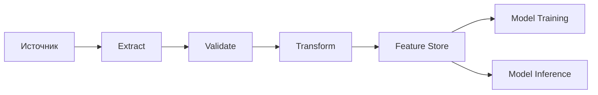
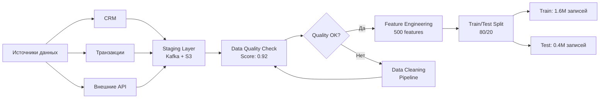

:::info TL;DR
Качество ML-модели определяется качеством данных, на которых она обучена. AI-аналитик отвечает за спецификацию данных: требования к объёму, качеству, разметке и пайплайнам. Без этой спецификации Data Scientist может построить модель, которая не взлетит в продакшне.
:::

## Для кого эта статья

- Data-аналитики, которые хотят перейти в ML
- Junior AI-аналитики, работающие над ML-продуктами
- Продуктовые менеджеры AI-направлений
- Все, кто специфицирует требования к данным для ML-моделей

## После прочтения вы узнаете

- Как оценивать достаточность данных для обучения ML-модели
- Какие метрики качества данных критичны для ML
- Как специфицировать требования к разметке и пайплайнам
- Как избежать data leakage при проектировании ML-системы

## Данные — bottleneck ML-проектов

Самая частая причина провала ML-проектов — не «мы не можем построить модель», а «у нас нет подходящих данных». Data Scientist может обучить модель с accuracy 98% на идеально размеченном датасете, но в реальности данных такого качества не существует.

AI-аналитик отвечает на вопросы:

- Какие данные нужны для обучения?
- Где они хранятся и как к ним получить доступ?
- Какого они качества и можно ли это качество измерить?
- Нужна ли разметка, кто будет размечать и по каким правилам?
- Как данные будут поступать в модель в продакшне?

## Требования к данным: чек-лист

### 1. Источники данных

Перечислить все источники, из которых модель получает признаки:

| Источник | Тип данных | Доступ | Ограничения |
|----------|------------|--------|-------------|
| CRM | Структурированные (таблицы) | SQL-доступ | Только агрегированные данные |
| Логи | Полуструктурированные (JSON) | S3 / Kafka | 30 дней хранения |
| Внешнее API | JSON по HTTP | API-ключ | Rate limit 100 req/min |

### 2. Объём данных

- **Сколько записей минимум** нужно для обучения (эмпирическое правило: для глубокой нейросети — от 10⁵ записей)
- **Сколько признаков** планируется использовать
- **Разбалансированность классов** — насколько неравномерно распределены целевые значения
- **Временной охват** — данные за какой период нужны (сезонность, тренды)

### 3. Качество данных

AI-аналитик должен специфицировать допустимый уровень проблем:

| Проблема | Допустимый уровень | Как измерять |
|----------|-------------------|--------------|
| Пропуски (null) | < 5% на признак | Доля null |
| Выбросы | < 1% записей | Z-score, IQR |
| Дубликаты | 0% | Хеширование |
| Невалидные значения | < 0.1% | Форматная валидация |
| Дрейф распределения | Отсутствует | KS-тест по временным срезам |

Если фактические показатели хуже — аналитик должен предложить стратегию очистки или зафиксировать риск.

### 4. Разметка данных

Для задач supervised learning (обучение с учителем) нужны размеченные данные. Это отдельная большая работа:

- **Способ разметки:** ручная (экспертами), краудсорсинг, автоматическая (по правилам), active learning
- **Инструкция по разметке:** что считать положительным классом, как обрабатывать пограничные случаи
- **Качество разметки:** как измеряем (Inter-Annotator Agreement, Cohen's Kappa), какой порог согласованности
- **Бюджет разметки:** сколько времени и денег нужно на разметку одной записи и всего датасета
- **Аугментация:** можно ли расширить датасет искусственно (повороты изображений, синонимы в тексте)

### 5. Пайплайн данных

Как данные будут двигаться от источника к модели:

**Ключевые требования к пайплайну:**
- **С fraquency:** как часто обновляются данные (batch — раз в день, streaming — в реальном времени)
- **Consistency:** гарантии консистентности (если данные пришли частично — модель не переобучается)
- **Feature store:** нужен ли централизованный репозиторий признаков (Feast, Tecton)
- **Data versioning:** нужно ли версионировать датасеты (DVC, LakeFS) для воспроизводимости экспериментов

### 6. Разделение выборок

Классическое разделение: train / validation / test. AI-аналитик фиксирует:

- **Пропорции:** 70/15/15 или 80/10/10
- **Стратегия разделения:** случайная, по времени (для временных рядов), стратифицированная (для несбалансированных классов)
- **Test set:** должен моделировать реальные данные, на которых модель будет работать в продакшне
- **Анти-cheating:** данные из теста не должны просочиться в обучение (data leakage)

## Ключевые термины

- **Supervised learning** — обучение с учителем: модель учится на размеченных парах «вход → правильный выход»
- **Feature engineering** — процесс создания признаков из сырых данных
- **Data leakage** — ситуация, когда информация из будущего или тестового набора попадает в обучающие данные, искажая оценку качества модели
- **Inter-Annotator Agreement** — метрика согласованности разметчиков: насколько два эксперта сходятся в оценке одного примера
- **Feature store** — централизованное хранилище признаков для обучения и инференса

## Кейс: пайплайн данных для кредитного скоринга

**Компания:** Финансовая платформа «КредитПлюс»
**Задача:** Построить ML-модель для скоринга заявок на микрозаймы

**Исходные данные:**
- 500 фичей (кредитная история, транзакции, демография, поведенческие паттерны)
- 2M записей за 3 года
- Quality Score на старте: 0.76

**Построенный пайплайн:**

**Процесс обеспечения качества:**

```mermaid
sequenceDiagram
    participant S as Источник
    participant Q as Quality Check
    participant F as Feature Store
    participant T as Train Pipeline
    participant I as Inference

    S->>Q: Сырые данные
    Q->>Q: Валидация схемы
    Q->>Q: Проверка пропусков &#60; 5%
    Q->>Q: Детекция выбросов Z-score
    Q->>F: Очищенные признаки
    F->>T: Batch-выгрузка 1.6M
    T->>T: Обучение модели XGBoost
    T->>F: Сохранение метаданных
    F->>I: Онлайн-признаки Redis
    I->>I: Инференс < 80ms
```

**Результаты:**
- Data Quality Score повышен с 0.76 до 0.92 за счёт автоматической очистки
- Выявлено 12% дубликатов и 3% невалидных записей в CRM
- Построен feature store на Feast — время инференса сократилось с 450 мс до 80 мс
- ROI за 6 месяцев: 4.2× (экономия на ручной проверке заявок — 1.8M руб/мес)

## Что дальше

- [Метрики ML-продуктов](/docs/specialization/ai-ml-metrics) — как оценить, что модель работает хорошо
- [Архитектура AI-решений](/docs/specialization/ai-ml-architecture) — как спроектировать ML-систему в продакшне
- [LLM, RAG и промпт-инжиниринг](/docs/specialization/ai-llm-rag) — если данные — текст, а задача — генерация

## Проверь себя

1. **Какая минимальная пропорция train/test обычно используется?**
   *Ответ:* 70/30 или 80/20. Для больших датасетов (миллионы записей) можно 90/10 или 98/2.

2. **Что такое data leakage и почему это опасно?**
   *Ответ:* Когда информация из тестового набора или из будущего просачивается в тренировочные данные. Модель показывает отличные метрики на тесте, но в реальности работает плохо.

3. **Как измерить качество ручной разметки?**
   *Ответ:* Inter-Annotator Agreement — дать один и тот же пример двум разметчикам и посчитать процент совпадений. Коэн's Kappa учитывает случайное совпадение.

4. **Что такое стратифицированное разделение выборок и когда оно нужно?**
   *Ответ:* Стратифицированное разделение сохраняет пропорции классов в train/test/val выборках. Нужно при несбалансированных классах, чтобы в тест не попали только примеры одного класса.

5. **Какая метрика используется для проверки дрейфа распределения признаков?**
   *Ответ:* KS-тест (Колмогорова-Смирнова) — сравнивает распределения признака на разных временных срезах. Если p-value &#60; 0.05 — распределение значимо изменилось, нужен retrain.

## Ссылки

1. [Feast — Feature Store Documentation](https://docs.feast.dev/)
2. [DVC — Data Version Control](https://dvc.org/doc)
3. [Scikit-learn — Train/Test Split](https://scikit-learn.org/stable/modules/generated/sklearn.model_selection.train_test_split.html)
4. [AWS — ML Data Quality Best Practices](https://docs.aws.amazon.com/wellarchitected/latest/machine-learning-well-architected/data-quality.html)
5. [Cohen's Kappa — Inter-Annotator Agreement](https://scikit-learn.org/stable/modules/generated/sklearn.metrics.cohen_kappa_score.html)
