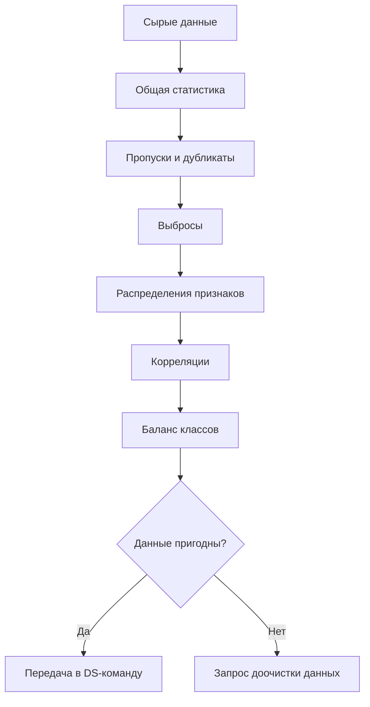
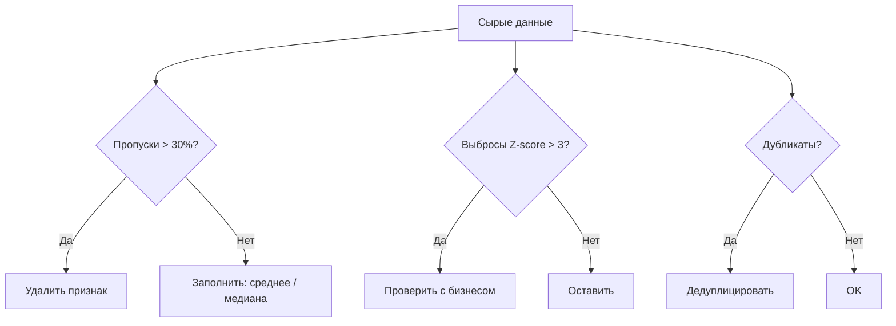
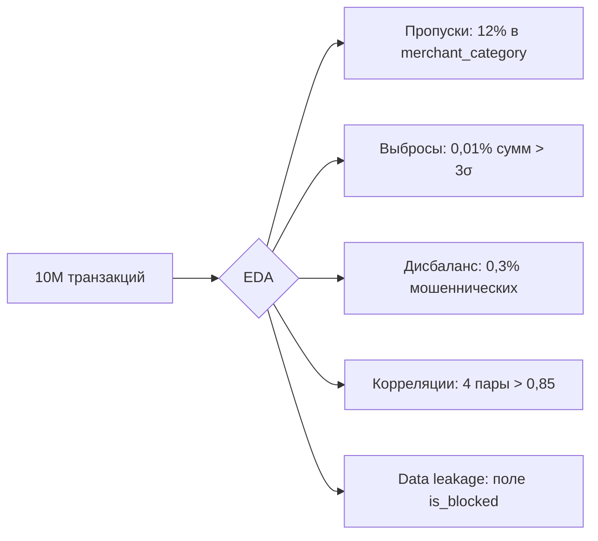
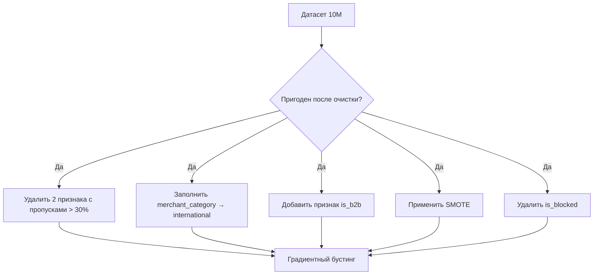
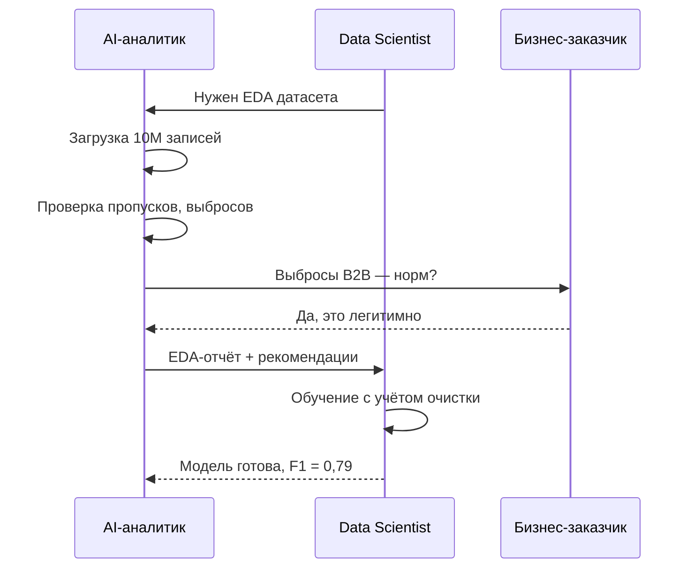

:::info TL;DR
EDA (Exploratory Data Analysis) — процесс исследования данных перед построением ML-модели: поиск закономерностей, выбросов, пропусков, проверка распределений. AI-аналитик использует EDA, чтобы оценить, пригодны ли данные для ML, и сформулировать требования к их очистке.
:::

## Для кого эта статья

- Системные аналитики, проверяющие готовность данных для ML
- Data Scientists, желающие структурировать подход к EDA
- Технические проджект-менеджеры AI-продуктов

## После прочтения вы узнаете

- Что такое EDA и почему он критичен перед построением ML-модели
- Какие 6 аспектов данных нужно проверить в первую очередь
- Как анализировать пропуски, выбросы и корреляции
- Как составить EDA-отчёт для передачи Data Science команде

## Что такое EDA

EDA — это «знакомство с данными». Прежде чем строить модель, нужно понять:

- Сколько данных и какие в них поля?
- Есть ли пропуски, выбросы, дубликаты?
- Как распределены ключевые признаки?
- Есть ли корреляции между признаками и целевой переменной?
- Сбалансированы ли классы?

**Аналогия:** EDA — это как осмотр квартиры перед покупкой. Вы не просто верите плану — вы смотрите на стены, трубы, окна, ищете трещины и плесень.



## Почему EDA критичен для ML

Без EDA Data Scientist может потратить недели на построение модели, которая не взлетит, потому что:

1. **Данные не те.** Ожидали 100K записей — получили 2K.
2. **Много пропусков.** В ключевом признаке 70% значений отсутствует.
3. **Выбросы искажают модель.** Одна транзакция на 1 млрд ₽ «сдвигает» всю регрессию.
4. **Классы несбалансированы.** Положительных примеров 0.1% — accuracy будет бессмысленна.
5. **Data leakage.** Поле «дата отмены подписки» случайно попало в признаки — модель «подглядела» будущее.

## Что анализировать в EDA

### 1. Общая статистика

| Показатель | Что даёт | Инструмент |
|-----------|----------|-----------|
| Количество записей | Хватает ли данных для ML | `df.shape`, `COUNT(*)` |
| Количество признаков | Сколько полей | `df.columns`, `DESCRIBE` |
| Типы данных | Числа, категории, текст, даты | `df.dtypes`, `information_schema` |
| Доля пропусков | Какие поля нужно чистить | `df.isnull().mean()` |
| Дубликаты | Нужно ли дедуплицировать | `df.duplicated().sum()` |



### 2. Распределение признаков

Для каждого числового признака:

- **Гистограмма** — как распределены значения (нормальное, равномерное, смещённое)
- **Боксплот (ящик с усами)** — есть ли выбросы, где медиана, квартили
- **Skewness** — смещено ли распределение (нужна ли трансформация)

Для каждого категориального признака:

- **Частотная таблица** — сколько значений в каждой категории
- **Bar chart** — визуализация частот

### 3. Пропуски

| Тип пропуска | Как обрабатывать |
|-------------|-----------------|
| MCAR (Missing Completely At Random) | Можно удалить или заполнить средним |
| MAR (Missing At Random) | Зависит от других признаков — нужно моделировать |
| MNAR (Missing Not At Random) | Пропуск сам по себе информация — нужно отдельное значение |

**Требование для аналитика:** зафиксировать процент пропусков по каждому признаку и согласовать стратегию обработки с Data Scientist.

### 4. Выбросы

Выбросы могут быть:

- **Ошибками данных** — сбой датчика, опечатка при вводе
- **Реальными аномалиями** — мошенническая транзакция, которая и есть цель ML
- **Закономерными экстремумами** — покупка в Black Friday

Методы обнаружения: Z-score (> 3), IQR (значение за пределами 1.5×IQR), визуальный анализ.

### 5. Корреляции

**Матрица корреляций** показывает, какие признаки связаны между собой и с целевой переменной:

- **Сильная корреляция с целевой** → хороший предиктор
- **Сильная корреляция между признаками** → мультиколлинеарность (нужно удалить один)
- **Отсутствие корреляции с целевой** → признак бесполезен (можно удалить)

### 6. Баланс классов

Для задач классификации критично проверить соотношение классов. Если положительных примеров 1%, а отрицательных 99%:

- Accuracy будет 99% даже у модели, которая всегда предсказывает «отрицательно»
- Нужны special техники: oversampling (SMOTE), undersampling, взвешенные метрики

## Типовой EDA-отчёт аналитика

Формат отчёта по EDA, который AI-аналитик передаёт команде:

```
Датасет: transactions_2024.csv
Записей: 1 245 389
Признаков: 47 (23 числовых, 14 категориальных, 10 дат)

Проблемы:
- 8 признаков с пропусками > 30% → удалить или запросить другие источники
- 2 признака с выбросами (Z-score > 5) → проверить с бизнесом
- Целевая переменная: 0.3% положительных → нужен oversampling
- Data leakage: поле is_blocked содержит информацию из будущего → удалить

Рекомендации:
- Датасет пригоден после очистки
- Минимальный объём для обучения: 800K записей
- Рекомендуемая модель: градиентный бустинг (XGBoost, CatBoost) из-за смешанных типов признаков
```

## Зачем это знать аналитику

- Принимать решение: «данные готовы к ML» или «нужно дочистить»
- Формулировать требования к данным на основе EDA-результатов
- Понимать риски: пропуски, выбросы, дисбаланс классов
- Коммуницировать с Data Scientist на одном языке («делали ли EDA? какие выбросы?»)

## Ключевые термины

- **EDA (Exploratory Data Analysis)** — разведочный анализ данных: исследование структуры, качества, распределений
- **Гистограмма** — график распределения числового признака
- **Боксплот (box plot)** — график, показывающий медиану, квартили и выбросы
- **Матрица корреляций** — таблица попарных корреляций между признаками
- **Мультиколлинеарность** — сильная корреляция между признаками-предикторами (ухудшает интерпретацию модели)

## Кейс: EDA для датасета 10 млн транзакций

### Контекст

Платёжный процессинг обрабатывает 10 млн транзакций в месяц. Data Scientist получил датасет для построения модели детекции мошенничества и запросил EDA-отчёт. AI-аналитик провёл разведочный анализ за 3 дня.

### Общая статистика

| Показатель | Значение |
|-----------|----------|
| Количество записей | 10 423 891 |
| Числовых признаков | 28 |
| Категориальных признаков | 15 |
| Признаков с пропусками > 5% | 6 |
| Признаков с пропусками > 30% | 2 |
| Доля мошеннических транзакций | 0,3% (31 272) |

### Найденные проблемы



### Решения

1. **Пропуски в merchant_category (12%).** Категория продавца отсутствовала у международных транзакций. Решение: создать категорию «international» вместо удаления признака.

2. **Выбросы (0,01% сумм > 3σ).** Проверка с бизнес-заказчиком подтвердила — это легитимные B2B-переводы. Решение: не удалять, добавить бинарный признак `is_b2b`.

3. **Дисбаланс классов (0,3% мошеннических).** Accuracy будет бессмысленна. Решение: взвешенная метрика F1, oversampling через SMOTE.

4. **Мультиколлинеарность (4 пары признаков с r > 0,85).** Сумма транзакции и баланс до/после сильно коррелированы. Решение: удалить 3 избыточных признака.

5. **Data leakage (поле is_blocked).** Поле заполнялось постфактум после проверки — содержит информацию из будущего. Решение: удалить из обучающих признаков.

### Итоговое заключение



**Итог:** датасет пригоден после очистки. Минимальный объём для обучения — 7 млн записей. Рекомендуемая модель — градиентный бустинг с взвешенным F1. Без EDA команда потратила бы 3 недели на модель, которая «схватила» бы data leakage и показала нереалистичное качество.



## Что дальше

- [Данные для ML: качество, разметка, пайплайны](/docs/specialization/ai-ml-data) — что делать с данными после EDA
- [Метрики ML-продуктов](/docs/specialization/ai-ml-metrics) — как оценивать качество модели

## Проверь себя

1. **Что такое EDA и зачем он нужен перед ML?**
   *Ответ:* EDA — исследование данных: проверка пропусков, выбросов, распределений, корреляций. Без EDA можно потратить недели на модель из некачественных данных.

2. **Что делать с признаком, у которого 70% пропусков?**
   *Ответ:* Варианты: удалить признак, заполнить (средним/медианой/по модели), или создать отдельную категорию «нет данных». Решение зависит от важности признака для бизнеса.

3. **Почему accuracy может быть обманчивой на несбалансированных данных?**
   *Ответ:* Если положительных примеров 1%, модель может всегда предсказывать «отрицательно» и иметь accuracy 99%, но реально не ловить ни одного целевого события.

4. **Как выбросы влияют на ML-модель и что с ними делать?**
   *Ответ:* Выбросы могут искажать обучение, особенно для регрессии и линейных методов. Одна транзакция на 1 млрд ₽ может «сдвинуть» линию регрессии. Выбросы нужно проверять с бизнесом: это могут быть как ошибки ввода, так и важные аномалии — цель ML.

5. **Что такое мультиколлинеарность и чем она опасна?**
   *Ответ:* Мультиколлинеарность — сильная корреляция между признаками-предикторами. Она ухудшает интерпретацию модели (непонятно, какой признак реально влияет) и делает веса линейных моделей нестабильными.

## Ссылки

- [Pandas: DataFrame.describe()](https://pandas.pydata.org/docs/reference/api/pandas.DataFrame.describe.html)
- [Scikit-learn: Feature Selection](https://scikit-learn.org/stable/modules/feature_selection.html)
- [Matplotlib: Visualization Guide](https://matplotlib.org/stable/tutorials/index.html)
- [SMOTE — Imbalanced-learn](https://imbalanced-learn.org/stable/over_sampling.html)
- [Seaborn: Statistical Data Visualization](https://seaborn.pydata.org/tutorial.html)
