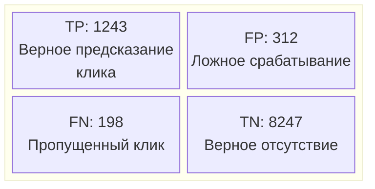
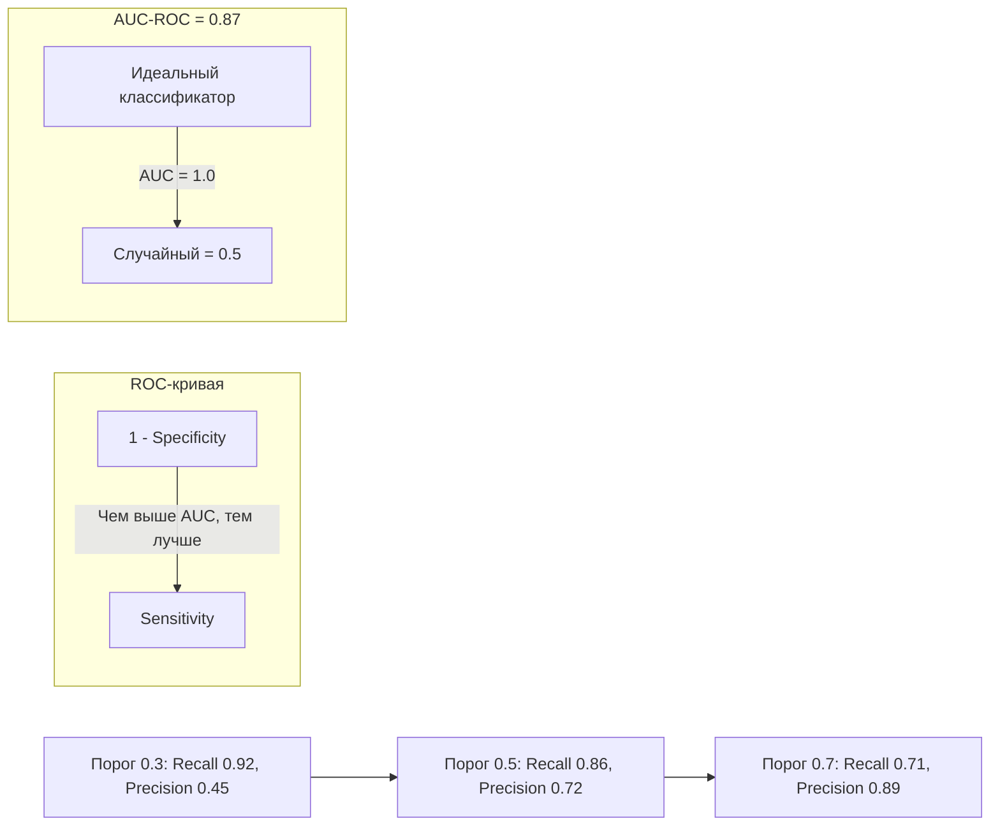

:::info TL;DR
ML-продукт оценивается на двух уровнях: технические метрики модели (precision, recall, F1) и бизнес-метрики (ROI, LTV, конверсия). AI-аналитик связывает эти уровни: определяет, какие технические метрики влияют на бизнес-показатели и какие пороговые значения считать приёмкой.
:::

## Для кого эта статья

- AI-аналитики, формулирующие критерии приёмки ML-моделей
- Product-менеджеры и владельцы ML-продуктов
- Data Scientist, которые хотят лучше понимать бизнес-контекст метрик
- Все, кто участвует в A/B-тестировании ML-моделей

## После прочтения вы узнаете

- Чем ML-метрики отличаются от бизнес-метрик и как их связать
- Как выбрать primary метрику для разных типов ML-задач
- Как спроектировать A/B-тест для ML-модели
- Какие метрики мониторить в продакшне и при каких порогах бить тревогу

## Два уровня метрик

Любой ML-продукт нужно оценивать одновременно с двух сторон:

**Уровень 1 — ML-метрики.** Говорят о качестве модели как алгоритма.

| Метрика | Суть | Когда важна |
|---------|------|-------------|
| Accuracy | Доля правильных ответов | Сбалансированные классы |
| Precision | Точность: сколько из предсказанных положительных — верны | Когда ложное срабатывание дорого |
| Recall | Полнота: сколько реальных положительных мы нашли | Когда пропустить событие дорого |
| F1-score | Гармоническое среднее precision и recall | Компромисс точности и полноты |
| AUC-ROC | Способность модели разделять классы | Бинарная классификация, ранжирование |
| MAE / RMSE | Средняя ошибка предсказания (регрессия) | Числовые прогнозы |
| Perplexity | Неопределённость модели (LLM) | Генеративные модели |

**Уровень 2 — Бизнес-метрики.** Говорят о влиянии модели на продукт.

| Метрика | Суть | Пример |
|---------|------|--------|
| ROI | Окупаемость ML-внедрения | «Модель сэкономила X руб/мес при стоимости Y руб/мес» |
| Conversion | Изменение конверсии в целевом действии | «+5% пользователей дошли до оплаты» |
| LTV | Изменение жизненной ценности клиента | «Клиенты, которых удержала модель, приносят на 20% больше» |
| NPS | Влияние на удовлетворённость | «После внедрения рекомендаций CSAT вырос на 10 п.п.» |
| Cost saved | Прямая экономия | «Автоматизация обработки запросов сократила штат на 3 FTE» |

Задача AI-аналитика — построить мост между этими уровнями: показать бизнесу, что «precision 0.95» означает «только 5% ложных срабатываний, которые вы увидете как инциденты».

## Как выбирать primary метрику

Не все метрики одинаково полезны. AI-аналитик выбирает **одну primary метрику**, под которую оптимизируется модель:

**Для задачи детекции (поиск иголки в стоге):**
```
Бизнес: «Мы теряем деньги на мошеннических транзакциях»
Primary: Recall (мы хотим поймать как можно больше мошенников)
Secondary: Precision (контролируем количество ложных блокировок)
```

**Для задачи ранжирования (рекомендации):**
```
Бизнес: «Пользователи должны чаще кликать на рекомендованные товары»
Primary: NDCG@10 (качество первых 10 рекомендаций)
Secondary: CTR (кликабельность рекомендаций)
```

**Для задачи генерации (LLM):**
```
Бизнес: «Ответы ассистента должны быть полезными и безопасными»
Primary: Human evaluation score (оценка экспертами)
Secondary: Ответы без галлюцинаций, время ответа
```

## A/B-тестирование ML-моделей

Модель, прошедшая offline-валидацию, не гарантирует успеха в реальном продукте. Единственный способ проверить — A/B-тест:

1. **Гипотеза:** модель X повысит конверсию в целевое действие на 5%
2. **Дизайн:** 50% пользователей видят текущую систему, 50% — с ML-моделью
3. **Длительность:** минимум 2 недели (чтобы покрыть недельные циклы)
4. **Метрика:** статистически значимое улучшение (p-value < 0.05)
5. **Защита:** если модель ухудшает метрику более чем на 2% — автоматический откат

AI-аналитик специфицирует дизайн A/B-теста и критерии остановки эксперимента.

## Мониторинг модели в продакшне

После внедрения модель нужно постоянно мониторить:

| Метрика мониторинга | Что отслеживает | Действие при отклонении |
|---------------------|-----------------|------------------------|
| Prediction drift | Распределение предсказаний изменилось | Проверить данные, переобучить |
| Feature drift | Распределение признаков изменилось | Обновить feature engineering |
| Accuracy на свежих данных | Качество модели упало | Retrain / rollback |
| Latency P99 | Модель стала медленнее | Оптимизация инфраструктуры |
| Business KPI | ML перестал приносить пользу | Остановить эксперимент |

Для каждой метрики мониторинга AI-аналитик фиксирует пороги срабатывания алерта (например, «если accuracy упала ниже 0.85 в течение часа — звонить дежурному»).

## Confusion Matrix и её интерпретация

Для задач классификации AI-аналитик должен уметь читать и объяснять Confusion Matrix:

| | Предсказан Positive | Предсказан Negative |
|---|---|---|
| **Факт Positive** | TP (True Positive) | FN (False Negative) |
| **Факт Negative** | FP (False Positive) | TN (True Negative) |

- **TP** — модель правильно поймала событие
- **FN** — модель пропустила событие (самое дорогое, если событие — мошенничество)
- **FP** — ложная тревога (создаёт шум, бесит пользователей)
- **TN** — модель правильно определила отсутствие события

На основе этой матрицы AI-аналитик обсуждает с бизнесом trade-off: «Мы можем повысить recall с 0.8 до 0.95, но тогда precision упадёт с 0.9 до 0.6 — будет в 4 раза больше ложных срабатываний. Вас это устраивает?»

## Кейс: A/B-тест модели рекомендаций

**Компания:** Маркетплейс «ТоварыОнлайн»
**Задача:** Повысить вовлечённость пользователей через персонализированные рекомендации

**Исходные данные:**
- Текущая система: rule-based рекомендации (по категориям)
- Новая модель: Two-Tower нейросеть на эмбеддингах товаров
- Трафик A/B-теста: 100K пользователей (50/50 split)

**Визуализация confusion matrix для модели классификации (есть клик / нет клика):**



**ROC-кривая — способность модели разделять классы:**



**Сравнение ML-метрик и бизнес-метрик:**

```mermaid
flowchart LR
    subgraph ML[ML-метрики]
        P[Precision@10: +23%]
        R[Recall@10: +15%]
        N[NDCG@10: +18%]
    end
    subgraph Business[Бизнес-метрики]
        RV[Revenue: +12%]
        CR[CTR: +8.5%]
        LTV[LTV: +6%]
    end
    P -->|Влияет| CR
    R -->|Влияет| RV
    N -->|Коррелирует| LTV
```

**Результаты A/B-теста:**
- precision@10 вырос на 23% (с 0.61 до 0.75)
- recall@10 вырос на 15% (с 0.52 до 0.60)
- CTR рекомендаций вырос на 8.5 процентных пункта
- Выручка с пользователя (revenue per user) — рост на 12%
- Тест длился 3 недели, p-value = 0.003, статистическая значимость подтверждена
- Дополнительная выручка: 2.4M руб/мес при стоимости инфраструктуры 180K руб/мес
- ROI: 13.3× годовых

**Вывод:** ML-метрики (precision, recall) предсказали улучшение бизнес-показателей, но точную величину влияния на revenue дал только A/B-тест.

## Что дальше

- [LLM, RAG и промпт-инжиниринг](/docs/specialization/ai-llm-rag) — метрики для генеративных моделей
- [Архитектура AI-решений](/docs/specialization/ai-ml-architecture) — как внедрить модель с мониторингом
- [Этика, bias и регуляторика ИИ](/docs/specialization/ai-ethics) — fairness-метрики и аудит

## Проверь себя

1. **Какая метрика primary для задачи детекции редких событий?**
   *Ответ:* Recall — важнее найти все события, чем не ошибиться. Но нужно контролировать precision, чтобы не было слишком много ложных срабатываний.

2. **Что такое Precision-Recall trade-off?**
   *Ответ:* Повышая полноту (recall), мы обычно снижаем точность (precision) — и наоборот. Выбор компромисса — бизнес-решение, а не техническое.

3. **Зачем нужен A/B-тест, если модель прошла offline-проверку?**
   *Ответ:* Offline-метрики не гарантируют успеха в реальном продукте: распределение данных может отличаться, пользователи ведут себя иначе, есть неучтённые факторы.

4. **Что показывает AUC-ROC и какие у него допустимые значения?**
   *Ответ:* AUC-ROC показывает способность модели разделять классы при разных порогах. 0.5 — случайное угадывание, 0.8+ — хорошая модель, 0.9+ — отличная, 1.0 — идеальная.

5. **Какую метрику мониторинга использовать для отслеживания деградации модели в продакшне?**
   *Ответ:* Prediction drift (изменение распределения предсказаний) и Accuracy на свежих размеченных данных. Если accuracy упала below порога — нужен retrain или rollback.

## Ссылки

1. [Scikit-learn — Metrics and Scoring](https://scikit-learn.org/stable/modules/model_evaluation.html)
2. [Google — A/B Testing for ML Models](https://developers.google.com/machine-learning/testing-debugging/ab-testing)
3. [Evidently AI — ML Monitoring Documentation](https://docs.evidentlyai.com/)
4. [StatQuest — ROC and AUC Explained](https://www.youtube.com/watch?v=4jRBRDbJemM)
5. [AWS — ML Business KPIs](https://docs.aws.amazon.com/wellarchitected/latest/machine-learning-well-architected/business-kpis.html)
