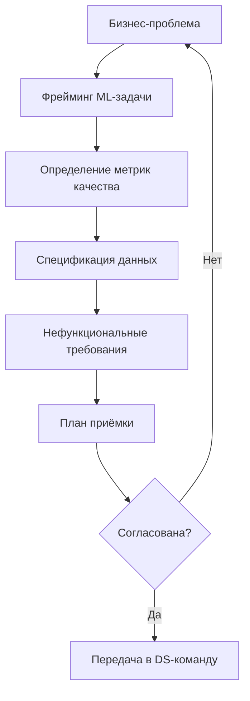
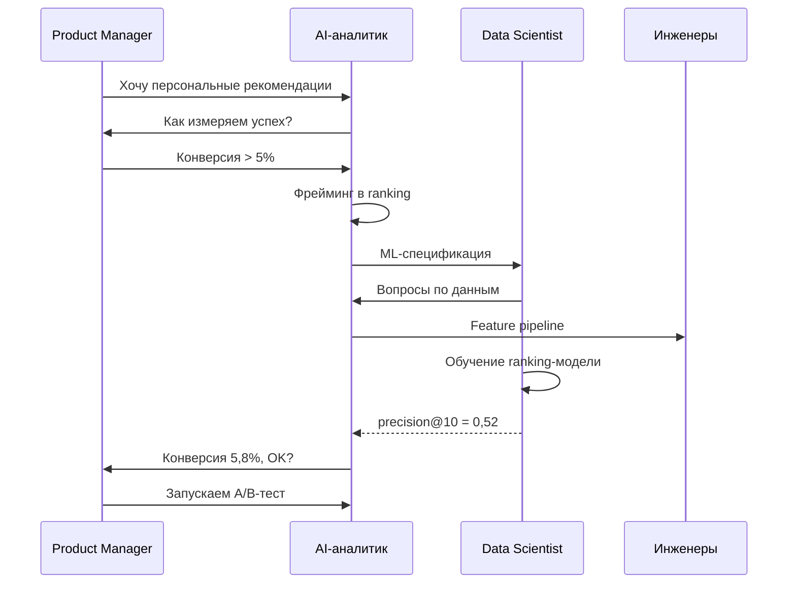

:::info TL;DR
ML-системы требуют иного подхода к требованиям: функциональные требования описывают не алгоритм, а ожидаемое поведение модели; нефункциональные — качество инференса, latency, объяснимость. Главная задача AI-аналитика — корректно сформулировать ML-задачу так, чтобы бизнес и Data Science говорили на одном языке.
:::

## Для кого эта статья

- Системные аналитики, которым предстоит описывать ML-компоненты в SRS
- Team Leads и архитекторы, интегрирующие ML в существующие системы
- Product Managers, желающие понимать, как формулировать требования к AI-продуктам

## После прочтения вы узнаете

- Чем ML-требования отличаются от классических
- Какова структура полноценной ML-спецификации
- Как формулировать primary-метрику и пороговые значения
- Какие нефункциональные требования критичны для ML-систем
- Типовые ошибки при сборе ML-требований и как их избежать

## Чем ML-требования отличаются от обычных

В классической разработке функциональное требование звучит так: «Система рассчитывает комиссию по формуле X». Алгоритм детерминирован — одинаковый вход всегда даёт одинаковый выход.

В ML-системе требование звучит иначе: «Модель классифицирует транзакцию как мошенническую с precision не ниже 90% и recall не ниже 80%». Результат вероятностный, и качество зависит от данных, на которых модель обучалась.

Это порождает три ключевых отличия:

1. **Невозможна полная спецификация.** Нельзя заранее описать все случаи, которые модель должна правильно обработать. Вместо этого описываются критерии качества и границы применимости.
2. **Данные — часть требований.** Требование к модели неполно без спецификации данных: какие признаки, какого качества, в каком объёме, как размечаются.
3. **Метрика — часть контракта.** Бизнес и команда договариваются не только о том, ЧТО делает модель, но и КАК ХОРОШО она должна это делать.

## Структура ML-спецификации

Вот минимальный набор разделов, которые AI-аналитик должен включить в документ требований к ML-компоненту:



### 1. Бизнес-контекст

- Какая бизнес-проблема решается
- Как сейчас (без ML) работает процесс
- Что изменится после внедрения модели
- Кто пользователь результата модели (человек или система)
- Какие риски при неверном предсказании

### 2. Формулировка ML-задачи

- **Тип задачи:** классификация (бинарная/многоклассовая), регрессия, кластеризация, ранжирование, генерация (LLM), детекция аномалий
- **Целевая переменная:** что именно предсказываем («отток клиента в течение 30 дней»)
- **Входные данные:** какие признаки используются на входе
- **Горизонт предсказания:** на какой срок вперёд делается прогноз

### 3. Требования к качеству

Это самая важная и сложная часть:

- **Primary ML-метрика:** accuracy, precision, recall, F1, MAE, RMSE — в зависимости от бизнес-задачи
- **Пороговые значения:** минимально приемлемый уровень («recall не ниже 0.85»)
- **Target-значение:** желаемый уровень («target recall 0.95»)
- **Стратегия валидации:** как проверяем — holdout, кросс-валидация, временные срезы
- **Тестовые сценарии:** edge cases, на которых модель обязана работать корректно

### 4. Требования к данным

- **Источники данных:** какие системы, таблицы, API
- **Объём:** сколько записей минимум нужно для обучения
- **Разметка:** нужна ли ручная разметка, кем, по каким инструкциям
- **Качество:** допустимый процент пропусков, выбросов, невалидных значений
- **Частота обновления:** как часто обновляются данные для обучения и инференса

### 5. Нефункциональные требования

- **Latency инференса:** максимальное время ответа модели (P99)
- **Throughput:** сколько запросов в секунду должна выдерживать
- **Объяснимость:** нужна ли интерпретация предсказания (SHAP, LIME)
- **Fairness:** на каких группах модель не должна дискриминировать
- **Cost:** бюджет на инференс (стоимость одного запроса к LLM, стоимость GPU)
- **SLA:** допустимое время недоступности ML-сервиса

### 6. Приёмка (Acceptance Criteria for ML)

- **Offline-валидация:** модель проходит пороговые метрики на тестовом наборе
- **Online-валидация:** A/B-тест показывает улучшение бизнес-метрики
- **Shadow mode:** модель работает параллельно с существующим процессом без влияния на бизнес
- **Bias-аудит:** проверка, что модель не дискриминирует защищённые группы

## Типовые ошибки при сборе ML-требований

- **Формулировка «сделайте нейросеть»** — бизнесу всё равно на архитектуру, ему важно решить проблему. Не принимайте технические решения на этапе требований.
- **Отсутствие baseline** — прежде чем внедрять ML, нужно знать, как сейчас решается задача. Правило эвристики или простой формулы может быть достаточно.
- **Accуracy как единственная метрика** — на несбалансированных классах accuracy обманчива. Для задачи детекции мошенничества (99% легитимных транзакций) модель с accuracy 99% может не ловить ни одного мошенничества.
- **Игнорирование cost-фактора** — стоимость инференса LLM может быть на порядки выше, чем классической ML-модели. Если на каждую транзакцию вызывать GPT-4, бизнес разорится на API-запросах.

## Ключевые термины

- **ML-спецификация** — документ, описывающий требования к ML-компоненту: данные, метрики, нефункциональные характеристики
- **Target variable** — целевая переменная, которую модель предсказывает
- **Inference latency** — время, за которое модель возвращает предсказание
- **Offline vs Online валидация** — проверка модели на исторических данных vs в реальном продукте
- **Baseline** — простейшее решение (например, «всегда предсказывать самый частый класс»), с которым сравнивается ML-модель

## Кейс: ML-спецификация для рекомендаций в e-commerce

### Контекст

Интернет-магазин с каталогом 1 млн товаров и 5 млн активных пользователей. Текущая система рекомендаций — правило «самые популярные товары в категории». Конверсия в покупку по рекомендациям — 3,2%. Бизнес поставил цель: персонализированные рекомендации с конверсией не ниже 5%.

### ML-спецификация (составлена AI-аналитиком)

**Тип задачи:** ранжирование (ranking) — для каждого пользователя упорядочить товары по вероятности покупки.

**Primary-метрика:** precision@10 (доля релевантных товаров среди первых 10 рекомендаций). Порог: ≥ 0,45. Target: ≥ 0,55.

**Входные данные:** история просмотров (90 дней), корзина, покупки, демография пользователя, характеристики товара.

**Объём данных:** 120 млн событий в месяц. Минимальный объём обучения — 6 месяцев.

**Нефункциональные требования:** latency P99 < 100 мс, throughput > 5 000 RPS, SLA — 99,95%.

```mermaid
flowchart LR
    A[События пользователя] --> B[Feature Store]
    B --> C[Ранжирующая модель]
    C --> D[Рекомендации top-10]
    D --> E{precision@10 ≥ 0,45?}
    E -->|Да| F[Пользователь]
    E -->|Нет| G[A/B-тест]
    G --> H[Переобучение]
    H --> C
```

### Реализация и ROI

| Показатель | До ML | После ML |
|-----------|-------|----------|
| Конверсия в покупку | 3,2% | 5,8% |
| Средний чек | 1 850 руб. | 1 850 руб. |
| Дополнительная выручка/мес | — | 240 млн руб. |
| Затраты на ML-инфраструктуру | — | 4,5 млн руб./мес |
| Затраты на разработку (аморт.) | — | 2,1 млн руб./мес |
| Чистый эффект в месяц | — | 233,4 млн руб. |

Персонализированные рекомендации увеличили конверсию до 5,8% (превысив target), принеся магазину 2,8 млрд руб. дополнительной выручки в год. Проект окупился за 1,5 месяца.



## Что дальше

- [Данные для ML: качество, разметка, пайплайны](/docs/specialization/ai-ml-data) — как специфицировать данные для обучения
- [Метрики ML-продуктов](/docs/specialization/ai-ml-metrics) — от accuracy до бизнес-показателей
- [Архитектура AI-решений](/docs/specialization/ai-ml-architecture) — как спроектировать систему с ML-компонентом

## Проверь себя

1. **Какая главная сложность в формулировке требований к ML?**
   *Ответ:* ML-модель недетерминирована — нельзя гарантировать конкретный результат на конкретном входе. Вместо этого формулируются требования к качеству на статистике.

2. **Что должно быть в требованиях к данным?**
   *Ответ:* Источники, объём, качество (пропуски, выбросы), разметка, частота обновления.

3. **Почему accuracy не всегда подходит как primary метрика?**
   *Ответ:* На несбалансированных классах accuracy не отражает реальное качество. Например, при 99% «хороших» транзакций модель может всегда предсказывать «хорошо» и иметь accuracy 99%, но не ловить мошенничество.

4. **Что такое offline и online валидация ML-модели?**
   *Ответ:* Offline-валидация — проверка метрик на исторических данных (test set). Online-валидация — A/B-тест в реальном продукте, где сравнивается бизнес-метрика (конверсия, выручка) с текущей системой.

5. **Почему в ML-спецификации важно указывать стратегию валидации?**
   *Ответ:* От стратегии валидации зависит достоверность оценки качества. Holdout, кросс-валидация и временные срезы дают разные оценки. Если Data Scientist выберет оптимистичный метод, модель может не пройти приёмку в проде.

## Ссылки

- [Rules of ML — Google](https://developers.google.com/machine-learning/guides/rules-of-ml)
- [CRISP-DM — методология ML-проектов](https://www.ibm.com/docs/en/spss-modeler/17.0.0?topic=mining-crisp-dm)
- [Scikit-learn: Cross-Validation](https://scikit-learn.org/stable/modules/cross_validation.html)
- [XGBoost: Learning to Rank](https://xgboost.readthedocs.io/en/stable/tutorials/learning_to_rank.html)
- [Neptune.ai: ML Model Validation](https://neptune.ai/blog/ml-model-validation)
