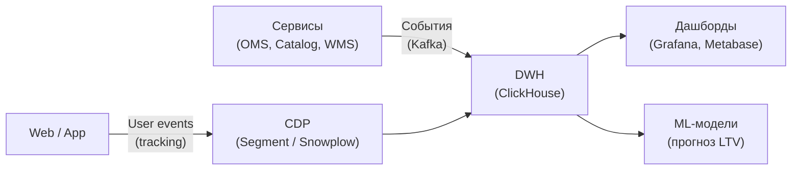
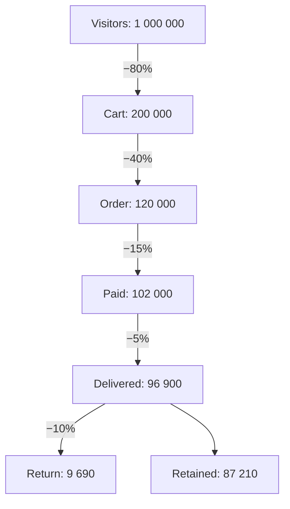
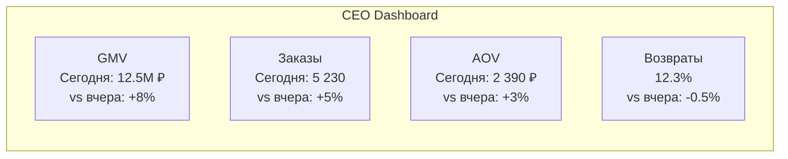

:::info[TL;DR]
E-commerce аналитика — сбор, хранение и визуализация метрик: product-метрики (конверсия, retention, LTV), business-метрики (GMV, AOV, Churn), операционные (RPS, latency). Ключевые инструменты: CDP (Customer Data Platform), продуктовые воронки (funnel), когортный анализ (cohort), ABC-XYZ анализ ассортимента. Аналитик специфицирует события, дашборды и rules для алертов.
:::

## Для кого эта статья

- Middle SA, специфицирующий аналитику в e-commerce
- SA, работающий с метриками и Dashboard

После прочтения вы:
- Узнаете 3 слоя метрик: Product, Business, Operations
- Поймёте, как строить воронку (funnel) и когорты
- Сможете спроектировать аналитический слой (события → DWH → Dashboard)

## Что это такое

Аналитика в e-commerce — система метрик для принятия решений:

- **Product** — конверсия, retention, LTV
- **Business** — GMV, AOV, Gross Margin, Churn
- **Operations** — RPS, latency, error rate, cost per order

**Архитектура аналитики:**

## Слой 1: Product-метрики

| Метрика | Описание | Формула |
|---------|----------|---------|
| **Conversion Rate (CR)** | % пользователей, совершивших покупку | Purchased / Unique Visitors |
| **Retention Rate** | % вернувшихся через N дней | Users D+N / Users D0 |
| **LTV** | Доход от клиента за всё время | AOV × Purchase Frequency × Lifetime |
| **Stickiness** | DAU / MAU | Насколько часто возвращаются |
| **CAC** | Стоимость привлечения клиента | Маркетинг / New Customers |

### Воронка (Funnel)

**Где теряем:**
- Cart → Order: 40% — высокая стоимость доставки, нет нужного способа оплаты
- Order → Paid: 15% — ошибка платежа, брошенная оплата

## Слой 2: Business-метрики

| Метрика | Описание | Норма |
|---------|----------|-------|
| **GMV** (Gross Merchandise Value) | Общая стоимость проданных товаров | — |
| **AOV** (Average Order Value) | Средний чек | 2 000-5 000 ₽ (fashion) |
| **Gross Margin** | GMV - COGS / GMV | 30-50% |
| **Net Profit** | GMV - COGS - Маркетинг - Операции | 5-15% |
| **Churn Rate** | % ушедших клиентов | 5-10%/мес |

### ABC-XYZ анализ ассортимента

**ABC (по выручке):**
| Категория | Доля в ассортименте | Доля в выручке |
|-----------|-------------------|---------------|
| A | 20% | 80% |
| B | 30% | 15% |
| C | 50% | 5% |

**XYZ (по стабильности продаж):**
| Категория | Коэффициент вариации | Пример |
|-----------|---------------------|--------|
| X | < 10% | Молоко, хлеб |
| Y | 10-25% | Одежда (сезонность) |
| Z | > 25% | Электроника (новинки) |

**Матрица ABC-XYZ:**

| | A | B | C |
|--|---|---|---|
| **X** | Постоянный запас, автозаказ | Стандартный заказ | Минимум |
| **Y** | Прогнозирование | Смешанный заказ | По потребности |
| **Z** | Осторожно, по факту | Индивидуальный подход | Удалить? |

## Слой 3: Operations-метрики

| Метрика | Описание | Норма |
|---------|----------|-------|
| **RPS** (Requests Per Second) | Нагрузка на сервисы | — |
| **Latency (p95)** | Время ответа API | < 500ms |
| **Error Rate (5xx)** | Доля ошибок | < 1% |
| **Cost per Order** | Себестоимость заказа | 200-500 ₽ |
| **Fulfillment Time** | От оплаты до доставки | 1-3 дня |
| **Return Rate** | Доля возвратов | 5-15% |

## Когортный анализ (Cohort)

**Пример когорты по неделям:**

| Неделя | W0 | W1 | W2 | W3 | W4 |
|--------|----|----|----|----|----|
| Янв 1 | 1000 | 300 | 150 | 80 | 40 |
| Янв 2 | 1200 | 350 | 180 | 90 | — |
| Янв 3 | 900 | 280 | 130 | — | — |

Из 1000 новых клиентов первой недели: 300 вернулись на W1, 150 на W2, 80 на W3.

**Retention Matrix — цветовая карта:**
- W0: 100% (все новые)
- W1: 30% (хорошо)
- W2: 15% (средне)
- W3: 8% (ниже среднего)
- W4: 4% (плохо — клиенты ушли)

## События (Event Tracking)

| Событие | Параметры | Откуда |
|---------|-----------|--------|
| `page_view` | url, referrer, user_id | Web/App |
| `product_view` | product_id, price, category | Catalog |
| `cart_add` | product_id, qty, price | Cart |
| `cart_remove` | product_id, qty | Cart |
| `order_create` | order_id, items, total, promo | OMS |
| `payment_success` | order_id, amount, method | Payment |
| `payment_fail` | order_id, amount, error | Payment |
| `order_delivered` | order_id, days | WMS/TMS |
| `return_start` | order_id, reason | Returns |

## Практический кейс: E-commerce дашборд

Дашборд для CEO / Head of E-commerce:

## Проверь себя

1. **Назовите 3 слоя метрик в e-commerce.**
   *Ответ:* Product (конверсия, LTV), Business (GMV, AOV, Margin), Operations (RPS, latency).

2. **Что такое ABC-XYZ анализ?**
   *Ответ:* ABC — деление товаров по доле в выручке (A=80%, B=15%, C=5%). XYZ — по стабильности продаж (X=стабильные, Y=сезонные, Z=хаотичные). Комбинация — стратегия управления запасом.

3. **Какие события нужно отслеживать в e-commerce?**
   *Ответ:* page_view, product_view, cart_add/remove, order_create, payment_success/fail, order_delivered, return_start.

4. **Что покажет Retention Matrix на W3, если W0=1000, W3=80?**
   *Ответ:* Retention = 80 / 1000 = 8%.

## Ссылки для самостоятельного изучения

| Что | Описание | URL |
|-----|----------|-----|
| Яндекс Метрика — e-commerce | Отчёты для e-commerce | yandex.ru |
| Google Analytics 4 — e-commerce | События и отчёты | google.com |
| ClickHouse — аналитика | Open-source DWH | clickhouse.com |
| Amplitude — product analytics | Аналитика продуктов | amplitude.com |
