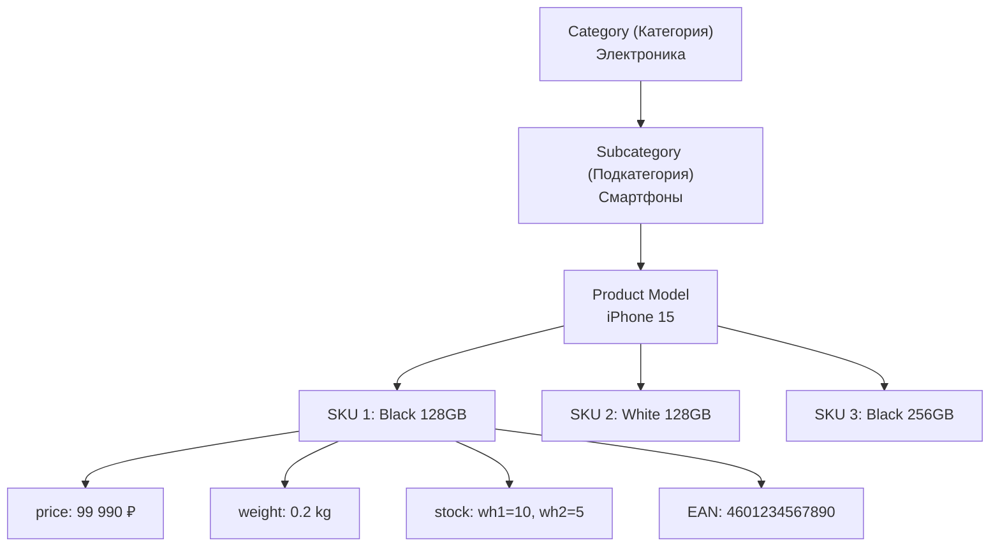
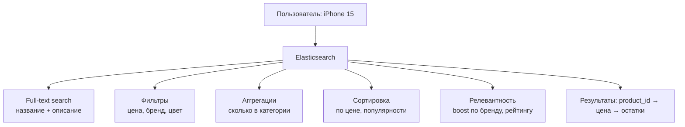
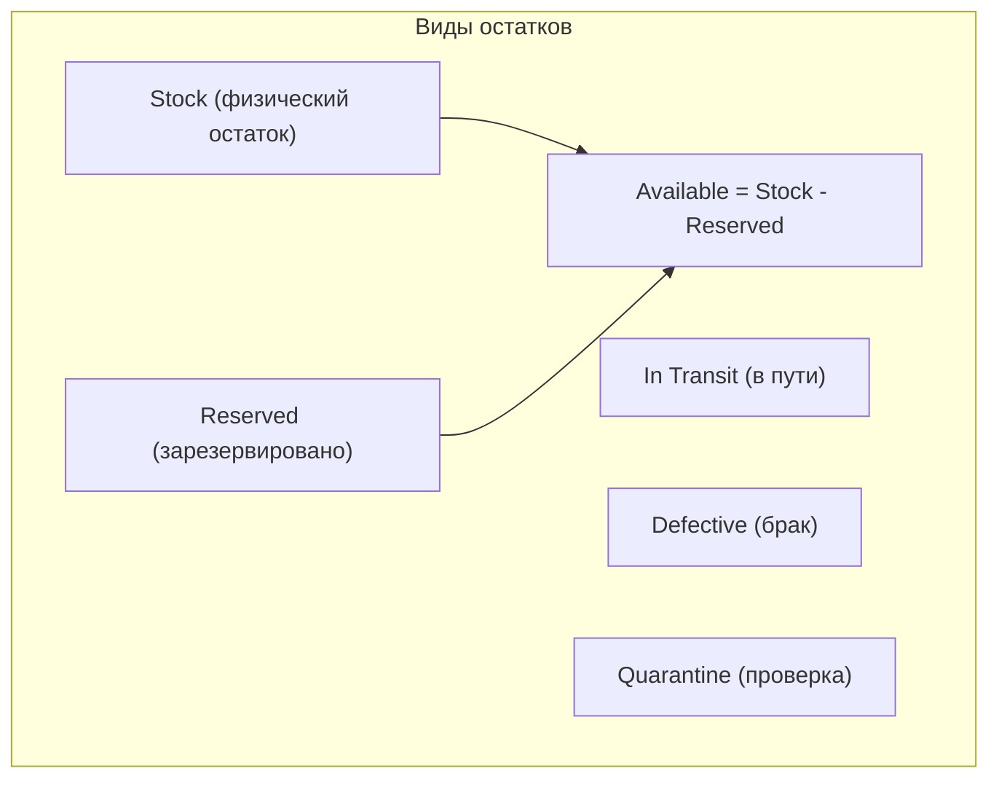

:::info[TL;DR]
Каталог товаров — центральная сущность e-commerce. Структура (категории, атрибуты, SKU), поиск (Elasticsearch), инвентаризация (остатки, резервы) и ценообразование. Типичная ошибка — проектировать каталог как плоскую таблицу. У Wildberries > 10M активных SKU, поиск — миллисекунды. Аналитик специфицирует атрибуты, связи между товарами, правила поиска и синхронизацию с WMS.
:::

## Для кого эта статья

- Middle SA, проектирующий каталог товаров
- Junior SA, разбирающийся в SKU и атрибутах
- SA, работающий с Elasticsearch-поиском

После прочтения вы:
- Сможете спроектировать иерархию каталога (категории → модели → SKU)
- Поймёте, какие атрибуты влияют на SKU, какие — только описывают
- Узнаете, как работает поиск через Elasticsearch и инвентаризация

## Ключевые термины

| Термин | Описание |
|--------|----------|
| SKU | Stock Keeping Unit — код товарной позиции для учёта |
| EAN/UPC | Международный штрихкод товара (13 цифр) |
| GTIN | Global Trade Item Number — глобальный ID товара |
| Attribute | Характеристика товара (цвет, размер, вес) |
| Variant | Вариант товара (SKU с уникальным набором атрибутов) |
| Inventory | Остатки товара на складах |
| Faceted search | Поиск с фильтрами |
| Fuzzy search | Нечёткий поиск с опечатками |

## Структура каталога

| Понятие | Описание | Пример |
|---------|----------|--------|
| **Category** | Верхний уровень иерархии | Электроника, Одежда, Дом |
| **Subcategory** | Вложенная категория | Смартфоны, Ноутбуки |
| **Product Model** | Абстрактный товар (без вариантов) | iPhone 15 |
| **Variant (SKU)** | Конкретный вариант к продаже | iPhone 15 Black 128GB |
| **SKU (код)** | Уникальный код для учёта | IP15-BLK-128 |
| **EAN/UPC** | Штрихкод (международный) | 4601234567890 |

## Атрибуты товара

| Тип | Пример | Использование | Влияет на SKU? |
|-----|--------|-------------|---------------|
| **Вариативные** | Цвет, размер, память | Выбор варианта | Да |
| **Фиксированные** | Вес, бренд, страна | Фильтры, карточка | Нет |
| **Технические** | Процессор, экран | Карточка товара | Нет |
| **SEO** | Title, description, keywords | Поиск, мета-теги | Нет |

**Правило:** Если атрибут влияет на цену или остатки — он должен быть вариативным (создаёт SKU).

## Поиск по каталогу (Elasticsearch)

**Требования к поиску:**

| Функция | Описание | Пример |
|---------|----------|--------|
| **Full-text** | Поиск по названию и описанию | «iphone» → iPhone 15 |
| **Fuzzy** | Нечёткий поиск (опечатки) | «айфон» → iPhone |
| **Autocomplete** | Подсказки при вводе | «i» → iPhone, iPad, iMac |
| **Synonyms** | Синонимы | «мобила» = «смартфон» |
| **Faceted** | Фильтры с количеством | Цвет: чёрный (25), белый (10) |
| **Geo** | Товары рядом с ПВЗ | Доставка завтра |

## Инвентаризация (Inventory Management)

### Методы учёта товара

| Метод | Описание | Когда используют |
|-------|----------|----------------|
| **FIFO** | First In First Out — первая партия уходит первой | Продукты, косметика |
| **LIFO** | Last In First Out — последняя партия уходит первой | Стройматериалы |
| **FEFO** | First Expiry First Out — сначала ближайший срок | Лекарства |
| **Average cost** | Средняя себестоимость | Одежда, электроника |
| **Lot tracking** | По партиям | Гарантия, отзыв товара |

## Синхронизация остатков

**Проблема:** каталог (Elasticsearch) и склад (WMS) — разные системы. Между списанием на складе и обновлением в каталоге — 1-5 минут задержки. На пиковых распродажах это приводит к oversell.

**Решения:**

| Решение | Описание | Лаг |
|---------|----------|-----|
| **Pre-reserve** | Safety stock (на 5% меньше показывать) | 0 |
| **MQ sync** | Kafka/RabbitMQ — немедленное уведомление | < 1 сек |
| **Throttling** | Ограничение количества в корзине | 0 |
| **Batch update** | Периодическая синхронизация Elasticsearch | 1-5 мин |

## Практический кейс: Редизайн каталога

**Проблема:** Маркетплейс одежды: каталог — flat-таблица в MySQL. 1M+ SKU. Поиск — SQL LIKE. Время поиска: 5-10 сек. Категории не сходятся с фильтрами.

**Анализ:**
- Атрибуты (цвет, размер) — varchar с запятыми
- Нет Elasticsearch — поиск через MySQL
- Категории — 2 уровня (мало для одежды: нужны пол, тип, сезон)

**Решение:**
1. Миграция в Elasticsearch (1 неделя индексации)
2. Категории: 4 уровня (Пол → Категория → Тип → SKU)
3. Атрибуты: вынесены в отдельные таблицы (EAV для вариативных)
4. Инвентаризация: реальное время через Kafka

**Результат:**
- Время поиска: 5-10 сек → 50 мс (100x)
- Oversell: 2% → 0.1%
- Конверсия поиска: +15% (благодаря autocomplete и fuzzy)
- Стоимость: 8 млн руб.

## Проверь себя

1. **Чем отличается Product Model от SKU?**
   *Ответ:* Product Model — абстрактный товар (iPhone 15). SKU — конкретный вариант (iPhone 15 Black 128GB). Один Product Model может иметь много SKU.

2. **Как работает поиск в каталоге e-commerce?**
   *Ответ:* Elasticsearch: full-text + fuzzy + фильтры + аггрегации + boost релевантности. Данные синхронизируются из БД через пайплайн.

3. **Какие есть методы учёта товара на складе?**
   *Ответ:* FIFO (первая партия — первая продажа), LIFO, FEFO (по сроку годности), average cost, lot tracking.

4. **Какие атрибуты должны быть вариативными, а какие — фиксированными?**
   *Ответ:* Вариативные — те, что влияют на цену/остатки (цвет, размер, память). Фиксированные — для описания (бренд, страна). Если атрибут влияет на SKU — он вариативный.

5. **Как избежать oversell при задержке синхронизации с WMS?**
   *Ответ:* Pre-reserve (safety stock), MQ-синхронизация, throttling корзины, batch update с приоритетом для распродаж.

## Ссылки для самостоятельного изучения

| Что | Описание | URL |
|-----|----------|-----|
| Elasticsearch — поисковая аналитика | Документация | elastic.co |
| EAV-модель | Entity-Attribute-Value для каталогов | martinfowler.com |
| Ozon Product API | Управление товарами на Ozon | seller.ozon.com |
| Wildberries Content API | Управление карточками | seller.wildberries.ru |

## Что дальше

- [Ценообразование и промо](/docs/specialization/ecommerce-pricing) — цены, скидки, промокоды
- [Фулфилмент и логистика](/docs/specialization/ecommerce-fulfillment) — Pick → Pack → Ship
- [Elasticsearch — технология](/tech/elasticsearch) — поиск и индексация
