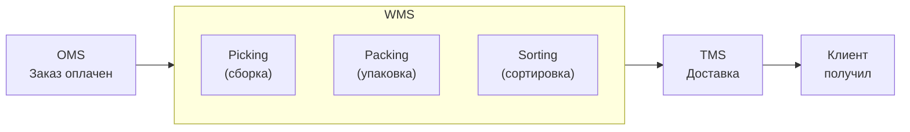
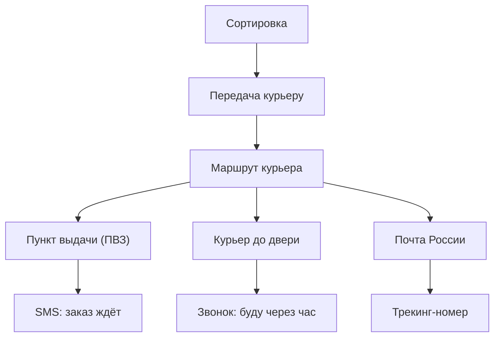
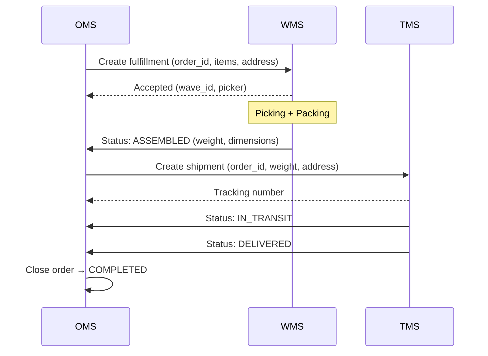

:::info[TL;DR]
Фулфилмент — всё, что происходит с заказом после оплаты: сборка на складе, упаковка, передача курьеру, доставка, возврат. Ключевые системы: WMS (склад) и TMS (транспорт). Интеграция: OMS → WMS (задание на сборку) → TMS (доставка). Сроки: D1 (сегодня), D2 (завтра), D3+ (до 7 дней). Last-mile — до 60% стоимости доставки. Возвраты — до 15% в fashion.
:::

## Для кого эта статья

- Middle SA, интегрирующий OMS с WMS и TMS
- SA в e-commerce логистике

После прочтения вы:
- Поймёте 5 этапов фулфилмента
- Узнаете сущности WMS (location, wave, task)
- Сможете спроектировать поток заказа через OMS → WMS → TMS

## Что это такое

Фулфилмент — операционный процесс от момента оплаты до вручения заказа клиенту (и возврата, если он нужен).

**Жизненный цикл заказа в фулфилменте:**



## 5 этапов фулфилмента

### 1. Сборка (Picking)

- WMS получает задание от OMS
- Wave picking: группа заказов собирается за один проход
- Сборщик следует по маршруту (WMS показывает: стеллаж A12, полка 3)
- Сканирование: подтверждение каждой позиции

**Методы сборки:**
| Метод | Описание | Производительность |
|-------|----------|-------------------|
| Piece (поштучно) | Один заказ = один сборщик | Низкая |
| Wave (волна) | Группа заказов = один проход | Высокая |
| Zone (зона) | Каждый собирает в своей зоне | Средняя |
| Cluster (кластер) | Несколько корзин за раз | Выше средней |

### 2. Упаковка (Packing)

- Выбор коробки (алгоритм: по весу и габаритам)
- Добавление накладной, маркировки, рекламных материалов
- Контроль веса (расхождение > 5% → перепроверка)
- Печать этикетки (трекинг-номер)

### 3. Сортировка (Sorting)

- По направлениям доставки (Москва-Юг, МО, Регионы)
- По службам доставки (СДЭК, Почта, Boxberry)
- По типам доставки (обычная, экспресс)

### 4. Доставка (Last-mile)



**Last-mile — 60% стоимости доставки.**

| Параметр | ПВЗ | Курьер | Почта |
|----------|-----|--------|-------|
| Стоимость | 150-250 ₽ | 300-600 ₽ | 200-400 ₽ |
| Сроки | D2-D4 | D1-D2 | D4-D7 |
| % интернет-магазинов | 80% | 60% | 40% |

### 5. Возвраты (Returns)

**Типы возвратов:**

- **Полный** — коробку не вскрывали, полный рефанд
- **Частичный** — часть товаров не подошла
- **Брак** — товар повреждён, полный рефанд + компенсация логистики
- **Отказ от получения** — не забрал из ПВЗ

**Воронка возврата:**

```
Клиент → Заявка → Курьер (забор) → Склад → QC → Решение
                                                      ├── На склад (годное)
                                                      ├── Уценка (лёгкий дефект)
                                                      └── Утилизация (брак)
```

## Интеграция OMS → WMS → TMS



## KPI фулфилмента

| Метрика | Норма | Расчёт |
|---------|-------|--------|
| **On-time delivery** | > 95% | % заказов, доставленных в срок |
| **Order accuracy** | > 99% | % заказов без ошибок в составе |
| **Picker productivity** | 80-120 строк/час | Строк / часы сборщика |
| **Damaged rate** | < 1% | Повреждённых / всего |
| **Return rate** | 5-15% (fashion — до 25%) | Возвратов / всего |
| **Cost per order** | 200-500 ₽ | Полные затраты / кол-во заказов |

## Практический кейс: Интеграция Ozon с фулфилментом

Ozon использует FBO (склад Ozon) и FBS (склад продавца). Для FBO:
- Продавец привозит товар на склад Ozon
- Ozon принимает, проверяет, размещает (Putaway)
- При заказе: сборка, упаковка, сортировка → доставка
- Комиссия: 10-25% в зависимости от категории

**Проблема:** пиковые нагрузки (11.11, Чёрная пятница) — в 10× выше обычных.
**Решение:** прогнозирование загрузки склада, гибкий штат курьеров.

## Проверь себя

1. **Перечислите 5 этапов фулфилмента.**
   *Ответ:* Сборка (Picking) → Упаковка (Packing) → Сортировка (Sorting) → Доставка (Last-mile) → Возвраты (Returns).

2. **Чем отличается Wave picking от Zone picking?**
   *Ответ:* Wave — сборщик проходит весь склад, собирая несколько заказов за один проход. Zone — каждый сборщик в своей зоне, заказ перемещается между зонами.

3. **Почему last-mile — 60% стоимости доставки?**
   *Ответ:* Большое количество точек, низкая плотность заказов, «последние метры» — самые дорогие. Курьер едет к конкретному адресу, часто неудачные попытки вручения.

4. **Какие виды возвратов бывают?**
   *Ответ:* Полный, частичный, брак, отказ от получения.

## Ссылки для самостоятельного изучения

| Что | Описание | URL |
|-----|----------|-----|
| Ozon — фулфилмент | FBO / FBS инструкция | seller.ozon.ru |
| Wildberries — фулфилмент | WB FBS инструкция | seller.wildberries.ru |
| СберЛогистика | TMS для e-commerce | sberlogistics.ru |
| Boxberry — доставка | Last-mile партнёр | boxberry.ru |
