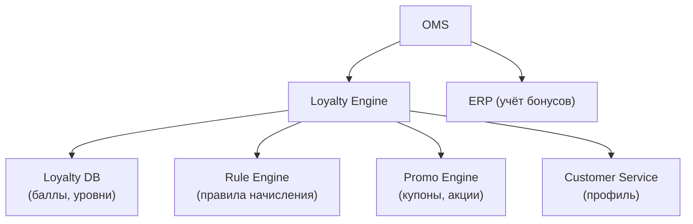
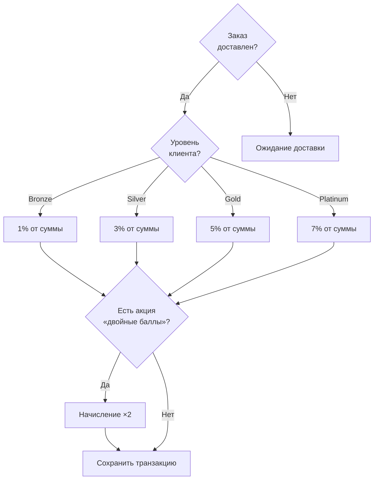
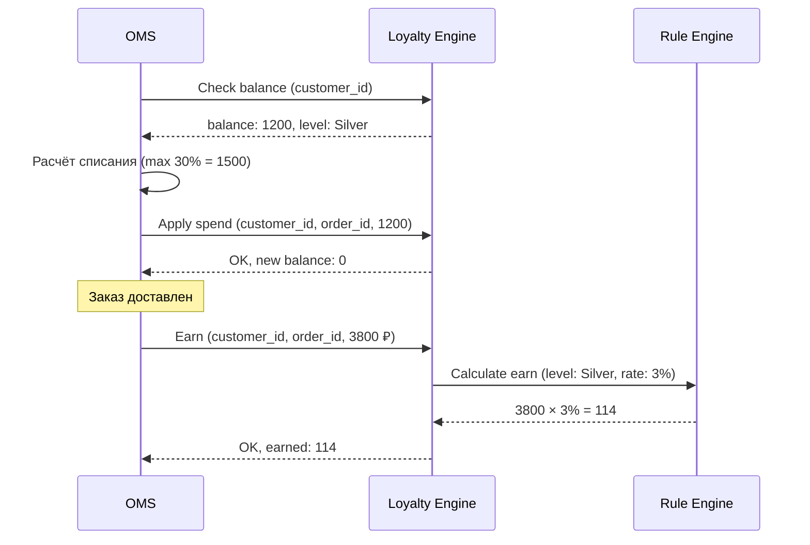

:::info[TL;DR]
Система лояльности — программа удержания клиентов через бонусы, кэшбэк, уровни, персональные предложения. Ключевые метрики: Retention Rate (удержание), Repeat Purchase Rate (повторные), Average Order Value (AOV), Customer Lifetime Value (LTV). Типы: балльная (1 балл = 1 рубль), кэшбэк (% от покупки), tiered (уровни Bronze → Silver → Gold), подписочная (Amazon Prime). Аналитик специфицирует правила начисления/списания, интеграцию с OMS и Promo Engine.
:::

## Для кого эта статья

- Middle SA, проектирующий систему лояльности
- SA в e-commerce с программами удержания

После прочтения вы:
- Поймёте 4 типа программ лояльности
- Узнаете key metrics: RPR, AOV, LTV, Churn, Redemption Rate
- Сможете спроектировать rule-based начисление бонусов

## Что это такое

Система лояльности — инструмент удержания клиентов: мотивация покупать чаще и больше.

**Типовая архитектура:**

## 4 типа программ лояльности

| Тип | Пример | Механика | LTV-эффект |
|-----|--------|----------|-----------|
| **Балльная (Points)** | «Спасибо» от Сбербанка | 1 балл = 1 рубль | +15-20% |
| **Кэшбэк (Cashback)** | «Яндекс Плюс» | 1-5% от суммы | +20-25% |
| **Уровневая (Tiered)** | Sephora Beauty Insider | Bronze → Silver → Gold | +30% |
| **Подписочная (Subscription)** | Amazon Prime | Ежемесячная плата за привилегии | +50% |

## Ключевые метрики

| Метрика | Описание | Норма | Формула |
|---------|----------|-------|---------|
| **RPR** (Repeat Purchase Rate) | Доля повторных покупок | 30-50% | Клиенты с 2+ заказами / всего клиентов |
| **AOV** (Average Order Value) | Средний чек | — | Выручка / кол-во заказов |
| **LTV** (Customer Lifetime Value) | Доход от клиента за всё время | — | AOV × Частота × Срок жизни |
| **Churn Rate** | Отток клиентов | 5-10%/мес | Ушедшие / всего за период |
| **Redemption Rate** | Доля использования бонусов | 60-80% | Списано / начислено за период |
| **Breakage** | Сгоревшие бонусы | 10-20% | Сгорело / начислено |

## Правила начисления бонусов

### Decision-tree

### Правила списания

- Максимум: 30% от стоимости заказа
- Минимум для списания: 100 баллов
- Не суммируется с некоторыми промо-кодами
- При возврате: баллы восстанавливаются (за вычетом сгоревших)

## Интеграция с OMS

## Практический кейс: «Яндекс Плюс»

**Механика:**
- Подписка: 299 ₽/мес
- Кэшбэк: до 10% баллами (1 балл = 1 рубль)
- Баллы начисляются на Яндекс.Маркет, Лавку, Такси, Музыку
- Сгорание: через 365 дней после начисления

**Результаты (данные Яндекса, 2024):**
- > 30 млн подписчиков
- AOV участников — на 40% выше
- Retention Rate — на 25% выше
- Churn — ниже на 15%

## Проверь себя

1. **Назовите 4 типа программ лояльности.**
   *Ответ:* Балльная, кэшбэк, уровневая, подписочная.

2. **Что такое Redemption Rate?**
   *Ответ:* Доля начисленных бонусов, которые клиенты реально потратили. Норма: 60-80%. Низкий показатель — баллы не ценятся, высокий — программа успешна.

3. **Как интеграция OMS с Loyalty Engine обрабатывает заказ?**
   *Ответ:* На этапе оформления — проверка баланса, списание. После доставки — начисление по правилам.

4. **Какие метрики используете для оценки программы лояльности?**
   *Ответ:* RPR, AOV, LTV, Churn, Redemption Rate.

## Ссылки для самостоятельного изучения

| Что | Описание | URL |
|-----|----------|-----|
| Яндекс Плюс — технология | Как устроен кэшбэк | yandex.ru |
| СберСпасибо | Программа лояльности | spasibo.sberbank.ru |
| Amazon Prime | Подписка | amazon.com |
| Harvard Business Review — Loyalty | Best practices | hbr.org |
