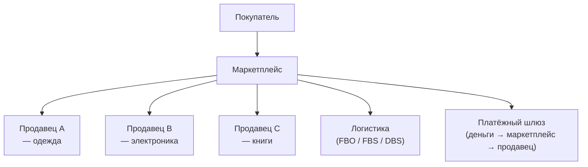
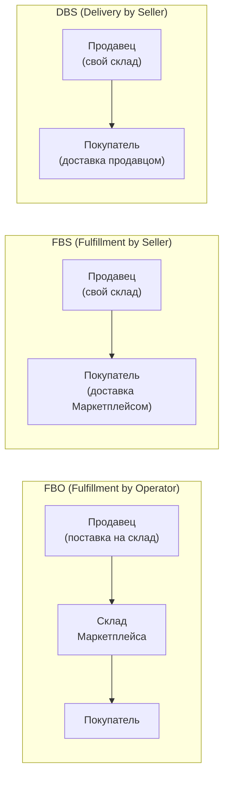
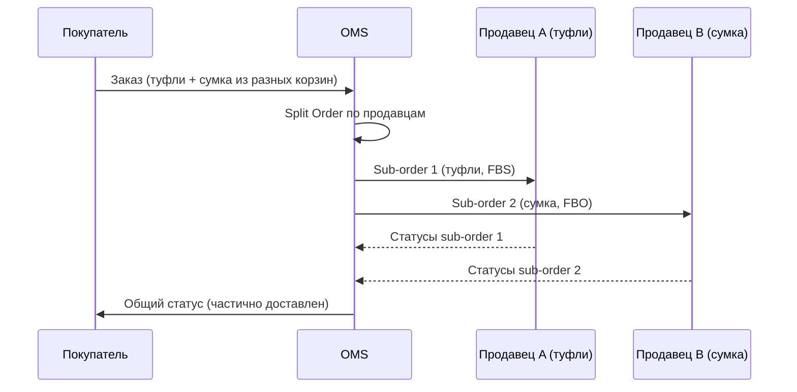

:::info[TL;DR]
Маркетплейс — платформа, где продавцы (третьи лица) торгуют через ваш канал. Ключевые модели: FBO (продавец везёт на склад маркетплейса), FBS (продавец хранит у себя, маркетплейс забирает), DBS (продавец сам доставляет). Комиссия — от 5% до 25% в зависимости от категории. Ядро — модель «заказ разделяется на суб-заказы по продавцам» + расчёт комиссий + рейтинг продавцов. Примеры: Wildberries, Ozon, Яндекс.Маркет.
:::

## Для кого эта статья

- Middle SA, проектирующий marketplace-платформу
- SA, работающий с мультивендорными заказами

После прочтения вы:
- Поймёте модели FBO / FBS / DBS
- Узнаете, как устроен расчёт комиссий и рейтинг продавцов
- Сможете спроектировать Split Order (разделение заказа по продавцам)

## Что это такое

Маркетплейс — e-commerce, где товары принадлежат не платформе, а третьим продавцам (селлерам). Платформа — посредник: предоставляет канал продаж, платёжную инфраструктуру, логистику (опционально).



## 3 модели фулфилмента



| Параметр | FBO | FBS | DBS |
|----------|-----|-----|-----|
| **Хранение** | Склад маркетплейса | Склад продавца | Склад продавца |
| **Сборка** | Маркетплейс | Продавец | Продавец |
| **Доставка** | Маркетплейс | Маркетплейс | Продавец |
| **Скорость** | 1-2 дня | 2-4 дня | 3-7 дней |
| **Комиссия** | Выше (10-25%) | Средняя (8-15%) | Ниже (5-10%) |
| **Риски** | Брак, пересорт — на маркетплейсе | Брак — на продавце | Брак — на продавце |

## Архитектура Split Order

Ключевое отличие marketplace от обычного магазина: **один заказ = несколько суб-заказов** (по продавцам).



## Расчёт комиссий

- **Комиссия за продажу** — % от цены товара (зависит от категории)
- **Комиссия за логистику** — фикс + вес/объём
- **Комиссия за эквайринг** — % от платежа
- **Комиссия за хранение** — ₽/паллета/день (только FBO)
- **Штрафы** — за просрочку отгрузки, брак, отмены

**Формула дохода маркетплейса:**
```
Доход = ∑(Комиссия_продажа + Логистика + Хранение) - Штрафы_продавцам + Налоги
```

## Рейтинг продавцов

Факторы (веса):
1. **Процент выкупа** — отношение выполненных заказов к отменённым (40%)
2. **Срок отгрузки** — доля вовремя отгруженных (25%)
3. **Возвраты** — доля брака / несоответствия (20%)
4. **Отзывы** — средняя оценка (10%)
5. **Споры** — доля выигранных продавцом (5%)

## Управление контентом (CMP)

- Продавец создаёт карточку товара
- Маркетплейс модерирует (автоматически / вручную)
- **Маппинг** — одинаковые товары от разных продавцов могут быть в одной карточке (единый view)
- Категории — модераторские (не продавец выбирает, а платформа назначает)

## Когда использовать

- Нужна модель с третьими продавцами (маркетплейс)
- Платформа хочет масштабировать ассортимент без закупки товаров
- Бизнес-модель: комиссия с продаж как основной доход

## Когда НЕ использовать

- Собственный бренд (нет сторонних продавцов)
- Закрытый каталог (B2B, дистрибуция)

## Проверь себя

1. **Чем FBO отличается от FBS?**
   *Ответ:* FBO — продавец везёт товар на склад маркетплейса (хранение + сборка + доставка — на маркетплейсе). FBS — продавец хранит у себя, маркетплейс забирает и доставляет.

2. **Зачем нужен Split Order?**
   *Ответ:* Товары из одного заказа могут принадлежать разным продавцам. Split Order создаёт суб-заказы для каждого продавца, которые обрабатываются независимо.

3. **Из чего складывается комиссия маркетплейса?**
   *Ответ:* Комиссия за продажу (категорийная) + логистика + хранение + эквайринг + штрафы.

4. **Какие факторы влияют на рейтинг продавца?**
   *Ответ:* % выкупа (40%), срок отгрузки (25%), уровень возвратов (20%), отзывы (10%), споры (5%).

## Ссылки для самостоятельного изучения

| Что | Описание | URL |
|-----|----------|-----|
| Wildberries — тарифы для продавцов | FBO/FBS/DBS | seller.wildberries.ru |
| Ozon — модели работы | FBO/FBS/rFBS | seller.ozon.ru |
| Яндекс.Маркет — для продавцов | Тарифы и модели | partner.market.yandex.ru |
