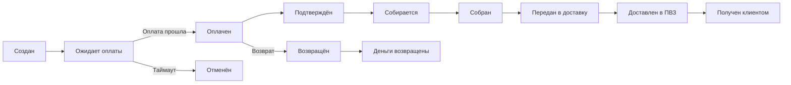
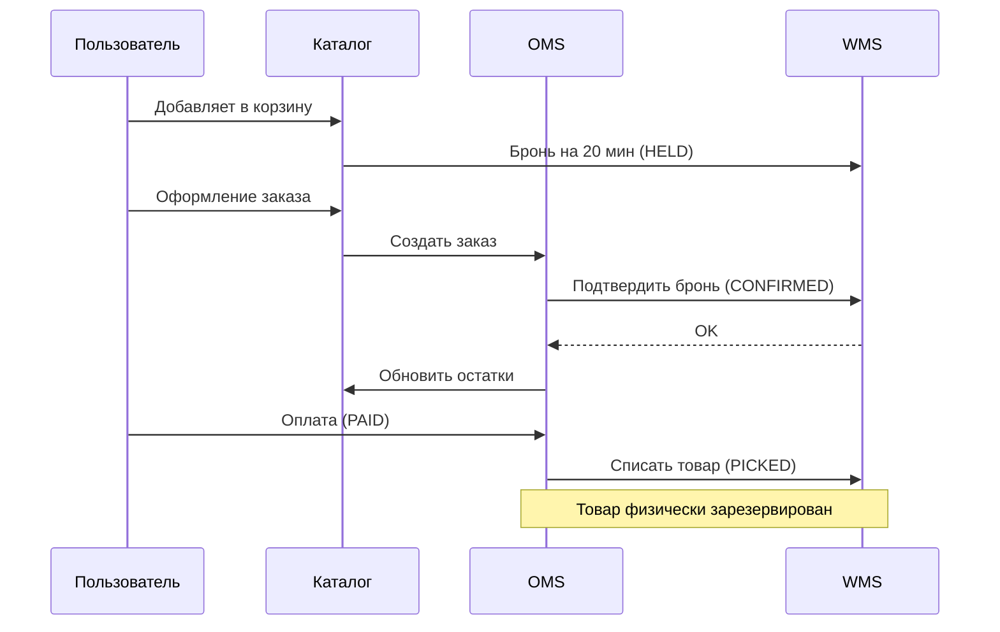
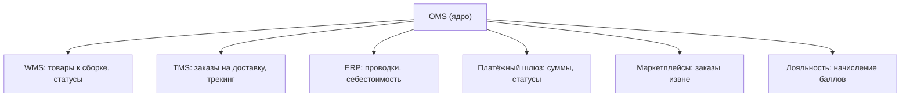

:::info[TL;DR]
OMS (Order Management System) — система управления заказами, ядро e-commerce платформы. Заказ проходит через 12+ статусов: от «создан» до «доставлен» или «возвращён». OMS — интеграционный хаб: связывает каталог (что продали), WMS (что собрали), TMS (что доставили) и платёжный шлюз (что оплатили). В пике (Black Friday) OMS должен обрабатывать 10 000+ заказов/час.
:::

## Для кого эта статья

- Middle SA, проектирующий OMS
- Junior SA, разбирающийся в статусной модели заказа
- SA, интегрирующий OMS с WMS/TMS/ERP

После прочтения вы:
- Сможете спроектировать машину состояний заказа (12+ статусов)
- Поймёте стратегии резервирования товаров (hybrid, pessimistic)
- Узнаете типовые интеграции OMS с WMS, TMS, ERP, платежами

## Ключевые термины

| Термин | Описание |
|--------|----------|
| OMS | Order Management System — управление заказами |
| SKU | Stock Keeping Unit — единица товара (код) |
| Reservation | Бронь товара на складе для конкретного заказа |
| Fulfillment | Процесс сборки-упаковки-отгрузки |
| TMS | Transport Management System — доставка |
| RMA | Return Merchandise Authorization — возврат |
| Saga | Распределённая транзакция через событийную цепочку |
| Oversell | Продажа товара, которого нет в наличии |

## Жизненный цикл заказа



### Ключевые статусы заказа

| Статус | Что происходит | Система-владелец | Таймаут |
|--------|---------------|-----------------|---------|
| `CREATED` | Заказ создан, товар зарезервирован | OMS | — |
| `PENDING_PAYMENT` | Ожидание оплаты (20 мин — 24ч) | Платёжный шлюз | 24 ч |
| `PAID` | Оплачен полностью | OMS | — |
| `CONFIRMED` | Подтверждён менеджером/автоматом | OMS | — |
| `ASSEMBLING` | Собирается на складе | WMS | 4 ч |
| `ASSEMBLED` | Собран, ожидает передачи в доставку | WMS | — |
| `SHIPPED` | Передан курьеру/ПВЗ | TMS | — |
| `DELIVERED` | Доставлен в ПВЗ | TMS | — |
| `RECEIVED` | Получен клиентом | OMS | — |
| `CANCELLED` | Отменён (клиентом/системой) | OMS | — |
| `RETURNED` | Возвращён | OMS | — |
| `REFUNDED` | Деньги возвращены | Платёжный шлюз | — |

## Резервирование товара (Inventory Reservation)



**Стратегии резервирования:**

| Стратегия | Описание | Плюсы | Минусы | Когда использовать |
|-----------|----------|-------|--------|-------------------|
| **Optimistic** | Не резервируем до оплаты | Нет брошенных корзин | Oversell, если товар закончился | Товары с большим запасом |
| **Pessimistic** | Резервируем в корзине | Нет oversell | Много брошенных корзин | Дефицитные товары |
| **Hybrid** | На N минут, затем отпускаем | Баланс | Сложнее реализовать | Стандартный подход |

## Интеграции OMS



| Система | Что передаём | Протокол | SLA |
|---------|-------------|----------|-----|
| WMS | Товары к сборке, статус сборки | REST / RabbitMQ | < 5 сек |
| TMS | Заказ на доставку, трекинг | REST API | < 10 сек |
| ERP | Проводки, себестоимость | REST / EDI / 1С | T+1 |
| Платёжный шлюз | Сумма к оплате, статус | REST | < 3 сек |
| Маркетплейс | Заказы из маркетплейса | REST API | < 30 сек |
| Лояльность | Начисление баллов | Event (Kafka) | < 1 мин |

## Состав заказа (модель данных)

```
Order
 ├── id, created_at, status, total
 ├── Customer (id, name, phone, email)
 ├── BillingAddress
 ├── ShippingAddress
 ├── Items[]
 │    ├── product_id, sku, name, quantity, price
 │    ├── reservation (stock_id, status)
 │    └── bundle_id (если в составе набора)
 ├── Payments[]
 │    └── amount, method, status, external_id
 ├── Shipments[]
 │    └── carrier, tracking_number, status
 ├── Discounts[]
 │    └── type, value, promo_code
 └── History[]
      └── status, timestamp, user, comment
```

## Требования к OMS

| Параметр | Типовое значение | Почему это важно |
|----------|------------------|------------------|
| Поддерживаемые статусы | 12+ статусов | Трекинг каждого этапа |
| Резервирование | Hybrid (20 мин на корзину) | Баланс между oversell и брошенными корзинами |
| Источники товара | Собственный склад + FBO + FBS | Гибкость фулфилмента |
| Доставка | 5+ служб (CDEK, Boxberry, Почта) | Покрытие всех регионов |
| Оплата | Карты, SBP, BNPL, наличные | Удобство клиента |
| Возвраты | 14 дней (ЗоЗПП), 30 дней (онлайн) | Закон |
| SLA | Заказ → отправка: 24 часа | Ожидание клиента |
| Пиковая нагрузка | 10 000 заказов/час | Black Friday |

## Практический кейс: Миграция OMS

**Проблема:** Интернет-магазин (100 000 заказов/мес). OMS на legacy (1С + самопис). Каждый месяц — 2-3 сбоя. Средний downtime: 4 часа.

**Анализ:**
- 1С не справляется: 50 заказов/мин — предел
- Нет event-driven: WMS и TMS дёргают OMS синхронно → блокировки
- Статусная модель: 5 статусов, не хватает

**Решение:** Новая OMS (Java + Kafka + Postgres):
1. Event-driven: each status change = Kafka event
2. WMS/TMS — асинхронное взаимодействие
3. Статусная модель: 15 статусов
4. Saga reservation: optimistic → hybrid после KYC

**Результат:**
- Пропускная способность: 50 → 5000 заказов/мин (100x)
- Downtime: 4 часа/мес → 0
- Black Friday: 250 000 заказов/сут без сбоя
- Стоимость: 40 млн руб. Окупаемость: 2 года

## Проверь себя

1. **Какие статусы проходит заказ от создания до получения?**
   *Ответ:* CREATED → PENDING_PAYMENT → PAID → CONFIRMED → ASSEMBLING → ASSEMBLED → SHIPPED → DELIVERED → RECEIVED (9 статусов), плюс отмена/возврат.

2. **Что такое резервирование товара и какие есть стратегии?**
   *Ответ:* Бронь товара для клиента. Optimistic (не резервируем до оплаты — риск oversell), Pessimistic (резервируем в корзине — риск брошенных корзин), Hybrid (на N минут — баланс).

3. **С какими системами интегрируется OMS?**
   *Ответ:* WMS (склад), TMS (доставка), ERP (учёт), платёжный шлюз, маркетплейсы, система лояльности.

4. **Почему OMS — интеграционный хаб, а не просто статусная модель?**
   *Ответ:* OMS координирует 5+ внешних систем: платёж (деньги), склад (товар), доставку (курьер), ERP (учёт), лояльность (баллы). Статусы — только отражение состояния этих интеграций.

5. **Какая модель резервирования лучше для дефицитных товаров (лимитированная коллекция)?**
   *Ответ:* Pessimistic — резервировать сразу при добавлении в корзину. Риск брошенных корзин, но oversell — потеря репутации. Для лимитированных коллекций — только pessimistic.

## Ссылки для самостоятельного изучения

| Что | Описание | URL |
|-----|----------|-----|
| Ozon OMS — документация | Управление заказами на Ozon | seller.ozon.com |
| RabbitMQ — Turotial | Асинхронная интеграция | rabbitmq.com |
| Saga Pattern | Распределённые транзакции | microservices.io |
| WMS — спецификация | Складской учёт | tech/wms |

## Что дальше

- [Каталог товаров](/docs/specialization/ecommerce-catalog) — структура, атрибуты, поиск
- [WMS — складской учёт](/tech/wms) — как OMS интегрируется со складом
- [Фулфилмент](/docs/specialization/ecommerce-fulfillment) — Pick → Pack → Ship
