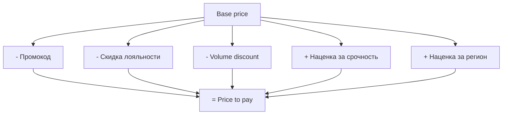
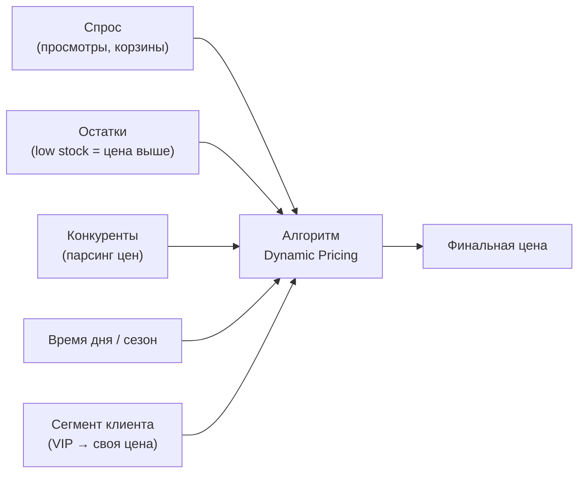

:::info[TL;DR]
Ценообразование в e-commerce — сложная система с перекрывающимися скидками, промокодами, программами лояльности и динамическими ценами. Аналитик должен специфицировать правила расчёта финальной цены, приоритеты скидок (stacking) и избегать «схлопывания» (когда скидки делают цену отрицательной). На крупных маркетплейсах цена меняется каждые 15 мин под влиянием спроса, конкурентов и остатков.
:::

## Для кого эта статья

- Senior SA, проектирующий систему ценообразования
- Middle SA, работающий с промо и купонами
- SA, специфицирующий правила динамических цен

После прочтения вы:
- Поймёте 6+ типов цен и 7+ видов скидок
- Узнаете, как работают stacking rules и приоритет скидок
- Сможете спроектировать движок промокодов с условиями

## Ключевые термины

| Термин | Описание |
|--------|----------|
| Base price | Базовая цена товара в каталоге |
| Sale price | Цена по акции (временная скидка) |
| Dynamic price | Цена, меняющаяся от спроса и остатков |
| Promocode | Код для активации скидки |
| Stacking | Применение нескольких скидок последовательно |
| Cashback | Возврат баллами на следующую покупку |
| Bundle | Набор товаров с общей скидкой |
| Flash sale | Временная акция с высокой скидкой |

## Типы цен

| Тип | Описание | Пример | Кто устанавливает |
|-----|----------|--------|------------------|
| **Base price** | Базовая цена | 9 990 ₽ | Продавец |
| **Sale price** | Скидка от base | 7 990 ₽ | Маркетинг |
| **Promo price** | Временная акция | 6 990 ₽ | Маркетинг |
| **Wholesale price** | Опт (B2B) | 5 990 ₽ | B2B-отдел |
| **Subscription price** | Цена по подписке | 499 ₽/мес | Продукт |
| **Dynamic price** | Меняется от спроса | 1 200-1 800 ₽ | Алгоритм |

## Система скидок



### Виды промо-акций

| Акция | Механика | Пример | Риски |
|-------|----------|--------|-------|
| **Flash sale** | N% на N часов | -30% на электронику, 12-15 ч | Oversell, падение сервера |
| **Bundle** | Набор со скидкой | Ноутбук + мышь = -15% | Остатки не синхронизированы |
| **Volume** | Скидка от количества | 2 по цене 1 | Схлопывание с другими скидками |
| **Cashback** | Возврат баллами | 10% кешбэк | Баллы не сгорают → долг |
| **Gift** | Подарок при покупке | Шампунь при заказе от 3 000 ₽ | Gift-товар не учтён в остатках |
| **Free delivery** | Доставка 0 ₽ от N | Бесплатно от 2 500 ₽ | Падение AOV |

## Промокоды (Coupon Engine)

**Модель промокода:**

```
Промокод
 ├── code: "SALE30"
 ├── type: fixed / percent / free_delivery
 ├── value: 30 (%) / 500 (₽)
 ├── conditions:
 │    ├── min_order: 2 000 ₽
 │    ├── max_discount: 5 000 ₽
 │    ├── categories: [electronics, books]
 │    ├── products: [IPHONE-15]
 │    ├── first_order_only: true
 │    └── valid_period: 2024-11-01..2024-11-30
 ├── usage:
 │    ├── max_uses: 1 000
 │    ├── per_user: 1
 │    └── used_count: 327
 └── stackable: false
```

### Условия промокода

| Условие | Тип | Проверка |
|---------|-----|----------|
| min_order | Сумма корзины | Минимальная сумма заказа |
| max_discount | Сумма | Максимальная скидка в ₽ |
| categories | Список категорий | Только эти категории |
| products | Список товаров | Только эти товары |
| first_order | Булево | Только первый заказ клиента |
| period | Дата-диапазон | Срок действия |
| max_uses | Число | Лимит применений всего |
| per_user | Число | Лимит на одного пользователя |

## Приоритет скидок (Stacking Rules)

**Проблема:** применить все скидки сразу → цена < 1 ₽.

**Правило приоритета (стандартное):**

```
1. Base price
2. Скидка по промокоду (если не stackable → stop)
3. Скидка по лояльности (% от base)
4. Volume discount (% от уже сниженной)
5. Бесплатная доставка (не влияет на цену товара)
6. Cashback (начисляется потом, не сейчас)
```

**Stackable vs Non-stackable:**

| Тип | Поведение | Пример |
|-----|-----------|--------|
| Stackable | Суммируется с другими | Лояльность (5%) + промокод (10%) = 15% |
| Non-stackable | Выбирается максимум | Два промокода: -10% и -15% → -15% |

## Динамическое ценообразование (Dynamic Pricing)



| Фактор | Влияние | Частота обновления |
|--------|---------|-------------------|
| Спрос (просмотры, корзины) | +10-30% | Каждые 15 мин |
| Остатки (low stock) | +20-50% | При изменении остатка |
| Конкуренты (парсинг) | -5-15% | Ежечасно |
| Время дня | -10-30% (ночью) | Ежечасно |
| Сегмент клиента | -5-20% (VIP) | При входе |

## Требования к системе ценообразования

| Параметр | Типовое значение | Почему это важно |
|----------|------------------|------------------|
| Типы скидок | percent, fixed, gift, delivery | Гибкость маркетинга |
| Условия промокода | 8+ параметров | Таргетинг скидок |
| Stacking | Да (с приоритетами) | Исключить цену < 0 |
| Максимальная скидка | 99% (не 100+) | Защита от ошибок |
| Периоды акций | С точностью до минуты | Flash sale в 12:00 |
| Аудит | Кто, когда, почему | Разбирательства |
| A/B тест | Для новых схем скидок | Data-driven |

## Практический кейс: Внедрение dynamic pricing

**Проблема:** Маркетплейс электроники (10 000 SKU). Цены фиксированные, конкуренты (М.Видео, Яндекс.Маркет) перебивают цену. Потеря 20% продаж.

**Анализ:**
- Конкуренты обновляют цены ежедневно
- Вручную отслеживать — 5 человек, обновление раз в 2 дня
- Остатки не влияют на цену: дефицитный iPhone стоит как залежалый чехол

**Решение:** Dynamic pricing engine:
1. Парсинг конкурентов (М.Видео, Ozon, Яндекс.Маркет)
2. Остатки: low stock → +15%, excess → -20%
3. Спрос: > 100 просмотров/день → +10%
4. Обновление цен: каждые 15 мин

**Результат:**
- GMV: +18%
- Маржа: -2% (за счёт снижения цен, но объём компенсировал)
- Время установки цены: 2 дня → 15 мин
- Стоимость: 5 млн руб. Окупаемость: 3 мес.

## Проверь себя

1. **Какие есть типы цен в e-commerce?**
   *Ответ:* Base, sale, promo, wholesale, subscription, dynamic.

2. **Что такое stacking правил и почему это важно?**
   *Ответ:* Приоритет применения скидок. Без него несколько скидок могут сделать цену отрицательной (например, 30% + 20% + 50% = 100%+).

3. **Какие условия можно задать для промокода?**
   *Ответ:* min_order, max_discount, категории, товары, first_order_only, период, max_uses, per_user.

4. **Как работает dynamic pricing?**
   *Ответ:* Алгоритм меняет цену в зависимости от спроса, остатков, конкурентов и сегмента клиента. Обновление — каждые 15-60 мин.

5. **Почему cashback — это не скидка, а отложенный платёж?**
   *Ответ:* Cashback начисляется после покупки, не влияет на текущую цену. Это обязательство вернуть баллы, а не уменьшить цену сейчас. Если клиент уйдёт — баллы не тратит, компания не теряет.

## Ссылки для самостоятельного изучения

| Что | Описание | URL |
|-----|----------|-----|
| Dynamic Pricing — обзор | Стратегии ценообразования | mckinsey.com |
| Prometheus — мониторинг цен | Отслеживание метрик | prometheus.io |
| 54-ФЗ об онлайн-кассах | Чек со скидкой | consultant.ru |
| ЗоЗПП — возврат | Цена при возврате | consultant.ru |

## Что дальше

- [Маркетплейсы](/docs/specialization/ecommerce-marketplace) — комиссия, онбординг продавцов
- [ERP — учёт](/tech/erp) — себестоимость и проводки
