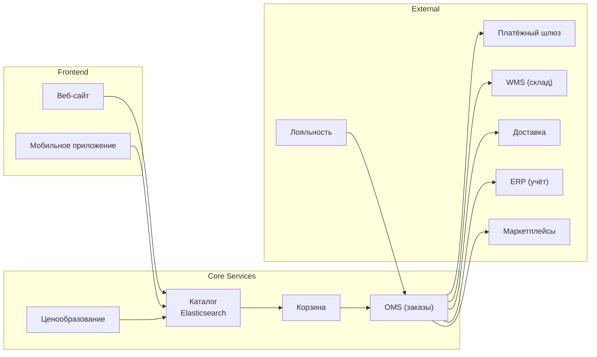

:::info[TL;DR]
E-commerce-аналитик работает с онлайн-продажами: каталогом товаров, корзиной, заказами, доставкой, платежами и возвратами. Рынок e-commerce РФ — 7+ трлн руб (2024), рост 30%+ в год. В отличие от FinTech, меньше регуляции, но выше требования к производительности (пики в 100x на распродажах) и сложнее логика ценообразования (промо, купоны, скидки). Крупнейшие платформы: Wildberries, Ozon, Яндекс.Маркет, AliExpress.
:::

## Для кого эта статья

- Middle SA, переходящий в e-commerce
- Junior SA, начинающий в ритейле
- Продуктовый аналитик, желающий понять системную сторону

После прочтения вы:
- Поймёте архитектуру e-commerce платформы (6+ подсистем)
- Узнаете ключевые метрики (GMV, AOV, LTV, CAC)
- Сможете спланировать карьерный путь в e-commerce

## Ключевые термины

| Термин | Описание |
|--------|----------|
| OMS | Order Management System — система управления заказами |
| WMS | Warehouse Management System — система управления складом |
| TMS | Transport Management System — управление доставкой |
| SKU | Stock Keeping Unit — единица товарного учёта |
| FBO/FBS/DBS | Модели фулфилмента маркетплейсов |
| GMV | Gross Merchandise Volume — валовый объём продаж |
| AOV | Average Order Value — средний чек |
| LTV | Lifetime Value — доход от клиента за всё время |

## Чем E-commerce отличается от других отраслей

| Тип | Описание | Пример | GMV (2024) |
|-----|----------|--------|-----------|
| **B2C** | Продажа физическим лицам | Wildberries, Ozon | 3+ трлн ₽ (WB) |
| **B2B** | Продажа юридическим лицам | Металл-профиль, PipeDrive | 500+ млрд ₽ |
| **D2C** | Производитель → клиент | Nike, Apple Store | 100+ млрд ₽ |
| **Marketplace** | Платформа для продавцов | Ozon, Яндекс.Маркет | 2+ трлн ₽ |
| **C2C** | Продажа между физлицами | Avito, Юла | 200+ млрд ₽ |

## Архитектура e-commerce платформы

## Ключевые особенности e-commerce

- **Высокая нагрузка** — Black Friday, 11.11: пики в 100x от обычной. Ozon: 50 000+ заказов/час в пик.
- **Асинхронность** — не все операции можно делать синхронно (проверка платежа, резервирование на складе)
- **Состояния заказа** — сложная машина состояний (до 20+ статусов)
- **Инвентаризация** — товарный запас в реальном времени, резервирование (oversell — потеря денег и репутации)
- **Интеграции** — с платёжными шлюзами (Сбер, ЮKassa, Т-Банк), WMS, ERP, CDEK, Boxberry, маркетплейсами

## Реальные e-commerce платформы

| Платформа | GMV 2024 | Модель | Особенность |
|-----------|----------|--------|-------------|
| **Wildberries** | 3+ трлн ₽ | Marketplace + 1P | Крупнейший маркетплейс РФ |
| **Ozon** | 2+ трлн ₽ | Marketplace + 1P | FBO/FBS/DBS, собственный фулфилмент |
| **Яндекс.Маркет** | 500+ млрд ₽ | Marketplace + D2C | Интеграция с Яндекс Go |
| **AliExpress Russia** | 300+ млрд ₽ | Marketplace | Dropshipping из Китая |
| **СберМегаМаркет** | 200+ млрд ₽ | Marketplace | FBO от Сбера |

## Типовые проекты e-commerce аналитика

1. **Внедрение OMS** — машина состояний заказа, интеграция с WMS/TMS
2. **Интеграция с маркетплейсами** — Ozon API, Wildberries API
3. **Проектирование каталога товаров** — Elasticsearch, атрибуты, поиск
4. **Система промо и купонов** — скидки, stackable rules, dynamic pricing
5. **Программа лояльности** — баллы, уровни (tiers), кешбэк, рефералки
6. **Миграция с legacy ERP** — SAP, 1С → современная платформа
7. **Фулфилмент и WMS** — Pick → Pack → Ship, распределение по складам

## Карьерный путь

| Этап | Роль | Опыт | Зарплата (Москва) | Ключевые навыки |
|------|------|------|-------------------|----------------|
| 1 | Junior SA | 0-1 год | 80-120K | OMS, базовые статусы заказов |
| 2 | Middle SA | 2-4 года | 180-280K | Каталог, интеграции, WMS |
| 3 | Senior SA | 5-7 лет | 300-450K | Ценообразование, промо, маркетплейсы |
| 4 | Lead / Architect | 8+ лет | 450-700K | Архитектура платформы, орг. изменения |

## Практический кейс: Внедрение OMS в интернет-магазине

**Проблема:** Интернет-магазин одежды (1000 заказов/день). OMS — самописный на 1С. Система не справляется с пиками (Black Friday), зависает на 30 мин. Возвраты обрабатываются вручную.

**Анализ:**
- Статусная модель: 5 статусов, не хватает для трекинга
- Нет интеграции с WMS — сборщики видят заказы в Excel
- Возвраты: бумажные акты, 2 недели обработки

**Решение:** Внедрение Ozon OMS (как сервис) + собственная WMS-прослойка:
1. Статусная модель: 12 статусов
2. Интеграция с WMS через RabbitMQ
3. Возвраты: RMA-процесс + личный кабинет

**Результат:**
- Black Friday: без сбоев, 5000 заказов/день (5x рост)
- Время обработки возврата: 14 дней → 2 дня
- Ошибки сборки: 3% → 0.3%
- Стоимость проекта: 12 млн руб.

## Проверь себя

1. **Какие бывают типы e-commerce?**
   *Ответ:* B2C, B2B, D2C, Marketplace, C2C. Различаются моделью продажи и участниками.

2. **Какие подсистемы входят в e-commerce платформу?**
   *Ответ:* Каталог, Корзина, OMS, Платежи, Доставка, WMS, ERP, Лояльность, Аналитика.

3. **Чем e-commerce отличается от FinTech?**
   *Ответ:* Меньше регуляции, выше пиковые нагрузки (100x), сложнее ценообразование, больше интеграций с внешними складами и доставкой.

4. **Что такое GMV и чем отличается от Revenue?**
   *Ответ:* GMV — сумма всех заказов (с учётом возвратов). Revenue = GMV - скидки - возвраты. GMV — «грязная» выручка, Revenue — чистая.

5. **Почему асинхронность важна в e-commerce?**
   *Ответ:* Платёж проходит 3-30 сек, резервирование на складе — 1-5 мин, доставка — часы. Делать всё синхронно — заблокировать пользователя на минуты.

## Ссылки для самостоятельного изучения

| Что | Описание | URL |
|-----|----------|-----|
| Ozon Seller API | API для интеграции с маркетплейсом | seller.ozon.com |
| Wildberries API | API для продавцов | seller.wildberries.ru |
| 54-ФЗ об онлайн-кассах | Регуляция для e-commerce | consultant.ru |
| ЗоЗПП — защита прав потребителей | Правила возврата | consultant.ru |
| Elasticsearch Guide | Поиск в e-commerce | elastic.co |

## Что дальше

- [OMS — управление заказами](/docs/specialization/ecommerce-oms) — ядро e-commerce
- [Каталог товаров](/docs/specialization/ecommerce-catalog) — структура и поиск
- [Elasticsearch — поиск](/tech/elasticsearch) — технология каталога
