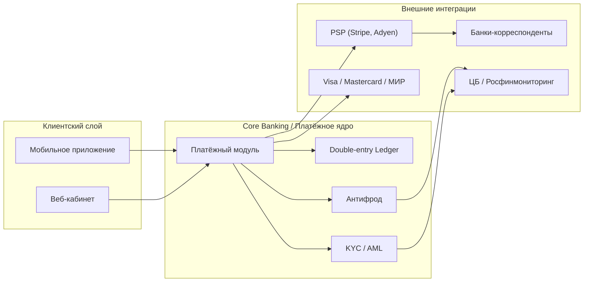
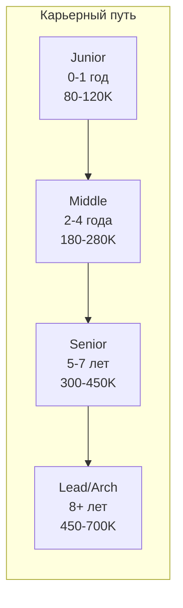

:::info TL;DR
FinTech-аналитик — системный аналитик, специализирующийся на финансовых продуктах: платежах, банкинге, кредитовании. В отличие от «обычного» SA, он должен понимать регуляторику (ЦБ, KYC/AML, PCI DSS), платёжные протоколы (ISO 8583, ISO 20022) и бухгалтерский учёт (double-entry ledger). Это одна из самых высокооплачиваемых ниш для аналитика.
:::

## Для кого эта статья

- Middle SA, переходящий в FinTech из другой отрасли
- Junior SA, начинающий карьеру в финтехе
- Продуктовый аналитик, желающий понять системную сторону финансовых продуктов

После прочтения вы:
- Поймёте, чем FinTech-аналитик отличается от обычного SA и какие hard skills нужны
- Узнаете типовые задачи и архитектуру FinTech-систем
- Сможете спланировать карьерный путь в FinTech

## Чем FinTech-аналитик отличается от обычного SA

| Аспект | Обычный SA | FinTech-аналитик |
|--------|-----------|-----------------|
| **Главный стейкхолдер** | Бизнес-заказчик | Бизнес + ЦБ + комплаенс |
| **Ключевые требования** | Функциональность | Функциональность + compliance |
| **Точность** | «Работает в 95% случаев» | «Ошибка в 1 копейку = инцидент» |
| **Доступность** | 99% (плановая ночь) | 99.99% (24/7, никаких остановок) |
| **Данные** | Заказы, пользователи | Транзакции, проводки, остатки |
| **Аудит** | По желанию | Обязателен (ЦБ, аудиторы) |
| **Домен** | Бизнес-логика | Платёжные схемы, бухгалтерия |

## Что должен знать FinTech-аналитик

**Hard skills (специфичные для FinTech):**
- Платёжные системы: 4-сторонняя модель, acquiring, issuing, transaction lifecycle
- Платёжные протоколы: ISO 8583, ISO 20022, SWIFT MT/MX, SEPA
- Регуляторика: KYC/AML (115-ФЗ), 152-ФЗ (персональные данные), PCI DSS
- Бухгалтерский учёт: double-entry, ledger, проводки, сальдо
- Open Banking: PSD2/PSD3, Berlin Group, consent management
- Фрод-мониторинг: rules engines, ML-scoring, 115-ФЗ ст.6, case management
- Кредитные продукты: loan origination, scoring, amortization, BNPL
- Архитектура: saga, transactional outbox, CQRS, audit trail

**Hard skills (общие для SA, критичные в FinTech):**
- SOAP/WSDL — legacy банковские системы
- NFR: zero downtime, reconciliation SLA, latency для платежей
- Трассировка требований — для регулятора
- Моделирование: BPMN для платёжных потоков, C4 для архитектуры

## Архитектура FinTech-системы

## Типовые задачи FinTech-аналитика

1. Интеграция с платёжным шлюзом (Stripe, Adyen, CardPay, SberPay)
2. Проектирование системы сверки платежей (reconciliation)
3. Миграция с legacy core banking (ЦФТ/SAP) на микросервисы
4. Спецификация отчётности для ЦБ (формы 0409701 и др.)
5. Внедрение Open Banking API (PSD2 / Berlin Group)
6. Проектирование кредитного конвейера
7. Интеграция с KYC/AML-провайдерами

## Где работать

- **Банки** — Альфа, Тинькофф, Сбер, ВТБ, legacy core + цифровые проекты
- **Платёжные системы** — Visa, Mastercard, НСПК (МИР), ЮМoney
- **Финтех-стартапы** — Revolut, N26, Finteka, Точка
- **PSP (Payment Service Providers)** — Stripe, Adyen, Checkout.com, Payture
- **Processing-компании** — процессинговые центры, карточный процессинг
- **BigTech с финансами** — Яндекс.Деньги, Ozon FinTech, Wildberries Bank

## Практический кейс: Миграция с legacy core banking

**Проблема:** Банк (100 тыс. клиентов) использует core banking систему на базе ЦФТ (1990-х годов). Невозможно выводить новые продукты быстрее 6 месяцев, каждая интеграция с финтех-партнёрами — через CSV-файлы. Команда аналитиков тратит 70% времени на reverse-engineering существующей логики.

**Анализ:**
- 28 000 строк PL/SQL-кода в процедурах ЦФТ без документации
- Статусная модель транзакций: 4 статуса (не хватает для трекинга lifecycle)
- Нет API — только файловый обмен (ISO 8583 через flat files)
- Среднее время на добавление нового платёжного метода: 4 месяца
- Ошибки сверки: 2% транзакций расходятся (потери ~5 млн ₽/мес)

**Решение:** Разработка платёжного микросервиса (Payment Hub) поверх ЦФТ:
1. Выделение платёжного модуля в микросервис с REST API (Berlin Group)
2. Внедрение Kafka для асинхронного обмена с ЦФТ
3. Построение слоя сверки (reconciliation engine) на базе Airflow + PostgreSQL
4. Статусная модель: 4 → 12 статусов (полный lifecycle)

**Результат:**
- Время вывода нового платёжного метода: 4 мес → 2 недели
- Ошибки сверки: 2% → 0.01%
- Интеграция с финтех-партнёрами: через REST API (вместо CSV)
- Стоимость проекта: 25 млн ₽, окупаемость: 14 месяцев
- Команда аналитиков: с 70% reverse-engineering до 30% (остальное — новые продукты)

## Ключевые термины

- **Acquiring** — эквайринг: обслуживание продавца (магазина)
- **Issuing** — эмиссия: выпуск карт для держателей
- **Transaction lifecycle** — авторизация → клиринг → settlement
- **ISO 8583** — протокол карточных транзакций
- **ISO 20022** — стандарт платёжных сообщений нового поколения
- **Double-entry** — двойная запись: дебет/кредит
- **Reconciliation** — сверка транзакций
- **Saga** — распределённая транзакция с компенсирующими шагами

## Что дальше

- [Платёжные системы: основы](/docs/specialization/fintech-payments) — как устроен платёж
- [Регуляторика в FinTech](/docs/specialization/fintech-regulation) — KYC/AML, PCI DSS, ЦБ

## Проверь себя

1. **Чем FinTech-аналитик отличается от обычного SA?**
   *Ответ:* Работает с compliance (ЦБ, KYC/AML, PCI DSS), финансовыми транзакциями (точность до копейки), 24/7 системами и бухгалтерским учётом.

2. **Какие платёжные протоколы нужно знать?**
   *Ответ:* ISO 8583 (карточные транзакции), ISO 20022 (новый стандарт платежей), SWIFT MT/MX (межбанк), SEPA (Европа).

3. **Почему в FinTech критична трассировка требований?**
   *Ответ:* Регулятор (ЦБ) может запросить: «Почему эта транзакция была одобрена?» — нужна цепочка от требования до реализации.

4. **Что такое double-entry ledger и зачем он нужен в FinTech?**
   *Ответ:* Принцип двойной записи: каждая операция = дебет одного счета + кредит другого. Обеспечивает аудируемость и баланс (сумма дебетов = сумме кредитов).

5. **Какие три фактора используются в SCA (Strong Customer Authentication)?**
   *Ответ:* 1) Знание — пароль/PIN, 2) Владение — телефон/карта, 3) Биометрия — отпечаток/лицо. Требуются два из трёх для онлайн-платежей.

## Ссылки для самостоятельного изучения

| Что | Описание | URL |
|-----|----------|-----|
| ISO 20022 | Стандарт платёжных сообщений | iso20022.org |
| PCI DSS v4.0 | Стандарт безопасности карточных данных | pcisecuritystandards.org |
| Berlin Group NextGenPSD2 | Спецификация Open Banking API | berlin-group.com |
| 115-ФЗ (ПОД/ФТ) | Закон о противодействии отмыванию | consultant.ru |
| ЦБ РФ — отчётность | Требования к отчётности банков | cbr.ru
