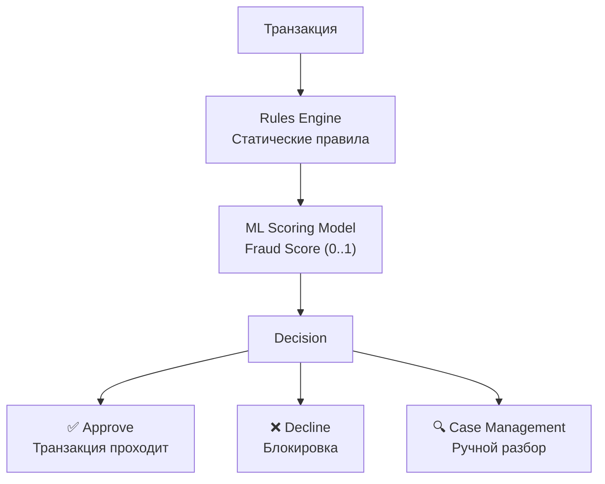

:::info TL;DR
Фрод-мониторинг (антифрод) — система выявления подозрительных операций в реальном времени. Каждая транзакция проверяется по правилам и ML-моделям до того, как будет одобрена. Аналитик специфицирует: правила фрод-скоринга, интеграцию с внешними чёрными списками, механизм блокировки, case management для ручного разбора.
:::

## Для кого эта статья

- Senior SA, работающий над антифрод-системой
- SA в FinTech, которому нужно специфицировать правила фрод-скоринга
- ML-аналитик, интегрирующий ML-модели в платёжный поток

После прочтения вы:
- Поймёте архитектуру антифрод-системы (Rules Engine + ML Scoring + Case Management)
- Узнаете типовые правила фрод-мониторинга
- Сможете специфицировать требования к антифрод-системе

## Зачем нужен антифрод

Потери от фрода в глобальной платёжной индустрии — > $30 млрд/год. Каждая утечка или мошенническая транзакция = деньги клиента + reputational damage + штрафы регулятора.

**Что считается фродом:**
- Мошенническая транзакция (карта украдена / данные скомпрометированы)
- Account takeover (взлом личного кабинета)
- Fake merchant (мошенник выдаёт себя за продавца)
- Многочисленные мелкие транзакции (карточный тест)
- Отмывание денег (layering, structuring)

## Архитектура антифрод-системы



### 1. Rules Engine

Статические правила, которые проверяют транзакцию:

| Правило | Описание | Severity |
|---------|----------|----------|
| Velocity check | > 10 транзакций за 5 минут | HIGH |
| Country mismatch | Страна карты ≠ страна IP | MEDIUM |
| Amount threshold | > 500 000 ₽ за одну операцию | HIGH |
| CVV fail | 3+ неверных CVV подряд | HIGH |
| BIN match | Карта из списка украденных | HIGH |
| New device | Устройство не использовалось ранее | LOW |
| Time anomaly | Транзакция в 3 AM (не типично) | LOW |
| Blacklist | IP/email/телефон в чёрном списке | HIGH |

**Для аналитика:** специфицировать, какие правила работают для какого типа транзакций, какие пороги, что делать при срабатывании (блокировать / помечать на review).

### 2. ML Scorring

ML-модель вычисляет **fraud score** (0.0 — точно не фрод, 1.0 — точно фрод):

```
Признаки (features):
  - Сумма транзакции
  - Тип карты (credit/debit)
  - Страна карты, страна IP, страна мерчанта
  - Время с момента выпуска карты
  - Количество транзакций за последний час/день
  - Тип товара (digital goods — риск выше)
  - История мерчанта
  - ...

Модель: Gradient Boosting / Random Forest / Neural Network
Порог: > 0.95 → Decline, 0.80–0.95 → Manual Review, < 0.80 → Approve
```

**Требования к ML-модели для фрода:**
- Inference time: < 100 ms (транзакция ждёт)
- Explainability: почему модель дала такой score (требование ЦБ)
- Мониторинг: дрифт модели, переобучение

### 3. Case Management Dashboard

Интерфейс для операторов, которые разбирают подозрительные транзакции:

| Поле | Описание |
|------|----------|
| Transaction ID | ID транзакции |
| Risk score | 0.00–1.00 |
| Triggered rules | Какие правила сработали |
| Customer history | История клиента |
| Recommendation | Approve / Decline / More info |
| Action | Оператор принимает решение |

**Требования к case management:**
- Время на разбор одного case: < 5 минут
- SLA: P0 — 1 час, P1 — 4 часа, P2 — 24 часа
- Audit: все действия оператора логируются
- Escalation: если оператор не принял решение за N минут — эскалация

## Интеграция с внешними системами

Антифрод-система интегрируется с:

- **Чёрные списки ЦБ / Росфинмониторинг** — лица, причастные к экстремизму/терроризму
- **Скоринговые бюро** — НБКИ, OKB (кредитная история)
- **Device fingerprinting** — идентификация устройства (ThreatMetrix, FingerprintJS)
- **3DS** — дополнительная аутентификация для high-risk транзакций

## Fraud vs Compliance (115-ФЗ)

Важно различать:

| Критерий | Фрод-мониторинг | Compliance (115-ФЗ) |
|----------|----------------|-------------------|
| Цель | Защита от мошенничества | Борьба с отмыванием денег |
| Объект | Конкретная транзакция | Паттерны операций |
| Реакция | Decline / блокировка | Уведомление Росфинмониторинг |
| Порог | Зависит от правил | > 600 000 ₽ (ст.6 115-ФЗ) |
| Время | Real-time (< 100 ms) | Пакетная обработка (T+1) |

## Практический кейс: Внедрение антифрода для P2P-переводов

**Проблема:** P2P-платёжный сервис (3 млн пользователей) теряет 50 млн ₽/мес на фроде. Мошенники украли базу данных (10K карт) и совершают переводы: small-amount transactions (50-200₽) тысячами. Антифрод — только базовый rules engine на 5 правил.

**Анализ:**
- Velocity check: мошенники делают 100+ переводов/мин с разных IP
- Country mismatch: карта EU, IP RU, телефон RU (подозрительно, но не заблокировано)
- Нет ML-скоринга: все правила статические, threshold подобран плохо
- Case management: нет — подозрительные транзакции не анализируются
- Chargeback rate: 2% (норма для FinTech — 0.1%)

**Решение:**
1. Внедрение реального rules engine (20+ правил) — velocity, amount, BIN, device fingerprint
2. ML scoring (Gradient Boosting): 50+ features, пороги: > 0.95 → Decline, 0.80-0.95 → Review
3. Device fingerprinting (FingerprintJS) — 90% фрод-транзакций с новых устройств
4. Case management dashboard для отдела фрод-мониторинга
5. SLA: Decline < 100 ms, Review < 200 ms

**Результат:**
- Фрод-потери: 50 млн ₽/мес → 3 млн ₽/мес (-94%)
- Chargeback rate: 2% → 0.08% (ниже нормы)
- ML модель: precision 98%, recall 85% (только 15% фрода пропускает)
- Case management: 200 случаев/день, среднее время разбора — 3 мин
- ROI: 600 млн ₽/год сэкономлено, стоимость проекта: 20 млн ₽

## Типовые требования к антифрод-системе

При спецификации антифрода аналитик определяет:

| Параметр | Пример |
|----------|--------|
| Время проверки | < 200 ms (иначе платёж ждёт) |
| Правила | 20+ правил (velocity, blacklist, amount) |
| ML score threshold | Decline > 0.95, Review > 0.80 |
| Case resolution SLA | P0: 1 час, P1: 4 часа |
| Retention | Данные транзакций — 3 года |
| Reporting | Ежемесячный отчёт для ЦБ (115-ФЗ) |
| Audit | Все изменения правил логируются |

## Ключевые термины

- **Fraud score** — оценка вероятности фрода (0..1)
- **Rules Engine** — статические правила проверки транзакций
- **Velocity check** — проверка частоты транзакций
- **Case Management** — ручной разбор подозрительных операций
- **Device fingerprinting** — идентификация устройства
- **Chargeback** — возврат по спорной транзакции
- **Blacklist** — чёрный список (IP, карта, email)
- **Compliance** — соблюдение законодательства (115-ФЗ)

## Что дальше

- [Регуляторика в FinTech](/docs/specialization/fintech-regulation) — 115-ФЗ, KYC/AML
- [Этика, bias и регуляторика ИИ](/docs/specialization/ai-ethics) — bias в ML-моделях для фрода
- [Мониторинг](/docs/architecture/monitoring) — метрики для антифрод-системы

## Проверь себя

1. **Как работает антифрод-система для платёжной транзакции?**
   *Ответ:* Транзакция → Rules Engine (статические правила) → ML Scoring → Decision (Approve/Decline/Manual). Всё за < 200 ms.

2. **Чем фрод-мониторинг отличается от compliance (115-ФЗ)?**
   *Ответ:* Фрод — защита от мошенничества (real-time, decline транзакций). Compliance — борьба с отмыванием (batch, уведомление регулятора).

3. **Что такое velocity check?**
   *Ответ:* Правило, которое проверяет, сколько транзакций совершил пользователь за короткий промежуток времени. > 10 транзакций за 5 минут = подозрительно.

4. **Почему для антифрода важна объяснимость ML-моделей?**
   *Ответ:* Требование ЦБ и 115-ФЗ: банк должен объяснить, почему транзакция заблокирована. «Модель так решила» — не ответ. Нужны конкретные причины (velocity, BIN, страна).

5. **Какие 3 решения принимает антифрод-система?**
   *Ответ:* Approve (пропустить), Decline (заблокировать), Manual Review/Hold (отправить на ручной разбор оператору).

## Ссылки для самостоятельного изучения

| Что | Описание | URL |
|-----|----------|-----|
| Stripe Radar | Антифрод от Stripe | stripe.com/radar |
| FingerprintJS | Device fingerprinting | fingerprintjs.com |
| Sift — Fraud Platform | Enterprise антифрод | sift.com |
| 115-ФЗ (ПОД/ФТ) | Закон о противодействии отмыванию | consultant.ru |
| Gradient Boosting Guide | ML для фрода | scikit-learn.org
